# خواننده تلگرام

<!-- TOP_NAV START -->

<a href="https://github.com/adamapplecoding/dlrl/blob/main/telegram/content/archive_1.md" style="display:inline-block; padding:6px 12px; margin:0 4px; background-color:#2ea44f; color:white; text-decoration:none; border-radius:4px; font-weight:bold;">صفحه بعد</a>

<!-- TOP_NAV END -->

<!-- MSG START -->

---
📅 بروزرسانی: 1405/02/31 13:45
---

## VahidOOnLine — post 241304

  <a href="telegram/content/VahidOOnLine_241304_1779358511.mp4" target="_blank">🎬 Download video</a>

♦️تصاویری که صفحه «اسرائیل به فارسی» روز پنجشنبه ۳۱ اردیبهشت در شبکه‌های اجتماعی منتشر کرده نشان می‌دهد، پرچم ملی شیروخورشید نشان ایران در کنار پرچم سایر کشورها در یکی از خیابان‌های شهر اشدود اسرائیل به اهتزاز درآمده است.
‌🇸🇦 Indypersian

🤖 @VahidOOnLine

## VahidOOnLine — post 241303

  

♦️ماریا زاخاروا، سخنگوی وزارت امور خارجه روسیه روز پنجشنبه ۳۱ اردیبهشت‌ماه گفت که تنها ایران باید درباره سرنوشت ذخایر اورانیوم این کشور تصمیم بگیرد.
سخنگوی وزارت امور خارجه روسیه بار دیگر بر موضع رسمی مسکو گفت: «پرونده هسته‌ای ایران تنها با در نظر گرفتن منافع ایران و و از راه دیپلماتیک قابل حل و فصل است.»
‌🇸🇦 Indypersian

🤖 @VahidOOnLine

## VahidOOnLine — post 241302

  

غلامرضا تاجگردون، رییس کمیسیون برنامه و بودجه مجلس، گفت دولت امروز به نقطه‌ای رسیده که باید «قرارگاه‌های مردمی تامین منابع مالی پایدار» را شکل دهد.

او اضافه کرد: «این یعنی بانک مرکزی باید یک پشتوانه مردمی دیگر برای تامین منابع داشته باشد؛ چه از جانب افرادی که در داخل کشور منابع دارند و چه ایرانیان خارج از کشور که امروز می‌توانند به اقتصاد کشورشان کمک کنند.»
‌🏁 🇬🇧 IranintlTV

🤖 @VahidOOnLine

## VahidOOnLine — post 241301

  <a href="telegram/content/VahidOOnLine_241301_1779358513.mp4" target="_blank">🎬 Download video</a>

♦️سازمان محیط زیست چهارمحل‌و‌بختیاری، روز پنجشنبه ۳۱ اردیبهشت تصاویری را از پرواز پرنده همای سعادت در آسمان منطقه حفاظت شده سبزکوه این استان منتشر کرد.
هما، پرنده اساطیری و اسرارآمیز در فرهنگ ایرانیان است که در ارتفاعات سنگی و صخره‌ای کشور زندگی می‌کند. این پرنده در رشته‌کوه‌های البرز، زاگرس، طالقان، سمنان و منطقه حفاظت‌شده گنو مشاهده شده است.
‌🇸🇦 Indypersian

🤖 @VahidOOnLine

## VahidOOnLine — post 241300

  

انور قرقاش، مشاور دیپلماتیک رییس امارات متحده عربی، با انتقاد از رفتار جمهوری اسلامی در منطقه گفت کشورهای خلیج فارس طی دهه‌های طولانی به «زورگویی ایران» عادت کرده‌اند و این رفتار به بخشی از صحنه سیاسی در خلیج فارس تبدیل شده است.

او گفت اعتبار جمهوری اسلامی میان «سخنان تهاجمی» و «بیانیه‌های توخالی دوستی» از بین رفته است.

قرقاش افزود: «امروز، پس از تجاوز آشکار ایران، این حکومت می‌کوشد واقعیتی تازه را تثبیت کند؛ واقعیتی که از یک شکست نظامی روشن زاده شده است. اما تلاش‌ها برای کنترل تنگه هرمز یا تعرض به حاکمیت دریایی امارات، چیزی جز خیال‌پردازی نیست.»

مشاور دیپلماتیک رییس امارات همچنین تاکید کرد هر کشوری که خواهان همزیستی با محیط عربی پیرامون خود است، باید بداند که اعتماد از بین رفته است.

او افزود بازسازی این اعتماد با شعار ممکن نیست، بلکه تنها با «زبان مسئولانه، پاسداشت حاکمیت و پایبندی واقعی به اصول حسن همجواری» امکان‌پذیر است.
‌🏁 🇬🇧 IranintlTV

🤖 @VahidOOnLine

## VahidOOnLine — post 241299

  <a href="telegram/content/VahidOOnLine_241299_1779358516.mp4" target="_blank">🎬 Download video</a>

انور قرقاش، مشاور سیاست خارجی رئیس امارات متحده عربی، در حساب ایکس خود نوشت جمهوری اسلامی پس از تجاوز و شکست نظامی آشکار، در تلاش است واقعیتی جدید را بر منطقه تحمیل کند، اما تلاش برای کنترل تنگه هرمز یا تعرض به حاکمیت دریایی امارات «چیزی جز رویاپردازی نیست.»
قرقاش افزود کشورهای عربی خلیج فارس دهه‌ها به «زورگویی‌های ایران» عادت کرده‌اند؛ تا جایی که این رفتار به بخشی از فضای سیاسی منطقه تبدیل شده و شکاف عمیقی میان شعارهای تهاجمی تهران و ادعاهای دوستی ایجاد کرده است.
او همچنین تأکید کرد هر کشوری که خواهان همزیستی با جهان عرب است باید بداند اعتماد از دست رفته و بازسازی آن نه با شعار، بلکه با احترام به حاکمیت کشورها، زبان مسئولانه و پایبندی واقعی به اصول حسن همجواری ممکن خواهد بود.
‌🏁 🇬🇧 ManotoTV

🤖 @VahidOOnLine

## VahidOOnLine — post 241298

  

♦️شبکه الجزیره قطر روز پنجشنبه ۳۱ اردیبهشت به نقل از یک مقام دولت پاکستان اعلام کرد سفر فیلد مارشال عاصم منیر به تهران، مشروط به نتیجه گفتگوهای وزیر کشور پاکستان با مقام‌های جمهوری اسلامی است.

این مقام دولتی به الجزیره گفت جمهوری اسلامی ایران از پاکستان خواسته است تا مهلتی را برای ارزیابی و بررسی معیارهای آمریکایی برای مذاکره دریافت کند.

به گفته همین منبع اورانیوم غنی‌شده، چالش اصلی در مذاکرات میان تهران و واشنگتن است.

فداحسین مالکی، عضو کمیسیون امنیت ملی و سیاست خارجی مجلس، چهارشنبه ۳۰ اردیبهشت‌ماه گفته بود که عاصم منیر، فرمانده ارتش پاکستان، فردا به ایران سفر خواهد کرد. این عضو کمیسیون امنیت ملی ادعا کرده بود که فرمانده ارتش پاکستان در این دیدار، حامل پیام جدیدی از سوی ایالات متحده آمریکا به مقام‌های جمهوری اسلامی است.
‌🇸🇦 Indypersian

🤖 @VahidOOnLine

## VahidOOnLine — post 241297

  <a href="telegram/content/VahidOOnLine_241297_1779358517.mp4" target="_blank">🎬 Download video</a>

بر اساس داده‌های مرکز پایش اینترنت نت‌بلاکس، خاموشی اینترنت در ایران اکنون وارد هشتادوسومین روز خود شده است.
نت‌بلاکس اعلام کرد دسترسی به شبکه‌های بین‌المللی برای بیش از ۱۹۶۸ ساعت به‌طور گسترده مسدود بوده است. این نهاد تأکید کرد اینترنت آزاد و باز نقشی اساسی در حفاظت از جان، آزادی و پاسخگویی عمومی دارد.
‌🏁 🇬🇧 ManotoTV

🤖 @VahidOOnLine

## VahidOOnLine — post 241296

  

♦️رضا امیری مقدم، سفیر جمهوری اسلامی در پاکستان روز پنجشنبه ۳۱ اردیبهشت از بازگشت ۲۰ ملوان یک کشتی توقیف شده ایرانی در آب‌های سنگاپور به ایران خبر داد.

این کشتی چند هفته پیش و در عملیات نیروهای آمریکایی توقیف شده بود.

به گزارش خبرگزاری صداوسیما، امیری مقدم با اعلام این خبر گفت: «از اقدام انسان‌دوستانه و خیرخواهانه دولت محترم پاکستان برای پیگیری آزادی ۲۰ ملوان ایرانی که به دلیل توقیف کشتی‌شان در آب‌های سنگاپور در وضعیت نامناسبی قرار داشتند، صمیمانه قدردانی می‌کنم.»

به گفته سفیر جمهوری اسلامی در پاکستان «این ملوانان پس از تلاش‌های دیپلماتیک از سنگاپور به اسلام‌آباد منتقل شدند» و پس از آن به ایران بازگشتند.
‌🇸🇦 Indypersian

🤖 @VahidOOnLine

## VahidOOnLine — post 241295

  <a href="telegram/content/VahidOOnLine_241295_1779358518.mp4" target="_blank">🎬 Download video</a>

وزیران خارجه استرالیا و بلژیک در واکنش به ویدیوی منتشرشده از نحوه برخورد نیروهای اسرائیلی با فعالان «ناوگان آزادی» حامیان غزه، از احضار سفیران اسرائیل خبر دادند. در این ویدیو ده‌ها فعال حامی غزه با دستان بسته روی زمین زانو زده‌اند و ایتامار بن‌گویر، وزیر امنیت ملی اسرائیل، در حالی که پرچم این کشور را در دست دارد، به آن‌ها می‌گوید: «به اسرائیل خوش آمدید.»
ینی وانگ، وزیر خارجه استرالیا، این تصاویر را «غیرقابل قبول» توصیف کرد و گفت «رفتار تحقیرآمیز با بازداشت‌شدگان را محکوم می‌کند». وزیر خارجه بلژیک نیز تصاویر منتشرشده را «عمیقاً نگران‌کننده» خواند و اعلام کرد شماری از شهروندان بلژیک در میان بازداشت‌شدگان هستند.
همزمان جورجا ملونی، نخست‌وزیر ایتالیا، و پدرو سانچز، نخست‌وزیر اسپانیا، نیز این اقدام را محکوم کرده‌اند
‌🏁 🇬🇧 ManotoTV

🤖 @VahidOOnLine

## VahidOOnLine — post 241294

  <a href="telegram/content/VahidOOnLine_241294_1779358519.mp4" target="_blank">🎬 Download video</a>

ویدیوی رسیده به ایران‌اینترنشنال نشان می‌دهد که شامگاه ۲۹ اردیبهشت در بندر کُنگ، یکی از شهرهای تابعه شهرستان بندر لنگه در استان هرمزگان، صف طولانی بنزین تشکیل شده است.

مسعود پزشکیان، رییس دولت جمهوری اسلامی، اعلام کرد در پی محاصره دریایی آمریکا، صادرات نفت ایران متوقف شده و کشور روزانه با کمبود ۵۰ میلیون لیتر بنزین روبه‌رو است، اما دلاری برای واردات آن وجود ندارد. ساعتی پس از انتشار سخنان پزشکیان، رسانه‌های دولتی از جمله ایرنا اقدام به حذف این اظهارات کردند.
‌🏁 🇬🇧 IranintlTV

🤖 @VahidOOnLine

## VahidOOnLine — post 241293

  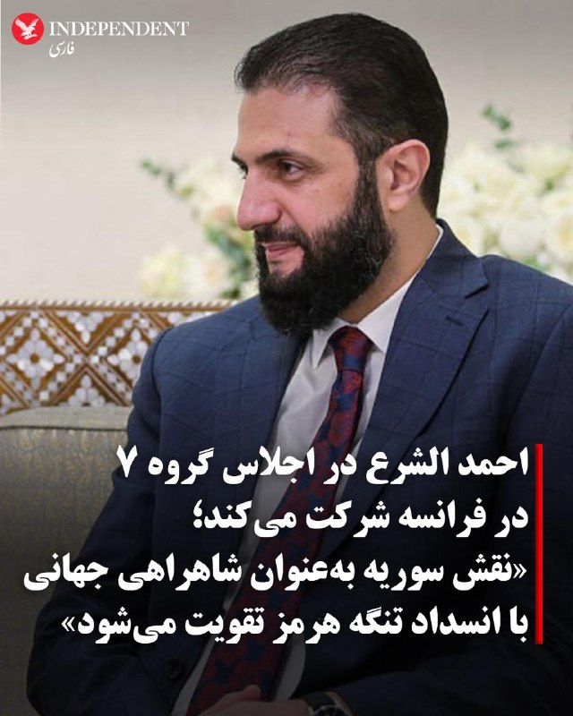

♦️خبرگزاری رویترز روز پنجشنبه ۳۱ اردیبهشت به نقل از سه منبع آگاه اعلام کرد که احمد الشرع، رئیس جمهوری «حکومت انتقالی» سوریه ماه آینده به عنوان کشور مهمان اجلاس گروه ۷ در فرانسه شرکت خواهد کرد.

 این اولین حضور سوریه در اجلاس این گروه از زمان تاسیس در سال ۱۹۷۵ است.
 یک مقام سوری به خبرگزاری رویترز گفت مشارکت سوریه در این مذاکرات احتمالا بر نقش این کشور به عنوان «مرکز راهبردی بالقوه برای زنجیره‌های تامین» پس از بسته شدن تنگه هرمز متمرکز خواهد بود.
به گفته همین منبع، دعوتنامه حضور احمد الشرع هفته گذشته به وزیر دارایی سوریه که برای شرکت در اجلاس وزاری دارایی گروه ۷ به پاریس سفر کرده بود، داده شده است.

کشتیرانی از طریق این تنگه از زمان آغاز جنگ ایران در پایان فوریه که اقتصاد جهانی را متزلزل کرد، تا حد زیادی متوقف شده است.
‌🇸🇦 Indypersian

🤖 @VahidOOnLine

## VahidOOnLine — post 241292

  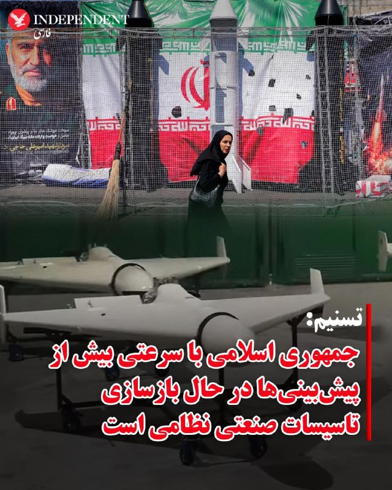

♦️شبکه سی‌ان‌ان روز پنجشنبه ۳۱ اردیبهشت به نقل از منابع آگاه از ارزیابی‌های اطلاعاتی آمریکا گزارش داد که جمهوری اسلامی با سرعتی بیش از برآوردهای اولیه در حال بازسازی توانمندی‌های نظامی خود است و حتی در جریان آتش‌بس شش‌هفته‌ای که از اوایل فروردین گذشته آغاز شد، بخشی از تولید پهپادهای خود را از سر گرفته است.

به گفته چهار منبع آگاه، ارزیابی‌های اطلاعاتی آمریکا نشان می‌دهد تهران در حال جایگزینی زیرساخت‌های آسیب‌دیده از حملات آمریکا و اسرائیل، از جمله پایگاه‌های موشکی، پرتابگرها و ظرفیت تولید تسلیحات کلیدی است؛ موضوعی که نشان می‌دهد نیروهای مسلح ایران همچنان می‌توانند تهدیدی جدی برای متحدان منطقه‌ای آمریکا باقی بمانند.

یک مقام آمریکایی به سی‌ان‌ان گفت برخی برآوردها نشان می‌دهد ایران ممکن است ظرف تنها شش ماه توان حملات پهپادی خود را به‌طور کامل بازسازی کند. او افزود: «ایرانی‌ها از تمام جدول‌های زمانی پیش‌بینی‌شده برای بازسازی فراتر رفته‌اند.»

سی‌ان‌ان همچنین گزارش داد اطلاعات آمریکا حاکی است حدود دو سوم پرتابگرهای موشکی ایران همچنان باقی مانده و نزدیک به نیمی از توان پهپادی این کشور نیز حفظ شده است.

یکی از منابع به سی‌ان‌ان گفت مجموعه‌ای از عوامل در بازسازی توان نظامی ایران دست داشته است، اول حمایت‌های روسیه و چین و دوم این واقعیت که آمریکا و اسرائیل به اندازه‌ای که انتظار داشتند نتوانستند به زیرساخت‌های نظامی سپاه پاسداران آسیب وارد کنند.
‌🇸🇦 Indypersian

🤖 @VahidOOnLine

## VahidOOnLine — post 241291

  <a href="telegram/content/VahidOOnLine_241291_1779358522.mp4" target="_blank">🎬 Download video</a>

ویدیوی رسیده به ایران‌اینترنشنال نشان‌دهنده استقرار خودروی زرهی نوپو (نیروی ویژه پاسدار ولایت) در تهران است که به عنوان یکی از واحدهای تابع یگان ویژه وظایفی چون سرکوب معترضان در پایتخت را برعهده دارد.
‌🏁 🇬🇧 IranintlTV

🤖 @VahidOOnLine

## VahidOOnLine — post 241290

  

شبکه سی‌ان‌ان به نقل از منابع آگاه از ارزیابی‌های اطلاعاتی آمریکا گزارش داد جمهوری اسلامی در جریان آتش‌بس شش‌هفته‌ای بخشی از تولید پهپادهای خود را از سر گرفته است.

بر اساس این گزارش، این موضوع نشانه‌ای از آن است که تهران با سرعت در حال بازسازی بخشی از توانمندی‌های نظامی خود است که در حملات آمریکا و اسرائیل آسیب دیده بود.

چهار منبع به سی‌ان‌ان گفتند اطلاعات آمریکا نشان می‌دهد ارتش جمهوری اسلامی بسیار سریع‌تر از برآوردهای اولیه در حال بازسازی و احیای توان خود است. این بازسازی شامل جایگزینی سایت‌های موشکی، پرتابگرها و ظرفیت تولید سامانه‌های تسلیحاتی کلیدی است که در جریان درگیری آسیب دیده یا نابود شده‌اند.

به گفته منابع آگاه از این ارزیابی‌ها، این روند به این معناست که در صورت ازسرگیری کارزار بمباران از سوی دونالد ترامپ، رییس‌جمهوری آمریکا، تهران همچنان تهدیدی جدی برای متحدان منطقه‌ای آمریکا خواهد بود.

یک مقام آمریکایی به سی‌ان‌ان گفت برخی برآوردهای اطلاعاتی نشان می‌دهد حکومت ایران ممکن است بتواند توان حمله پهپادی خود را ظرف شش ماه به‌طور کامل بازسازی کند.
‌🏁 🇬🇧 IranintlTV

🤖 @VahidOOnLine

## VahidOOnLine — post 241289

  <a href="telegram/content/VahidOOnLine_241289_1779358524.mp4" target="_blank">🎬 Download video</a>

سی‌ان‌ان به نقل از منابع اطلاعاتی آمریکا گزارش داد جمهوری اسلامی بازسازی زیرساخت‌های نظامی و تولید پهپاد را سریع‌تر از برآوردهای اولیه از سر گرفته است.
بر اساس این گزارش، ایران در جریان آتش‌بس شش‌هفته‌ای که از اوایل آوریل آغاز شد، بخشی از تولید پهپادهای خود را دوباره راه‌اندازی کرده است. منابع آگاه گفته‌اند این موضوع نشان می‌دهد تهران در حال بازسازی سریع توان نظامی آسیب‌دیده خود در حملات آمریکا و اسرائیل است.
چهار منبع مطلع نیز به سی‌ان‌ان گفته‌اند ارزیابی نهادهای اطلاعاتی آمریکا نشان می‌دهد روند بازسازی ارتش ایران بسیار سریع‌تر از آن چیزی است که پیش‌تر تخمین زده می‌شد
به گفته این منابع، بازسازی پایگاه‌های موشکی، سکوهای پرتاب و ظرفیت تولید سامانه‌های تسلیحاتی نشان می‌دهد ایران همچنان در صورت ازسرگیری حملات، تهدیدی جدی برای متحدان منطقه‌ای آمریکا خواهد بود.
یکی از مقام‌های آمریکایی نیز گفته است برخی برآوردهای اطلاعاتی نشان می‌دهد ایران ممکن است ظرف شش ماه توان کامل حملات پهپادی خود را بازیابی کند.
‌🏁 🇬🇧 ManotoTV

🤖 @VahidOOnLine

## VahidOOnLine — post 241288

  

♦️حسین شریعتمداری، مدیرمسئول روزنامه کیهان، در یادداشتی خواستار تصویب قانونی در مجلس جمهوری اسلامی شد که بر اساس آن، تنگه هرمز تا زمان «کشته‌شدن دونالد ترامپ» به روی شناورهای آمریکایی و متحدان واشنگتن بسته بماند.

 او همچنین پیشنهاد کرد از تمامی شناورها «حق عبور» دریافت شود و شناورهای متعلق به اسرائیل یا حامل کالا و نفت برای این کشور نیز تا «محو کامل اسرائیل از جغرافیای جهان» مصادره شوند.
‌🇸🇦 Indypersian

🤖 @VahidOOnLine

## VahidOOnLine — post 241287

  

صنایع هوافضای اسرائیل در گزارش مالی سه‌ماهه نخست سال ۲۰۲۶ از ثبت رکوردهای تازه در فروش، سود خالص و حجم سفارش‌ها خبر داد. این آمار تحت تاثیر افزایش تقاضا برای سامانه‌های دفاعی، به‌ویژه پس از درگیری با جمهوری اسلامی، بوده است.

بر اساس گزارش مالی صنایع هوافضای اسرائیل که شامگاه چهارشنبه منتشر شد، فروش این شرکت در سه‌ماهه نخست سال ۲۰۲۶ از مرز دو میلیارد دلار گذشت و سود خالص آن حدود ۳۴ درصد افزایش یافت. همچنین حجم سفارش‌های ثبت‌شده این شرکت به حدود ۳۳ میلیارد دلار رسید؛ رقمی که بالاترین سطح در تاریخ صنایع هوافضای اسرائیل توصیف شده و معادل حدود چهار سال و نیم فعالیت این شرکت است.
‌🏁 🇬🇧 IranintlTV

🤖 @VahidOOnLine

## VahidOOnLine — post 241286

  <a href="telegram/content/VahidOOnLine_241286_1779358526.mp4" target="_blank">🎬 Download video</a>

⭕️ثبت تصاویر کم‌نظیر از عبور هم‌زمان دو پلنگ ایرانی در جنگل‌های هیرکانی

♦️معاون اداره‌کل محیط‌زیست گیلان روز پنجشنبه ۳۱ اردیبهشت اعلام کرد دوربین‌های تله‌ای نصب‌شده در جنگل‌های هیرکانی، تصاویر کم‌نظیر و ارزشمندی از عبور هم‌زمان دو پلنگ را در فاصله زمانی کوتاه ثبت کرده‌اند.

 به گفته مقام‌های محیط‌زیست، ثبت این تصاویر نشانه‌ای مهم از پویایی زیستگاه و ادامه حضور گونه‌های شاخص حیات‌ وحش در جنگل‌های هیرکانی به شمار می‌رود.

پلنگ ایرانی از گونه‌های در معرض تهدید محسوب می‌شود و جنگل‌های هیرکانی یکی از زیستگاه‌های اصلی آن هستند.
‌🇸🇦 Indypersian

🤖 @VahidOOnLine

## VahidOOnLine — post 241285

  <a href="telegram/content/VahidOOnLine_241285_1779358528.mp4" target="_blank">🎬 Download video</a>

♦️محسن نقوی، وزیرکشور پاکستان که برای دومین بار در یک هفته اخیر به تهران سفر کرده است، با عباس عراقچی، زیر امور خارجه جمهوری اسلامی دیدار کرد.
پیش از این، اسماعیل بقایی، سخنگوی وزارت امورخارجه اعلام کرده بود سفر محسن نقوی، وزیر کشور پاکستان به ایران، با هدف «تسهیل تبادل پیام‌ها و ارائه توضیحات تکمیلی برای شفاف‌سازی متن‌های ارسالی میان طرفین» انجام شده است.
همزمان، خبرگزاری ایسنا گزارش کرد فیلد مارشال، عاصم منیر، فرمانده ارتش پاکستان روز پنجشنبه ۳۱ اردیبهشت ماه به تهران سفر می‌کند.
‌🇸🇦 Indypersian

🤖 @VahidOOnLine

## WithYashar — post 11826

همکنون زلزله در بندر عباس
@withyashar
مرحله بعدی زامبی و گودزیلا است

## WithYashar — post 11825

‏علی قلهکی : آمریکایی‌ها پس از دریافت نظراتِ ایران، پیشنهاد کرده‌اند که «پایانِ جنگ در تمامیِ جبهه‌ها»، «رفع محاصره تنگه هرمز توسط آمریکا»، «بازشدن تنگه هرمز توسط ایران با تعرفه و مسیر دریایی مدنظر ایران»، «آزادسازی ۲۵٪ از اموال بلوکه شده ایران _حدود ۲۵ میلیارد دلار»، «معافیتِ فروشِ نفت ایران به مدت ۳۰روز» و فازِ اصلیِ مذاکره یعنی «خروجِ ۴۰۰ کیلو اورانیوم از ایران _در بهترین حالت ارسال به کشور ثالث_» و «قبولِ حقِ غنی‌سازی ۳.۶۷ ٪ برای ایران (بعید است در فاز نهایی آمریکا آن را بپذیرد)» و «تعطیلی مراکز هسته‌ای _منهای راکتورِ تهران صرفا با کاربرد پزشکی) به طور یکجا توسط ایران امضا شود!
‏ایران می‌گوید تمام فازهای پیشنهادی آمریکا برای راستی‌آزمایی به مدت ۳۰ روز انجام شود تا هم ایران نفت خود را بفروشد و هم‌مُجاب شود در بحث هسته‌ای مذاکره را انجام دهد!
‏پی‌نوشت: ۱. اختلاف جدی بَر سَرِ مباحث هسته‌ای است؛ «۴۰۰ کیلو اورانیوم» خط قرمزِ دیکته‌ای اسرائیل برای آمریکاست! ایران ۴۰۰کیلو اورانیوم را نمی‌دهد، غنی‌سازی را هم حتما می‌خواهد و ۲۰ سال آن را تعلیق نمی‌کند. ایران با ارسال ۴۰۰ کیلو اورانیوم به کشور ثالث _چین و روسیه_ موافقت نکرده، آمریکا هم همینطور و خودش آن را می‌خواهد. نقطه‌ی جدی شکستِ توافق اینجاست. ایران مذاکره بر سر «پرونده‌ی هسته‌ای» را جُدای از «پرونده بازگشایی تنگه هرمز» و «اتمامِ جنگ» می‌داند!
‏۲. ایران و آمریکا سر فاز بندی توافق اختلاف دارند؛ ایران یکجا توافق نمی‌کند و آمریکا دنبالِ توافق یکجاست!
‏۳. آمریکا متعهد به متون و محورهای ارسالی نیست؛ محورهای ذکر شده با اینکه فاصله جدی با شروط ایران دارد ولی همین‌ها هم توسط آمریکا به مرحله اجرا در نمی‌آید!
‏۴. آمریکا تحریمی را لغو نمی‌کند؛ شاید تعلیقِ مدت‌دار در بهترین حالت، قسمتِ ایران در توافق شود.
‏۵. بر فرض توافق با آمریکا، هیچ تضمینی برای جلوگیری از ترور سطح بالا توسط اسرائیل نیست!
@withyashar

## WithYashar — post 11824

  <a href="telegram/content/WithYashar_11824_1779358529.mp4" target="_blank">🎬 Download video</a>

اعضای تیم ملی فوتبال ایران برای درخواست ویزا به سفارت آمریکا در آنکارا مراجعه کردند
@withyashar

## WithYashar — post 11823

الجزیره به نقل از یک منبع پاکستانی:

مقامات ایرانی از پاکستان خواسته‌اند تا مهلتی برای ارزیابی و بررسی معیارهای آمریکایی برای مذاکره دریافت کند.
اورانیوم غنی‌شده، گره اصلی در مذاکرات آمریکا و ایران است.
ژنرال منیر هنوز در پاکستان است و سفر او به ایران بستگی به نتایج سفر وزیر کشور دارد.
@withyashar

## WithYashar — post 11822

  

صدا و سیما : تا عید غدیر مجسمه‌ای ۱۵ متری از مشت علی خامنه‌ای در میدان انقلاب تهران نصب میشه‌.
@withyashar

## WithYashar — post 11821

فاکس نیوز در گزارشی به نقل از عمر محمد، کارشناس مبارزه با تروریسم، نوشت سبک زندگی مجتبی خامنه‌ای به سطحی از ناپدید شدن رسیده که اسامه بن لادن سال‌ها در ایبت‌آباد تجربه می‌کرد؛ زندگی بدون ارتباط مخابراتی و با اتکا به پیک‌های مورد اعتماد.
@withyashar

## WithYashar — post 11820

۲۰ ملوان ایرانی به کشور بازگشتند
سفیر ایران در پاکستان از بازگشت ۲۰ ملوان ایرانی که به‌دلیل توقیف کشتی‌شان در آب‌های سنگاپور گرفتار شده بودند، به ایران خبر داد.

این ملوانان پس از تلاش‌های دیپلماتیک از سنگاپور به اسلام‌آباد منتقل و ساعاتی پیش به میهن بازگشتند.
@withyashar

## WithYashar — post 11819

ایران در حال پاسخ به متن ارسال شده از سوی آمریکا است

ایران در حال گفت و گو‌ بر سر چارچوب کلان، برخی جزییات و اقدامات اعتمادساز به عنوان تضمین است.
متن ارسالی به میزانی شکاف‌ها را کم کرده است اما کمتر شدن شکاف‌ها نیازمند پایان یافتن وسوسه جنگ در سمت واشنگتن است.

ورود ژنرال عاصم منیر به تهران، به منظور کم کردن این شکاف‌ها و رسیدن به لحظه اعلام رسمی پذیرش یادداشت تفاهم است./ ایسنا
@withyashar

## WithYashar — post 11817

گزارش CNN: حکومت ایران در طول آتش‌بس بخشی از تولید پهپادهای خود را از سر گرفته است، که نشان می‌دهد در حال سریعاً بازسازی برخی توانایی‌های نظامی است که در حملات آسیب دیده‌اند.
@withyashar

## WithYashar — post 11816

امروز ۲۱ می روز جهانی چای است
و یادی میکنیم از پدر چای ایران ، حاج محمد میرزا (کاشف السلطنه)
او معتقد بود مردم ایران نباید برای چای و قند و نفت سفید به کشورهای دیگر وابسته باشند. از این رو به عنوان سفیر ایران راهی هند شد و در پوشش تاجر فرانسوی بصورت مخفی در مزارع چای مشغول یاد گیری کشت چای شد. دلیل این کار این بود که فن چای کاری را سری و انحصاری میدانستند و حاضر نمی شدند کسی آن را یاد گرفته و در سطح وسیع عمل کند. وی قبل از مراجعت به ایران تخم چای و چهار هزار گلدان نهال چای به ایران فرستاد و با سختی و مشقت فراوان موفق به کشت و توسعه چای در ایران شد و از طرف مظفرالدین شاه کاشف السلطنه لقب گرفت.
برای آموزش چای کاری به کشاورزان چهار چای کار چینی توسط وی به ایران آورده شدند که منجر به اسلام آوردن آنها و تشکیل خانواده در ایران شد.
انگلستان که منافعش در انحصار چای در ایران به خطر افتاده بود طی توطئه ای وی را به قتل رساند در برخی نوشته‌ها هم عنوان شده که او در سال ۱۳۰۸ خورشیدی در یک سانحهٔ اتومبیل مشکوک در مسیر بوشهر–شیراز درگذشت
@withyashar

## WithYashar — post 11815

رسانه عبری والا: منابع اسرائیلی می‌گویند آمریکایی‌ها در مذاکرات با ایران یک قدم به جلو برداشته‌اند، بنابراین برآوردها این است که حمله‌ای به ایران در ۲۴ ساعت آینده تکرار نخواهد شد
@withyashar

## WithYashar — post 11814

ادعای یدیعوت آحارانوت به نقل از یک مقام امنیتی اسرئیل:

ما ممکن است جنگ‌هایی را با سرعت بیشتری علیه ایران آغاز کنیم تا برنامه هسته‌ای و موشک‌هایش تهدیدی ایجاد نکند.
@withyashar

## WithYashar — post 11813

سید محسن نقوی وزیر کشور پاکستان با سید عباس عراقچی وزیر امور خارجه دیدار و گفت‌وگو کرد.
@withyashar
پاکستانی ها از‌ عمانی ها هم پیگیر ترن ، پلنگ مارو ول کرد تو ما رو ول نکردی !!!

## WithYashar — post 11811

سازمان هواشناسی: امروز برای استانهای شمال غرب ، مناطقی در غرب ، دامنه های البرز ، شمال و شمال شرق کشور در برخی ساعات بارندگی ، رعد و برق و وزش باد شدید پیش بینی می شود.
@withyashar
هوا هنوز مساعد حمله چکشی نیست

## WithYashar — post 11810

خبرگزاری نور: سخنگوی وزارت خارجه ایران، بقائی، گزارش داد که پاسخ ایالات متحده به طرح ۱۴ نقطه‌ای خود را دریافت کرده‌اند و در حال بررسی آن هستند.
«بر اساس همان متن اولیه ۱۴ نقطه‌ای از ایران، تبادل پیام‌ها چندین بار انجام شده است و ما دیدگاه‌های طرف آمریکایی را دریافت کرده‌ایم و در حال حاضر در حال بررسی آن‌ها هستیم.»
@withyashar

## WithYashar — post 11809

  

سنتکام با انتشار این عکس تایید کرد : یک بمب‌افکن B-1B لنسر متعلق به نیروی هوایی آمریکا، در جریان یک پرواز آموزشی بر فراز آب‌های منطقه‌ای خاورمیانه، از یک هواپیمای سوخت‌رسان KC-135 استراتوتنکر سوخت‌گیری کرد.
@withyashar
در این ویدیو اتاق جنگ چند روز پیشاین هواپیما رو رهگیری کردیم …

https://www.instagram.com/reel/DYQCr39RJ4i/?igsh=MThycjJiYWZmbnJ3dA==

## WithYashar — post 11808

رایزنی‌های مصر، عربستان و قطر درباره آخرین تحولات مذاکرات تهران-واشنگتن

وزیر خارجه مصر با همتایان سعودی و قطری خود درباره آخرین تحولات مربوط به مذاکرت تهران-واشنگتن گفت‌وگو و تاکید کرد که استمرار این مذاکرات اهمیت داشته و در هر توافقی در آینده حاصل می‌شود، باید دغدغه‌های امنیتی کشورهای منطقه در نظر گرفته شوند.
@withyashar

## mwarmonitor — post 9396

  

✈️⛽️ یک دسته از تانکرهای سوخت‌رسان نیروی هوایی آمریکا از پایگاه هوایی Lajes Field به پرواز درآمده‌اند؛ این هواپیماها در حال سوخت‌رسانی به جنگنده‌ها هستند و احتمالاً به سمت پایگاه‌های آمریکا در خاورمیانه حرکت می‌کنند. 🔸پایگاه هوایی Lajes Field در جزایر آزور…

## mwarmonitor — post 9394

  

✈️⛽️ یک دسته از تانکرهای سوخت‌رسان نیروی هوایی آمریکا از پایگاه هوایی Lajes Field به پرواز درآمده‌اند؛ این هواپیماها در حال سوخت‌رسانی به جنگنده‌ها هستند و احتمالاً به سمت پایگاه‌های آمریکا در خاورمیانه حرکت می‌کنند.

🔸پایگاه هوایی Lajes Field در جزایر آزور (میان اقیانوس اطلس) قرار دارد و متعلق به پرتغال است.
این پایگاه روی جزیره ترسیرا (Terceira) واقع شده و یکی از نقاط راهبردی هوایی میان آمریکا، اروپا و غرب آسیاست.

@mwarmonitor

## pm_afshaa — post 91149

  <a href="telegram/content/pm_afshaa_91149_1779358533.mp4" target="_blank">🎬 Download video</a>

اکانت اسرائیل به فارسی:درخشش پرچم شیر‌ و خورشید در کنار پرچم کشورهای دیگر در شهر اشدود در اسرائیل.

💧 Rainbet.com the #1 Non-KYC Crypto Casino & Sportsbook @rainbetcom

😁 @Pm_Afshaa

## pm_afshaa — post 91148

🔴3 انفجار پیاپی در بندر عباس

💧 Rainbet.com the #1 Non-KYC Crypto Casino & Sportsbook @rainbetcom

😁 @Pm_Afshaa

## pm_afshaa — post 91147

  

🚨اشتراک استارز ⭐️ فیلترشکن ایران وی پی ان
تخفیف ها تا ساعت ۱۲ امشب هستن و هیچ وقت دیگر بر نمیگردن❌

تعرفه های باور نکردنی🔮

سرورا بدون ضریب هستن و ساب دارن😎🔋

1 gig= 230t🚀

3 gig= 670t 🚀

5 gig= 1050t🚀

7 gig = 1550t 🚀

10 gig= 2100t 🚀

قبل خرید میتونید تست بگیرید 🛜
بهترین و ارزون ترین سرور ایران دست ماست

🚨تمامی سرور ها کاربر نامحدود هستن و تاریخ انقضا ندارن✅

جهت خرید به ایدی زیر پیام بدین 👇

@IRAN_VPNADMIN

کانال. و رضایت مشتری ها👇

https://t.me/IRAN_VPNON

## pm_afshaa — post 91146

🔴تایمز اسرائیل: ایران در جریان آتش‌بس از فرصت برای جابه‌جایی لانچرهای موشکی و آماده‌سازی برای دور جدید درگیری استفاده کرده

💧 Rainbet.com the #1 Non-KYC Crypto Casino & Sportsbook @rainbetcom

😁 @Pm_Afshaa

## pm_afshaa — post 91145

🔴والا نیوز:منابع اسرائیلی می‌گویند آمریکایی‌ها در مذاکرات با ایران یک قدم به جلو برداشته‌اند، بنابراین برآوردها این است که حمله‌ای به ایران در 24 ساعت آینده تکرار نخواهد شد

💧 Rainbet.com the #1 Non-KYC Crypto Casino & Sportsbook @rainbetcom

😁 @Pm_Afshaa

## pm_afshaa — post 91144

🔴یدیعوت آحارونوت به نقل از یک مقام امنیتی: باید جنگ‌ها رو سریع‌تر علیه جمهوری اسلامی راه بندازیم تا برنامه هسته‌ای و موشک‌هایشون دیگه تهدیدی نباشن

💧 Rainbet.com the #1 Non-KYC Crypto Casino & Sportsbook @rainbetcom

😁 @Pm_Afshaa

## pm_afshaa — post 91143

🔴میدل ایست آی:سه منبع گفتند که انتظار دارند جنگ در هفته‌های آینده و پس از پایان دوره حج، از سر گرفته شود

💧 Rainbet.com the #1 Non-KYC Crypto Casino & Sportsbook @rainbetcom

😁 @Pm_Afshaa

## DEJradio — post 4799

  <a href="telegram/content/DEJradio_4799_1779358535.mp4" target="_blank">🎬 Download video</a>

⭕️ سنتکام: تفنگداران آمریکایی وارد یک نفتکش جمهوری اسلامی شدند

سنتکام اعلام کرد نیروهای آمریکایی روز چهارشنبه در دریای عمان وارد نفتکش «ام‌تی سلستیال سی» شدند.
ستاد فرماندهی مرکزی آمریکا گفت این نفتکش که پرچم جمهوری اسلامی را برافراشته بود، برای نقض محاصرۀ دریایی و حرکت به سمت بنادر ایران در تلاش بود.
سنتکام اعلام کرد پس از بازرسی و صدور دستور تغییر مسیر، این شناور را آزاد کرده است.
به گزارش سنتکام، تاکنون ۹۱ کشتی تجاری مرتبط با جمهوری اسلامی، در جریان محاصرۀ دریایی ناگزیر به تغییر مسیر شده‌اند.
#محاصره_دریایی #سنتکام
@DEJradio

## DEJradio — post 4798

⭕️ ترامپ: چند روز منتظر می‌مانیم اما پاسخ تهران باید ۱۰۰ درصد درست باشد

دونالد ترامپ گفت آمریکا حاضر است چند روز دیگر برای پاسخ جمهوری اسلامی به پیشنهاد توافق منتظر بماند.
رئیس جمهوری آمریکا هشدار داد پاسخ تهران باید «۱۰۰ درصد درست» باشد، در غیر این صورت تنش‌ها به‌سرعت افزایش می‌یابد.
ترامپ همچنین مدعی شد واشینگتن اکنون با افرادی «باهوش و قدرتمند» از طرف تهران روبه‌رو است که جایگزین رهبران پیشین شده‌اند.
او پیش‌تر نیز گفته بود در صورت شکست مذاکرات، حمله‌ای شدیدتر از حملات پیشین، علیه جمهوری اسلامی آغاز می‌شود.

#ترامپ #توافق #مذاکرات
@DEJradio

## DEJradio — post 4797

⭕️ جمهوری اسلامی دو زندانی مخالف حکومت را اعدام کرد

قوۀ قضائیه جمهوری اسلامی روز پنج‌شنبه اعلام کرد رامین زله و کریم معروف‌پور، را به اتهام عضویت در «گروه‌های تروریستی» اعدام کرده است.
دستگاه قضایی ایران این دو شهروند اهل نقده را به عضویت در «گروه‌های تروریستی تجزیه‌طلب» و «قیام مسلحانه» متهم کرده است.
بر پایۀ گزارش منابع حقوق بشری، اتهامات مخالفان حکومت، بر پایۀ اعترافات اجباری آنها تنظیم می‌شود.
بنا برگزارش‌ها، دستگاه‌های امنیتی و قضائی جمهوری اسلامی برای گرفتن اعترافات اجباری، از ابزار شکنجۀ روحی و جسمی متهمان استفاده می‌کنند.

#اعدام #زندانیان_سیاسی
@DEJradio

## DEJradio — post 4796

⭕️ میانجی‌گری اسلام‌آباد بخشی از توافق مالی پنهان با تهران است

به گزارش کانال ۱۴ اسرائیل، تلاش‌ پاکستان برای میانجی‌گری میان تهران و واشینگتن، بخشی از یک توافق مالی محرمانه با جمهوری اسلامی است.
براساس این گزارش، اسلام‌آباد به ازای پشتیبانی از مواضع تهران در مذاکرات، امیدوار است پس از کاهش تحریم‌ها از کمک مالی جمهوری اسلامی برای مدیریت بدهی‌های خارجی خود بهره‌مند شود.
این رسانۀ اسرائیلی اعلام کرد پاکستان با بیش از یک‌صد میلیارد دلار بدهی خارجی روبه‌رو شده است.

#مذاکرات #پاکستان
@DEJradio

## DEJradio — post 4795

  <a href="telegram/content/DEJradio_4795_1779358537.webm" target="_blank">🎬 Download video</a>

🔺📢 اعدام دو شهروند عراقی به اتهام جاسوسی

سازمان حقوق بشر ایران گزارش داد جمهوری اسلامی دو شهروند عراقی به نام‌های علی نادر العبیدی، ۲۷ ساله و فاضل شیخ کریم، ۲۹ ساله، به اتهام «جاسوسی» به‌صورت مخفیانه در زندان مرکزی کرج اعدام شدند.

اتهام عبیدی و شیخ کریم «جاسوسی برای نهادهای اطلاعاتی و امنیتی یکی از کشورهای عربی» است.

این منبع مطلع گفت: «آنان پیش از صدور حکم، به مدت ۱۱ ماه در بازداشتگاه وزارت اطلاعات تحت بازجویی قرار داشتند و سپس به بند اطلاعات سپاه در زندان رجایی‌شهر کرج منتقل شدند. این دو زندانی در نهایت برای اجرای حکم اعدام به ندامتگاه مرکزی کرج منتقل شده بودند.»

جمهوری اسلامی ایران پس از جنگ ۱۲ روزه، اعدام‌های زنجیره‌ای شهروندان به اتهام «جاسوسی» و «همکاری» با اسرائیل را آغاز کرد. این روند بعد از جنگ ۴۰ روزه، سرعت بیشتری گرفت.

حکم اعدام احسان افرشته در ۲۳ اردیبهشت عرفان شکورزاده در ۲۱ اردیبهشت یعقوب کریم‌پور و ناصر بکرزاده در ۱۲ اردیبهشت، مهدی فرید در دوم اردیبهشت محمد معصوم شاهی و حامد ولیدی در ۳۱ فروردین و کوروش کیوانی در ۲۷ اسفند سال گذشته به اتهام «جاسوسی» اجرا شد.

#جنگ۱۲روزه #جنگ۴۰روزه #اعدام
@DEJradio

## DEJradio — post 4794

  <a href="telegram/content/DEJradio_4794_1779358537.webm" target="_blank">🎬 Download video</a>

🚨
🔸 خبر ۲۱
چهارشنبه ۳۰ اردیبهشت ۱۴۰۵

#خبر۲۱
@DEJradio

## DEJradio — post 4793

  <a href="telegram/content/DEJradio_4793_1779358538.webm" target="_blank">🎬 Download video</a>

🔺📢 روزنامه «اسرائیل هیوم» گزارش داد دونالد ترامپ درباره وضعیت ایران با رهبران منطقه گفت‌وگو کرده است. به گفته دو منبع، بنیامین نتانیاهو نخست‌وزیر اسرائیل و محمد بن زاید رئیس امارات متحده عربی، از اتخاذ موضعی سخت‌گیرانه علیه جمهوری اسلامی حمایت کردند و در عین حال بر ضرورت حفاظت از تأسیسات حساس در کشورهایشان تأکید داشتند.

در مقابل، محمد بن سلمان ولیعهد عربستان و شیخ تمیم بن حمد آل ثانی امیر قطر، ترجیح می‌دهند درگیری‌ها دوباره آغاز نشود.
منابع دیپلماتیک منطقه می‌گویند عربستان و قطر تماس‌های مستمری با ایران دارند؛ از جمله برای کاهش خطرات امنیتی، زیرا معتقدند حکومت تهران همچنان پابرجا خواهد ماند. در مقابل، امارات و بحرین بر این باورند که دیگر نمی‌توان به ایران اعتماد کرد، به‌ویژه پس از بسته شدن تنگه هرمز، و آمریکا باید شروط خود را به تهران تحمیل کند.

در تماس شبانه میان نتانیاهو و ترامپ، گزینه‌های مختلف از حمله نظامی گرفته تا ادامه مذاکرات بررسی شد. اطلاعات به‌دست‌آمده توسط اسرائیل هیوم نشان می‌دهد ترامپ تصمیم گرفته اجازه ادامه مذاکرات را بدهد و اکنون منتظر پاسخ ایران پس از دیدارهای وزیر کشور پاکستان با مقام‌های ارشد سـ.ـپاه پاسداران است.

یک مقام آمریکایی گفت نتانیاهو از رفتار ایران و احتمال وقت‌کشی تهران ابراز ناامیدی کرده، در حالی که ترامپ بر دشواری تصمیمات پیش روی خود تأکید داشته است.

عربستان سعودی و قطر با وجود اینکه با تهدید مداوم از سوی جمهوری اسلامی ایران روبه‌رو هستند اما همچنان ترجیح می‌دهند رژیم اسلامی در تهران حکومت کند.

#تنگه_هرمز #ترامپ #کشورهای_عربی
@DEJradio

## DEJradio — post 4792

  

💀
🚨 بر اساس گزارش منابع محلی یک مامور نیروی انتظامی در سراوان روز چهارشنبه ۳۰ اردیبهشت در اثر تیراندازی افراد مسلح ناشناس کشته شد.

رسانه‌های حکومتی از جمله خبرگزاری تسنیم وابسته به سـ.ـپاه پاسداران، هویت نیروی کشته‌شده را «امیرحسین شهرکی» با درجه ستوان‌سومی اعلام کرده و مدعی شده‌اند که وی بر اثر اصابت گلوله جان خود را از دست داده است.

مهاجمان از داخل یک ماشین به سمت خودرو پلیس شلیک کردند. خبرگزاری ایلنا گزارش داد دو فرد مسلح نیز در تبادل آتش کشته شدند.

#حذف_هدفمند #سراوان
@DEJradio

## DEJradio — post 4791

  <a href="telegram/content/DEJradio_4791_1779358539.mp4" target="_blank">🎬 Download video</a>

🚨
🔸 رشید مظاهری، دروازه‌بانی که شرافت را انتخاب کرد

#رشید_مظاهری #ورزشکار_مردمی
@DEJradio

## mamlekate — post 103562

📝 ادعای نیویورک‌تایمز: محمود احمدی‌نژاد بخشی از طرح تغییر رژیم ایران بود

روزنامه نیویورک تایمز در گزارشی مدعی شد اسرائیل و آمریکا محمود احمدی‌نژاد را یکی از گزینه‌های احتمالی برای ادارهٔ ایران پس از حمله نظامی در نظر گرفته بودند.

@mamlekate ⚠️ خطر فرناز فصیحی

## mamlekate — post 103561

📝 هلی‌کوپتر، جنگ و پاستور؛ روایتی از دو سال پرحادثه جمهوری اسلامی

روز سی‌ام اردیبهشت‌ماه سال ۱۴۰۳، هلی‌کوپتر حامل ابراهیم رئیسی، رئیس‌جمهوری منصوب علی خامنه‌ای، و همراهانش در جنگل‌های ارسباران سقوط کرد. این حادثه از همان ساعات نخست، به یکی از پرابهام‌ترین رخدادهای تاریخ جمهوری اسلامی تبدیل شد و در حالی که دو هلی‌کوپتر همراه دیگر بدون مشکل به مقصد رسیدند، سقوط هلی‌کوپتر حامل رئیس دولت سیزدهم موجی از پرسش‌ها و گمانه‌زنی‌ها را برانگیخت.

دو سال پیش:
t.me/mamlekate/87456

## mamlekate — post 103560

  

📝 پس از نقض حکم اعدام؛ ۳ متهم پرونده شهرک اکباتان به حبس و دیه محکوم و ۳ تن تبرئه شدند

رسانه های حقوق بشری گزارش دادند دادگاه کیفری تهران پس از رسیدگی دوباره به پرونده شهرک اکباتان، سه معترض بازداشت شده در این پرونده را به دیه و پنج سال حبس محکوم و سه معترض دیگر را از اتهام مشارکت در «قتل عمد» تبرئه کرد. حکم اعدام این شش تن پیش تر در دیوان عالی کشور نقض شده بود.

سایت هرانا چهارشنبه ۳۰ اردیبهشت گزارش داد شعبه ۱۳ دادگاه کیفری یک استان تهران، میلاد آرمون، علیرضا کفایی و امیرمحمد خوش اقبال را بابت اتهام «مشارکت در قتل عمد» آرمان علی وردی، از نیروهای بسیج، محکوم کرد.

هر یک از آن ها به پرداخت سهم مساوی از دیه کامل یک انسان و پنج سال حبس محکوم شده اند.

طبق گزارش هرانا، نوید نجاران، حسین نعمتی و علیرضا برمرزپورناک، سه متهم دیگر این پرونده، به دلیل «فقدان مدارک دال بر وارد کردن ضربه به ناحیه مشخصی از بدن علی وردی» از اتهام مشارکت در قتل عمد تبرئه شدند.

@mamlekate

## IranIntlTV — post 338221

  <a href="telegram/content/IranIntlTV_338221_1779358541.mp4" target="_blank">🎬 Download video</a>

نگرانی‌ها درباره تداوم موج اعدام‌ها در ایران افزایش یافته است. هم‌زمان با اعلام قوه قضاییه درباره اعدام دو زندانی سیاسی، سازمان حقوق بشر ایران نیز از اعدام مخفیانه دو تبعه عراقی در زندان مرکزی کرج خبر داد و نسبت به روند رو به افزایش اجرای احکام اعدام هشدار داد.
گفت‌وگو با شراره عزیزی، عضو تحریریه ایران‌اینترنشنال
@iranintltv

## IranIntlTV — post 338220

  <a href="telegram/content/IranIntlTV_338220_1779358542.mp4" target="_blank">🎬 Download video</a>

روزنامه اسرائیل هیوم گزارش داد نشست کاخ سفید درباره پرونده جمهوری اسلامی با اختلاف‌نظر میان مقام‌های ارشد آمریکا همراه بوده است. به‌گفته این روزنامه، دونالد ترامپ بر ادامه مذاکرات تاکید کرده است. در مقابل، مارکو روبیو، وزیر امور خارجه، و پیت هگست، وزیر جنگ، معتقدند بدون تهدید به حمله و افزایش فشار اقتصادی، از تهران نمی‌شود امتیاز گرفت.
جزییات بیشتر با حسین آقایی، عضو تحریریه ایران‌اینترنشنال
@iranintltv

## IranIntlTV — post 338219

  

غلامرضا تاجگردون، رییس کمیسیون برنامه و بودجه مجلس، گفت دولت امروز به نقطه‌ای رسیده که باید «قرارگاه‌های مردمی تامین منابع مالی پایدار» را شکل دهد.

او اضافه کرد: «این یعنی بانک مرکزی باید یک پشتوانه مردمی دیگر برای تامین منابع داشته باشد؛ چه از جانب افرادی که در داخل کشور منابع دارند و چه ایرانیان خارج از کشور که امروز می‌توانند به اقتصاد کشورشان کمک کنند.»
https://iranintl.com/202605219231

## IranIntlTV — post 338218

  

انور قرقاش، مشاور دیپلماتیک رییس امارات متحده عربی، با انتقاد از رفتار جمهوری اسلامی در منطقه گفت کشورهای خلیج فارس طی دهه‌های طولانی به «زورگویی ایران» عادت کرده‌اند و این رفتار به بخشی از صحنه سیاسی در خلیج فارس تبدیل شده است.

او گفت اعتبار جمهوری اسلامی میان «سخنان تهاجمی» و «بیانیه‌های توخالی دوستی» از بین رفته است.

قرقاش افزود: «امروز، پس از تجاوز آشکار ایران، این حکومت می‌کوشد واقعیتی تازه را تثبیت کند؛ واقعیتی که از یک شکست نظامی روشن زاده شده است. اما تلاش‌ها برای کنترل تنگه هرمز یا تعرض به حاکمیت دریایی امارات، چیزی جز خیال‌پردازی نیست.»

مشاور دیپلماتیک رییس امارات همچنین تاکید کرد هر کشوری که خواهان همزیستی با محیط عربی پیرامون خود است، باید بداند که اعتماد از بین رفته است.

او افزود بازسازی این اعتماد با شعار ممکن نیست، بلکه تنها با «زبان مسئولانه، پاسداشت حاکمیت و پایبندی واقعی به اصول حسن همجواری» امکان‌پذیر است.
https://iranintl.com/202605217797

## IranIntlTV — post 338217

  <a href="telegram/content/IranIntlTV_338217_1779358545.mp4" target="_blank">🎬 Download video</a>

یک مخاطب با ارسال ویدیویی به ایران اینترنشنال گفت که قیمت یک بسته چیپس ساده محصول یکی از برندهای شناخته‌شده تولید مواد خوراکی به بیش از نیم میلیون تومان افزایش یافته است. صدای این شهروند با هوش مصنوعی تغییر داده شده است.

## IranIntlTV — post 338216

  <a href="telegram/content/IranIntlTV_338216_1779358546.mp4" target="_blank">🎬 Download video</a>

ژنرال کنت ویلزباخ، رییس ستاد نیروی هوایی ایالات متحده، گفت پهپادهای ام‌کیو-۹ ریپر ابزار عملیاتی کلیدی این نیرو در جنگ علیه جمهوری اسلامی بوده‌اند. او تاکید کرد ام‌کیو-۹ «ارزشمندترین بازیگر» این جنگ بود.
جزییات بیشتر با احمد صمدی، خبرنگار ایران‌اینترنشنال
@iranintltv

## IranIntlTV — post 338215

  <a href="telegram/content/IranIntlTV_338215_1779358547.mp4" target="_blank">🎬 Download video</a>

فاکس نیوز در گزارشی به نقل از عمر محمد، کارشناس مبارزه با تروریسم، نوشت سبک زندگی مجتبی خامنه‌ای به سطحی از ناپدید شدن رسیده که اسامه بن لادن سال‌ها در ایبت‌آباد تجربه می‌کرد؛ زندگی بدون ارتباط مخابراتی و با اتکا به پیک‌های مورد اعتماد.

گفت‌وگو با محمد جواد اکبرین، عضو تحریریه ایران‌اینترنشنال
@iranintltv

## IranIntlTV — post 338214

  <a href="telegram/content/IranIntlTV_338214_1779358549.mp4" target="_blank">🎬 Download video</a>

در حالی که تنها ۲۱ روز تا آغاز جام جهانی باقی مانده، نایب رییس فدراسیون فوتبال ایران اعلام کرد اعضای تیم برای دریافت ویزای آمریکا به سفارت این کشور در ترکیه مراجعه می‌کنند.
گفت‌وگو با رها پوربخش، عضو تحریریه ایران‌اینترنشنال
@iranintltv

## IranIntlTV — post 338213

  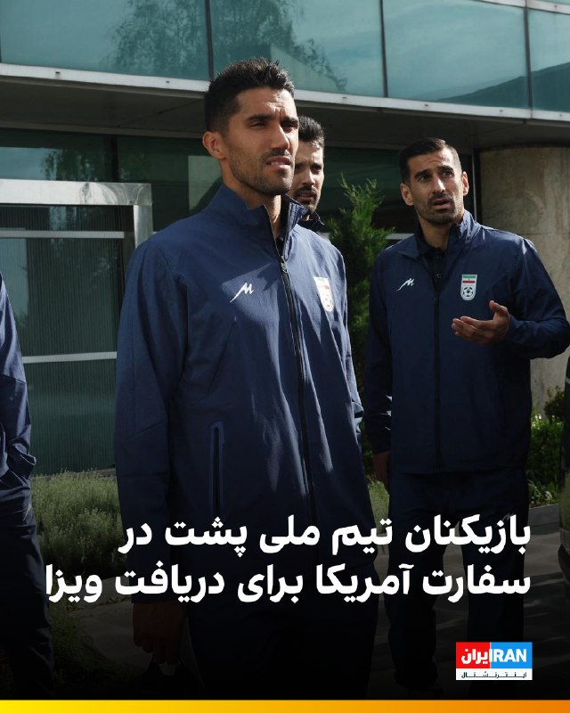

🔻تیم ملی فوتبال، صبح پنج‌شنبه ۳۱ اردیبهشت، برای طی مراحل اداری دریافت ویزای آمریکا به سفارت این کشور در آنکارا رفت.

🔹فدراسیون فوتبال در فاصله حدود ۲۰ روز تا آغاز جام جهانی، با بحران ویزا دست‌به‌گریبان است. امیر قلعه‌نویی هنوز نمی‌داند کدام بازیکنان ویزا دریافت خواهند کرد و چه نفراتی را در آمریکا در اختیار خواهد داشت.

🔹احتمال دارد برای برخی اعضای کاروان ایران، به دلیل سوابق فعالیت یا ارتباط با سپاه پاسداران، ویزا صادر نشود.

@iranintltvsport

## IranIntlTV — post 338212

  <a href="telegram/content/IranIntlTV_338212_1779358551.mp4" target="_blank">🎬 Download video</a>

ویدیوی رسیده به ایران‌اینترنشنال نشان می‌دهد که شامگاه ۲۹ اردیبهشت در بندر کُنگ، یکی از شهرهای تابعه شهرستان بندر لنگه در استان هرمزگان، صف طولانی بنزین تشکیل شده است.

مسعود پزشکیان، رییس دولت جمهوری اسلامی، اعلام کرد در پی محاصره دریایی آمریکا، صادرات نفت ایران متوقف شده و کشور روزانه با کمبود ۵۰ میلیون لیتر بنزین روبه‌رو است، اما دلاری برای واردات آن وجود ندارد. ساعتی پس از انتشار سخنان پزشکیان، رسانه‌های دولتی از جمله ایرنا اقدام به حذف این اظهارات کردند.

## IranIntlTV — post 338211

  <a href="telegram/content/IranIntlTV_338211_1779358552.mp4" target="_blank">🎬 Download video</a>

خبرگزاری میزان، رسانه قوه قضاییه جمهوری اسلامی، از اعدام رامین زله و کریم معروف‌پور به اتهام «عضویت در گروه‌های تروریستی»، «تشکیل گروه با هدف بر هم زدن امنیت کشور» و «قیام مسلحانه» خبر داد.
هم‌زمان، سازمان حقوق بشر ایران از اعدام مخفیانه دو شهروند عراقی به نام‌های علی نادر العبیدی و فاضل شیخ کریم در ۱۷ فروردین، در زندان مرکزی کرج خبر داد.

گفت‌وگو با رضا اکوانیان، روزنامه‌نگار و فعال حقوق بشر
@iranintltv

## IranIntlTV — post 338210

  <a href="telegram/content/IranIntlTV_338210_1779358554.mp4" target="_blank">🎬 Download video</a>

مرتضی کاظمیان، عضو تحریریه ایران‌اینترنشنال، گفت: «وضعیت موجود میان جمهوری اسلامی و ایالات متحده تا وقتی که تکلیف منافع آمریکا، به‌صورت استراتژیک، مشخص نشود ادامه خواهد داشت.» او افزود در چنین وضعیتی، «سایه جنگ نه‌تنها بر جمهوری اسلامی، بلکه بر سر ایران باقی خواهد ماند».
@iranintltv

## IranIntlTV — post 338209

  

🔻انتشار گزارش‌هایی درباره احتمال ممنوعیت ورود پرچم شیر و خورشید به ورزشگاه‌های میزبان جام جهانی، موجی از واکنش‌ها را میان ایرانیان و فعالان سیاسی ایجاد کرده است. در تازه‌ترین اقدام، یک نهاد مدنی برای مقابله با این تصمیم احتمالی، در مراجع قضایی آمریکا شکایت ثبت کرده است.

🔹اندیشکده «آوای آزادی» شکایتی را علیه فدراسیون بین‌المللی فوتبال، فیفا، در دادگاه فدرال حوزه مرکزی ایالت کالیفرنیا ثبت کرده است. هدف از این اقدام حقوقی این است که از ممانعت فیفا برای ورود پرچم شیر و خورشید به ورزشگاه‌های جام جهانی جلوگیری کند.

🔹این اقدام پس از آن صورت گرفت که نشریه اتلتیک در گزارشی نوشت فیفا تحت فشار و به درخواست فدراسیون فوتبال جمهوری اسلامی، قصد دارد مانع ورود پرچم شیر و خورشید به استادیوم‌های محل برگزاری مسابقات شود.

🔹یکی از دغدغه‌های اصلی مقام‌های جمهوری اسلامی، احتمال شکل‌گیری فضای اعتراضی و سر دادن شعارهای ضدحکومتی در جریان این مسابقات است.

🔹جزییات بیشتر را در سایت بخوانید.

@iranintltvsport

## IranIntlTV — post 338208

  <a href="telegram/content/IranIntlTV_338208_1779358556.mp4" target="_blank">🎬 Download video</a>

ویدیوی رسیده به ایران‌اینترنشنال نشان‌دهنده استقرار خودروی زرهی نوپو (نیروی ویژه پاسدار ولایت) در تهران است که به عنوان یکی از واحدهای تابع یگان ویژه وظایفی چون سرکوب معترضان در پایتخت را برعهده دارد.

## IranIntlTV — post 338207

  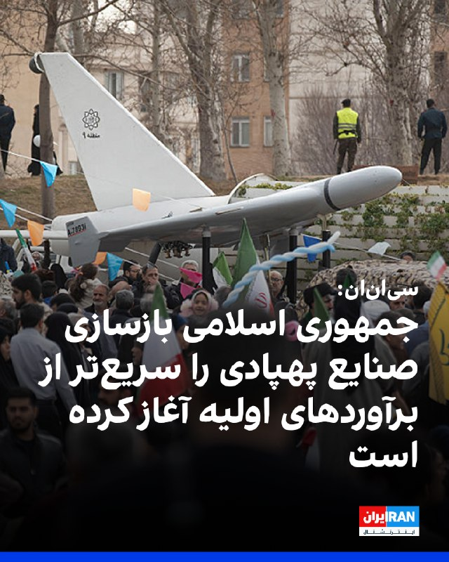

شبکه سی‌ان‌ان به نقل از منابع آگاه از ارزیابی‌های اطلاعاتی آمریکا گزارش داد جمهوری اسلامی در جریان آتش‌بس شش‌هفته‌ای بخشی از تولید پهپادهای خود را از سر گرفته است.

بر اساس این گزارش، این موضوع نشانه‌ای از آن است که تهران با سرعت در حال بازسازی بخشی از توانمندی‌های نظامی خود است که در حملات آمریکا و اسرائیل آسیب دیده بود.

چهار منبع به سی‌ان‌ان گفتند اطلاعات آمریکا نشان می‌دهد ارتش جمهوری اسلامی بسیار سریع‌تر از برآوردهای اولیه در حال بازسازی و احیای توان خود است. این بازسازی شامل جایگزینی سایت‌های موشکی، پرتابگرها و ظرفیت تولید سامانه‌های تسلیحاتی کلیدی است که در جریان درگیری آسیب دیده یا نابود شده‌اند.

به گفته منابع آگاه از این ارزیابی‌ها، این روند به این معناست که در صورت ازسرگیری کارزار بمباران از سوی دونالد ترامپ، رییس‌جمهوری آمریکا، تهران همچنان تهدیدی جدی برای متحدان منطقه‌ای آمریکا خواهد بود.

یک مقام آمریکایی به سی‌ان‌ان گفت برخی برآوردهای اطلاعاتی نشان می‌دهد حکومت ایران ممکن است بتواند توان حمله پهپادی خود را ظرف شش ماه به‌طور کامل بازسازی کند.
https://iranintl.com/202605219929

## IranIntlTV — post 338204

  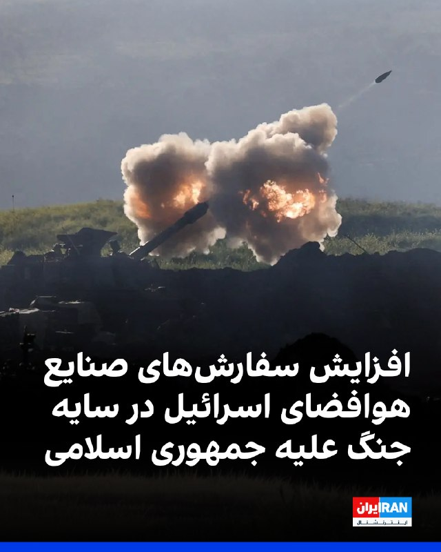

صنایع هوافضای اسرائیل در گزارش مالی سه‌ماهه نخست سال ۲۰۲۶ از ثبت رکوردهای تازه در فروش، سود خالص و حجم سفارش‌ها خبر داد. این آمار تحت تاثیر افزایش تقاضا برای سامانه‌های دفاعی، به‌ویژه پس از درگیری با جمهوری اسلامی، بوده است.

بر اساس گزارش مالی صنایع هوافضای اسرائیل که شامگاه چهارشنبه منتشر شد، فروش این شرکت در سه‌ماهه نخست سال ۲۰۲۶ از مرز دو میلیارد دلار گذشت و سود خالص آن حدود ۳۴ درصد افزایش یافت. همچنین حجم سفارش‌های ثبت‌شده این شرکت به حدود ۳۳ میلیارد دلار رسید؛ رقمی که بالاترین سطح در تاریخ صنایع هوافضای اسرائیل توصیف شده و معادل حدود چهار سال و نیم فعالیت این شرکت است.
https://iranintl.com/202605219713

## IranIntlTV — post 338202

  <a href="telegram/content/IranIntlTV_338202_1779358558.mp4" target="_blank">🎬 Download video</a>

در حالی که پاکستان نقش میانجی اصلی را در مذاکرات میان واشینگتن و تهران ایفا می‌کند، هم‌زمان به حمایت گسترده نظامی از عربستان سعودی، یکی از رقبای اصلی جمهوری اسلامی، ادامه داده است.
@iranintltv

## IranIntlTV — post 338201

  <a href="telegram/content/IranIntlTV_338201_1779358559.mp4" target="_blank">🎬 Download video</a>

جاویدنامان انقلاب ملی ایرانیان
«محمد گلی»، آتش‌نشان ۴۳ ساله و اهل نجف‌آباد اصفهان، در ۱۸ دی ماه جان خود را فدای مردم معترض کرد. نامش در حافظه‌ این سرزمین می‌ماند و یادش چراغ راه آزادی‌خواهان است.
@iranintltv

## IranIntlTV — post 338200

  <a href="telegram/content/IranIntlTV_338200_1779358561.mp4" target="_blank">🎬 Download video</a>

کانال ۱۲ اسرائیل گزارش داد بنیامین نتانیاهو و دونالد ترامپ در تماسی پرتنش، بر سر طرح میانجی‌ها برای جلوگیری از آغاز دوباره جنگ اختلاف‌نظر داشتند. بر اساس این گزارش، نتانیاهو همچنان خواهان ادامه فشار نظامی بر جمهوری اسلامی است، در حالی که میانجی‌ها از جمله قطر و پاکستان، به‌ دنبال طرحی برای پایان جنگ و آغاز مذاکرات ۳۰ روزه هستند.

ارزیابی بن سبطی، پژوهش‌گر مسائل ایران و اسرائیل
@iranintltv

## IranIntlTV — post 338199

  <a href="telegram/content/IranIntlTV_338199_1779358562.mp4" target="_blank">🎬 Download video</a>

دونالد ترامپ، رییس‌جمهوری آمریکا، گفت با افرادی «منطقی‌تر» در تهران گفت‌وگو کرده و اکنون منتظر دریافت پاسخ جمهوری اسلامی درباره توافق است. ترامپ تاکید کرد اگر این صبر به جلوگیری از جنگ کمک کند، ارزشمند خواهد بود.

گفت‌وگو با حسین علیزاده، تحلیل‌گر مسائل بین‌الملل
@iranintltv

## Shin_Persian — post 6120

Shin ✓ @hey_itsmyturn
Thu, 21 May 2026 10:02:55 UTC

3 blasts were just heard in Qeshm island.
(Highly likely EOD)
Hormozgan Province, #Iran

فارسی

۳ انفجار دقایقی پیش در جزیره قشم شنیده شد.
(احتمال زیاد خنثی‌سازی مهمات - EOD)
استان هرمزگان، #Iran_

𝕏 · @shin_persian

## ManotoTV — post 105714

  <a href="telegram/content/ManotoTV_105714_1779358563.mp4" target="_blank">🎬 Download video</a>

انور قرقاش، مشاور سیاست خارجی رئیس امارات متحده عربی، در حساب ایکس خود نوشت جمهوری اسلامی پس از تجاوز و شکست نظامی آشکار، در تلاش است واقعیتی جدید را بر منطقه تحمیل کند، اما تلاش برای کنترل تنگه هرمز یا تعرض به حاکمیت دریایی امارات «چیزی جز رویاپردازی نیست.»
قرقاش افزود کشورهای عربی خلیج فارس دهه‌ها به «زورگویی‌های ایران» عادت کرده‌اند؛ تا جایی که این رفتار به بخشی از فضای سیاسی منطقه تبدیل شده و شکاف عمیقی میان شعارهای تهاجمی تهران و ادعاهای دوستی ایجاد کرده است.
او همچنین تأکید کرد هر کشوری که خواهان همزیستی با جهان عرب است باید بداند اعتماد از دست رفته و بازسازی آن نه با شعار، بلکه با احترام به حاکمیت کشورها، زبان مسئولانه و پایبندی واقعی به اصول حسن همجواری ممکن خواهد بود.

## ManotoTV — post 105713

  <a href="telegram/content/ManotoTV_105713_1779358564.mp4" target="_blank">🎬 Download video</a>

بر اساس داده‌های مرکز پایش اینترنت نت‌بلاکس، خاموشی اینترنت در ایران اکنون وارد هشتادوسومین روز خود شده است.
نت‌بلاکس اعلام کرد دسترسی به شبکه‌های بین‌المللی برای بیش از ۱۹۶۸ ساعت به‌طور گسترده مسدود بوده است. این نهاد تأکید کرد اینترنت آزاد و باز نقشی اساسی در حفاظت از جان، آزادی و پاسخگویی عمومی دارد.

## ManotoTV — post 105712

  <a href="telegram/content/ManotoTV_105712_1779358564.mp4" target="_blank">🎬 Download video</a>

وزیران خارجه استرالیا و بلژیک در واکنش به ویدیوی منتشرشده از نحوه برخورد نیروهای اسرائیلی با فعالان «ناوگان آزادی» حامیان غزه، از احضار سفیران اسرائیل خبر دادند. در این ویدیو ده‌ها فعال حامی غزه با دستان بسته روی زمین زانو زده‌اند و ایتامار بن‌گویر، وزیر امنیت ملی اسرائیل، در حالی که پرچم این کشور را در دست دارد، به آن‌ها می‌گوید: «به اسرائیل خوش آمدید.»
ینی وانگ، وزیر خارجه استرالیا، این تصاویر را «غیرقابل قبول» توصیف کرد و گفت «رفتار تحقیرآمیز با بازداشت‌شدگان را محکوم می‌کند». وزیر خارجه بلژیک نیز تصاویر منتشرشده را «عمیقاً نگران‌کننده» خواند و اعلام کرد شماری از شهروندان بلژیک در میان بازداشت‌شدگان هستند.
همزمان جورجا ملونی، نخست‌وزیر ایتالیا، و پدرو سانچز، نخست‌وزیر اسپانیا، نیز این اقدام را محکوم کرده‌اند

## ManotoTV — post 105711

  <a href="telegram/content/ManotoTV_105711_1779358565.mp4" target="_blank">🎬 Download video</a>

سی‌ان‌ان به نقل از منابع اطلاعاتی آمریکا گزارش داد جمهوری اسلامی بازسازی زیرساخت‌های نظامی و تولید پهپاد را سریع‌تر از برآوردهای اولیه از سر گرفته است.
بر اساس این گزارش، ایران در جریان آتش‌بس شش‌هفته‌ای که از اوایل آوریل آغاز شد، بخشی از تولید پهپادهای خود را دوباره راه‌اندازی کرده است. منابع آگاه گفته‌اند این موضوع نشان می‌دهد تهران در حال بازسازی سریع توان نظامی آسیب‌دیده خود در حملات آمریکا و اسرائیل است.
چهار منبع مطلع نیز به سی‌ان‌ان گفته‌اند ارزیابی نهادهای اطلاعاتی آمریکا نشان می‌دهد روند بازسازی ارتش ایران بسیار سریع‌تر از آن چیزی است که پیش‌تر تخمین زده می‌شد
به گفته این منابع، بازسازی پایگاه‌های موشکی، سکوهای پرتاب و ظرفیت تولید سامانه‌های تسلیحاتی نشان می‌دهد ایران همچنان در صورت ازسرگیری حملات، تهدیدی جدی برای متحدان منطقه‌ای آمریکا خواهد بود.
یکی از مقام‌های آمریکایی نیز گفته است برخی برآوردهای اطلاعاتی نشان می‌دهد ایران ممکن است ظرف شش ماه توان کامل حملات پهپادی خود را بازیابی کند.

## ManotoTV — post 105710

  <a href="telegram/content/ManotoTV_105710_1779358566.mp4" target="_blank">🎬 Download video</a>

رسانه‌های اسرائیل به نقل از سی‌ان‌ان گزارش دادند تماس تلفنی اخیر دونالد ترامپ و بنیامین نتانیاهو درباره ایران، «پرتنش» بوده است. بر اساس این گزارش، نتانیاهو خواهان ازسرگیری حملات به ایران شده اما ترامپ خواستار زمان بیشتر برای ادامه دیپلماسی بوده است.
به گزارش رسانه‌های اسرائیل، نتانیاهو گفته تعلل آمریکا به سود ایران است، در حالی که ترامپ تأکید کرده ترجیح می‌دهد فرصت بیشتری به مسیر دیپلماتیک داده شود.
همزمان، وال‌استریت ژورنال گزارش داد اسرائیل نسبت به پایبندی جمهوری اسلامی به هرگونه توافق هسته‌ای تردید دارد و مقام‌های اسرائیلی از آنچه «وقت‌کشی دیپلماتیک ایران» می‌خوانند ابراز نارضایتی کرده‌اند.

دو طرف است

## ManotoTV — post 105709

  <a href="telegram/content/ManotoTV_105709_1779358566.mp4" target="_blank">🎬 Download video</a>

روزنامه تلگراف در گزارشی به واحد مخفی دلفین‌های نیروی دریایی آمریکا پرداخت؛ واحدی که از دوران جنگ سرد برای شناسایی مین‌های دریایی و کمک به عملیات مین‌روبی ایجاد شده است.
بر اساس این گزارش، دلفین‌های پوزه‌بطری با استفاده از توانایی مکان‌یابی صوتی، مین‌ها و اجسام زیر آب را با دقت بالا شناسایی کرده و محل آن‌ها را به نیروهای نظامی اطلاع می‌دهند تا به‌صورت ایمن خنثی شوند.
تلگراف تأکید کرده این دلفین‌ها برای منفجر کردن مین‌ها آموزش نمی‌بینند، بلکه وظیفه آن‌ها شناسایی تهدیدها و کمک به باز نگه داشتن مسیرهای دریایی است.
این گزارش همزمان با افزایش تنش‌ها در تنگه هرمز منتشر شده و به نقش احتمالی این واحد ویژه در تأمین امنیت کشتیرانی در من اشاره می‌کند.

## ManotoTV — post 105708

  <a href="telegram/content/ManotoTV_105708_1779358567.mp4" target="_blank">🎬 Download video</a>

دومین زمین‌لرزه در کمتر از ۱۰ ساعت گذشته، دریای خزر در حوالی شهرستان مرزی آستارا را لرزاند. بنا بر گزارش رسانه‌های داخلی، این زمین‌لرزه ۳.۸ ریشتر قدرت داشته است.
هنوز گزارشی از خسارات احتمالی یا تلفات منتشر نشده است.

## ManotoTV — post 105707

  <a href="telegram/content/ManotoTV_105707_1779358567.mp4" target="_blank">🎬 Download video</a>

وب‌سایت وای‌نت به نقل از یک مقام ارشد اسرائیلی گزارش داد که «جنگ بعدی با ایران، آخرین جنگ نخواهد بود» و تا زمانی که جمهوری اسلامی در قدرت باشد، احتمال تکرار درگیری‌ها وجود دارد.
این مقام گفته است باید «انتظارات عمومی بازتنظیم شود» زیرا حتی در صورت حمله‌ای دیگر، تهدیدها علیه اسرائیل پایان نخواهد یافت. به گفته او، در صورت ادامه وضعیت کنونی، ممکن است درگیری‌ها هر سال یا حتی در بازه‌های کوتاه‌تر تکرار شوند.
این مقام اسرائیلی همچنین مدعی شد هدف از این سیاست، مهار تهدید هسته‌ای و برنامه موشک‌های بالستیک ایران علیه موجودیت اسراییل است.

## FarsiVOA — post 218279

🔺رکورد جمهوری اسلامی در ایجاد محدودیت ارتباطی برای شهروندان به مرز ۲۰۰۰ ساعت رسید

▪️جمهوری اسلامی باز هم رکورد خود در ایجاد محدودیت در دسترسی به اینترنت را بالاتر برد و اکنون شهروندان ایرانی هشتادوسومین روز از خاموشی دیجیتال را تجربه می‌کنند.

▪️براساس گزارش نت‌بلاکس، نهاد ناظر بر اختلالات اینترنت، خاموشی اینترنت از مرز هزار و ۹۸۶ ساعت گذشته است.

▪️به گفته نت‌بلاکس، اینترنت آزاد و باز، نقشی اساسی در حفاظت از جان انسان‌ها، آزادی، و پاسخ‌گویی عمومی دارد.

▪️این سطح بی‌سابقه از محدودیت نشان می‌دهد که قطع اینترنت دیگر یک ابزار موقت و اضطراری برای مهار کوتاه‌مدت اعتراضات یا مواجه با شرایط بحرانی نیست، بلکه به عنوان یک زیرساخت یکپارچه برای کنترل مطلق جریان اطلاعات به کار گرفته شده است.

⬇️ بیشتر بخوانید:
https://ir.voanews.com/a/8152359.html

## FarsiVOA — post 218278

  

وزارت خارجه چین اعلام کرد که شهباز شریف، نخست‌وزیر پاکستان، از ۲۳ تا ۲۶ مه (دوم تا پنجم خرداد) به چین سفر خواهد کرد. این سفر سه روز پس از سفرهای اخیر رهبران آمریکا و روسیه به چین صورت می‌گیرد.

همچنین محمد اسحاق دار، وزیر خارجه پاکستان در اواخر ماه مارس و در بحبوحه تلاش‌های فشرده برای کاهش تنش‌ها در خاورمیانه به پکن سفر کرده بود.

پاکستان در روزهای اخیر تلاش‌های دیپلماتیک خود را برای تسریع مذاکرات صلح میان آمریکا و ایران افزایش داده است.

در حالی که تهران اعلام کرد در حال بررسی پاسخ‌های جدید واشنگتن است، دونالد ترامپ، رئیس‌جمهور آمریکا، گفته ممکن است چند روز برای «پاسخ‌های درست» از تهران صبر کند، اما او هشدار داده که آماده ازسرگیری حملات به جمهوری اسلامی است.
@FarsiVOA

## FarsiVOA — post 218277

🔺جهش ۴۰ درصدی فروش خودروهای برقی در خاورمیانه

▪️آژانس بین‌المللی انرژی از جهش ۴۰ درصدی فروش خودروهای برقی در خاورمیانه طی سال ۲۰۲۵ خبر داد.

▪️سال گذشته ۷۵ هزار دستگاه خودرو برقی در خاورمیانه به فروش رفته که نیمی از آنها در امارات و ۴۵ درصد در عربستان و قطر ثبت شده است.

▪️فروش خودروهای برقی در آسیای مرکزی نیز به شدت اوج گرفته و به ۶۰ هزار دستگاه در سال گذشته رسیده است.

▪️بازار ترکیه کماکان صدرنشین فروش خودروهای برقی منطقه است و پارسال ۲۴۰ هزار دستگاه خودرو برقی در این کشور به فروش رسیده که دو برابر سال ۲۰۲۴ است.

⬇️ بیشتر بخوانید:
https://ir.voanews.com/a/8152358.html

## FarsiVOA — post 218276

  

وزارت خارجه مصر اعلام کرد که وزیر خارجه این کشور در دو تماس جداگانه با همتایان قطری و سعودی خود درباره مذاکرات جاری میان تهران و واشنگتن گفت‌وگو کرد.

در بیانیه وزارت خارجه مصر آمده که این تماس‌ها از سوی بدر عبدالعاطی در روز چهارشنبه صورت گرفته است. این بیانیه می‌افزاید: «در این دو تماس، هماهنگی مستمر درباره تحولات شتابان منطقه و تلاش‌های مشترک برای مهار وضعیت کنونی تنش و کاهش تنش مورد بحث قرار گرفت.»

بر اساس این گزارش، عبدالعاطی «از موضع رئیس‌جمهور آمریکا، دونالد ترامپ، در فراهم کردن فرصت برای گفت‌وگو و دیپلماسی به منظور حل اختلافات و جلوگیری از گرفتار شدن منطقه در خطر کشیده شدن به رویارویی‌های گسترده‌تر، قدردانی کرد.»

وزیر خارجه مصر همچنین بر «اهمیت بسیار بالای ادامه مسیر مذاکرات آمریکا - ایران تا دستیابی به توافقی متوازن که منافع همه طرف‌ها را تأمین کند»، تأکید کرد.

او با این حال گفت که «هرگونه توافق باید نگرانی‌های امنیتی کشورهای منطقه، به‌ویژه امنیت و ثبات کشورهای خلیج فارس را مدنظر قرار دهد، زیرا این موضوع یکی از ارکان اساسی امنیت ملی مصر و جهان عرب به شمار می‌رود.»
@FarsiVOA

## FarsiVOA — post 218275

  

رسانه‌های ایران گزارش دادند که عاصم منیر، رئیس ستاد ارتش پاکستان روز پنجشنبه به تهران سفر خواهد کرد. این سفر در ادامه سفرهای مکرر مقامات بلندپایه پاکستانی به تهران در چارچوب میانجیگری برای پایان جنگ علیه جمهوری اسلامی است.

خبرگزاری ایسنا نوشت که منیر در جریان این سفر با مقامات حکومت ایران گفت‌وگو خواهد کرد.

روز چهارشنبه نیز وزیر کشور پاکستان در تهران بود و شامگاه چهارشنبه سخنگوی وزارت خارجه جمهوری اسلامی اعلام کرد که مقامات حکومت ایران در حال بررسی آخرین نظرات دولت آمریکا درباره مذاکرات برای پایان دادن به جنگ هستند.

دونالد ترامپ، رئیس‌جمهور آمریکا، روز دوشنبه با اعلام توقف موقت یک حمله برنامه‌ریزی‌شده به حکومت ایران، اعلام کرد که این تصمیم برای به نتیجه رسیدن مذاکرات جاری بوده است.

آقای ترامپ اعلام کرده که آماده است چند روزی صبر کند تا «پاسخ‌های درست» را از تهران دریافت کند، اما هشدار داده که اگر توافقی حاصل نشود، حملات از سر گرفته خواهند شد.
@FarsiVOA

## FarsiVOA — post 218274

  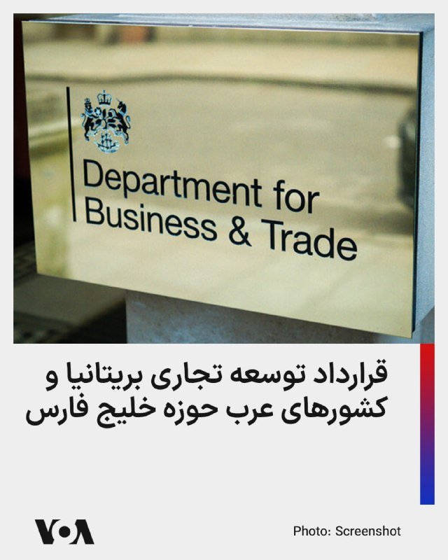

وزارت تجارت بریتانیا از امضای قرارداد لغو بخشی از تعرفه‌ کالاهای صادراتی این کشور با اعضای شورای همکاری خلیج فارس خبر داد. طبق توافق، سالانه ۵۸۰ میلیون پوند (۷۸۰ میلیون دلار) تعرفه کشورهای عرب حوزه خلیج فارس بر صادرات کالاهای بریتانیایی لغو شد.

وزارت بازرگانی بریتانیا می‌گوید ارزش این قرارداد با کشورهای عربستان، امارات، قطر، بحرین، عراق و عمان بر اقتصاد این کشور پنج میلیارد دلار خواهد بود.

این قرارداد در میانه تنش‌های منطقه، انسداد تنگه هرمز توسط جمهوری اسلامی و محاصره دریایی جمهوری اسلامی توسط آمریکا امضا شد. پیشتر بریتانیا قراردادهای مشابهی با هند و کره جنوبی امضا کرده بود.
@FarsiVOA

## DW_Farsi — post 124953

  

📸 کلاه‌ها به نشانه شادی در هوا

مراسم پایانی دوره افسری گارد ساحلی ایالات متحده در نیولندن با شادی فارغ‌التحصیلان برگزار شد. آکادمی گارد ساحلی آمریکا پیشینه‌ای طولانی دارد. در جشن امسال دونالد ترامپ، رئیس جمهور آمریکا حضور داشت و سخنانی خطاب به فارغ‌التحصیلان ایراد کرد. پرسنل گارد ساحلی آمریکا بیش از ۴۳ هزار نفر است.

## DW_Farsi — post 124952

  

🔶 عاصم منیر، فرمانده ارتش پاکستان، راهی تهران می‌شود

رسانه‌های داخلی ایران گزارش داده‌اند فیلد مارشال عاصم منیر، فرمانده ارتش پاکستان، روز پنج‌‌شنبه ۳۱ اردیبهشت به تهران سفر می‌کند. این سفر در حالی صورت می‌گیرد که روز چهارشنبه نیز وزیر کشور پاکستان برای دومین بار در هفته جاری به تهران رفته و با مسعود پزشکیان، رئیس جمهور و اسکندر مؤمنی وزیر کشور ایران دیدار و گفت‌وگو کرده بود.

در این گزارش‌ها بدون اشاره به جزئیات بیشتر گفته شده که عاصم منیر برای "ادامه گفت‌وگو‌ها و رایزنی با مقامات" ایرانی در چارچوب تلاش‌های میانجی‌گرانه پاکستان میان ایران و آمریکا راهی تهران می‌شود.

@dw_farsi

## DW_Farsi — post 124951

  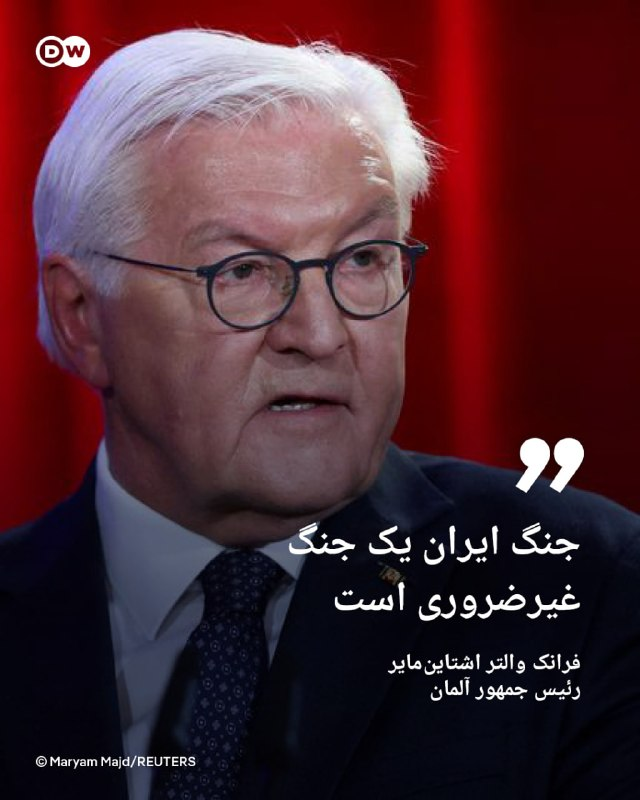

🔶 رئیس جمهور آلمان: جنگ ایران یک جنگ غیرضروری است

فرانک والتر اشتاین‌مایر، رئیس جمهور آلمان، در گفت‌وگویی با پادکست "Vorangedacht" حمله نظامی آمریکا و اسرائیل به ایران را "قابل اجتناب" خوانده و گفت: «این جنگ غیرضروری است.»

اشتاین مایر با اشاره به توافق هسته‌ای سال ۲۰۱۵ موسوم به "برجام" که میان ایران و غرب امضا شد و آمریکا در نخستین دوره ریاست‌جمهوری دونالد ترامپ در سال ۲۰۱۸ از آن خارج شد، گفت: «خوب می‌بود که ما این توافق را حفظ می‌کردیم. عواقبی که اکنون شاهد آن هستیم، نباید اتفاق می‌افتادند.»

رئیس جمهور آلمان اوایل فروردین نیز در یک سخنرانی شدیدالحن، جنگ ایران را "یک خطای سیاسی فاجعه‌بار" خوانده و گفته بود اگر هدف آن متوقف کردن ایران در مسیر دستیابی به سمت بمب اتمی بوده باشد، "یک جنگ واقعا قابل اجتناب و غیرضروری" است.

@dw_farsi

## DW_Farsi — post 124950

  

🔶 سازمان حقوق بشر ایران: دو شهروند عراقی در ایران به اتهام جاسوسی اعدام شدند

"سازمان حقوق بشر ایران" روز چهارشنبه ۳۰ اردیبهشت از اعدام دو شهروند عراقی در زندان مرکزی کرج خبر داد.

این سازمان هویت این دو نفر را علی نادر العبیدی ۲۷ ساله و فاضل شیخ کریم ۲۹ ساله معرفی کرده و گفته است که آنها در یک پرونده مشترک به اتهام "جاسوسی"، سحرگاه روز دوشنبه ۱۷ فروردین در سکوت خبری اعدام شدند.

طبق این گزارش این دو زندانی از شهروندان عرب و اهل شهر عماره در عراق بوده‌اند که پیش‌تر در کرج بازداشت و به "جاسوسی برای نهادهای اطلاعاتی و امنیتی یکی از کشورهای عربی" متهم شده بودند.

یک منبع مطلع به سازمان حقوق بشر ایران گفته است علی نادر العبیدی و فاضل شیخ کریم پیش از صدور حکم، "به مدت ۱۱ ماه در بازداشتگاه وزارت اطلاعات تحت بازجویی قرار داشتند و سپس به بند اطلاعات سپاه در زندان رجایی‌شهر کرج منتقل شدند".

طبق این گزارش،‌ این دو زندانی در نهایت برای اجرای حکم اعدام به ندامتگاه مرکزی کرج منتقل شده بودند.

@dw_farsi

## DW_Farsi — post 124949

  

🔶 دو تن به اتهام "عضویت در گروه‌های تروریستی" در ایران اعدام شدند

خبرگزاری میزان، ارگان رسمی قوه قضائیه ایران، از اعدام دو تن به اتهام "عضویت در گروه‌های تروریستی تجزیه‌طلب" و "قیام مسلحانه از طریق تشکیل گروه‌های مجرمانه" در صبح پنج‌شنبه ۳۱ اردیبهشت خبر داد.

در این گزارش هویت این دو نفر، رامین زله و کریم معروف‌پور معرفی شده، اما به نام گروهی که آنها متهم به عضویت در آن بوده‌اند، اشاره‌ای نشده است.

میزان ادعا کرده است که رامین زله و کریم معروف‌پور برای "ترور فرمانده پایگاه سپاه" یکی از شهرستان‌های غرب کشور "همکاری" داشته‌اند. به ادعای میزان، رامین زله پس از "طی دوره‌های آموزشی از طرف یک گروهک ماموریت پیدا کرده بود تا در ناآرامی‌های کشور به عنوان لیدر شرکت کند".

در این گزارش ادعا شده است که او در اعترافات خود گفته است که به سمت یک خودرو حامل نیروهای نظامی "شلیک و از این عملیات فیلمبرداری کرده‌اند". به ادعای میزان کریم معروف‌‌پور در اعترافات خود اقرار کرده است که از "اقدامات مسلحانه" این گروه "آگاهی داشته" و یکی از مسئولیت‌هایش "نگهداری سلاح برای انجام عملیات‌های تروریستی" بوده است.

@dw_farsi

## DW_Farsi — post 124948

  

🔶 جام‌های ۱۹۷۰ و ۱۹۷۴؛ گرد مولر، "بمب‌افکن" تیم ملی آلمان

گرد مولر که در نوک حمله‌ی تیم فوتبال باشگاه بایرن مونیخ و تیم ملی فوتبال آلمان بازی می‌کرد، در فاصله‌ی سال‌های ۱۹۶۶ تا ۱۹۷۴، در تیم ملی آلمان جزو محور اسطوره‌ای "مایر ـ بکن‌باوئر ـ مولر" به شمار می‌رفت و در تاریخ فوتبال آلمان و جهان رکوردهای شگفت‌انگیزی برجای گذاشت.

اگر چه ستاره گرد مولر در سال ۱۹۶۶ درخشیدن گرفت، اما هلوت شون، سرمربی تیم ملی فوتبال آلمان او را پس از جام جهانی ۱۹۶۶ انگلیس به تیم ملی دعوت کرد. با این حساب، گرد مولر در دو دوره جام جهانی (۱۹۷۰ و ۱۹۷۴) حضور داشت.

او که در تاریخ ۳ نوامبر سال ۱۹۴۵ در نوردلینگن (آلمان) متولد شد، برای نخستین بار در ۲۱ سالگی پیراهن تیم ملی فوتبال آلمان را به تن کرد و ۸ سال در خدمت این تیم بود؛ در این ۸ سال روی هم ۶۲ بازی برای تیم ملی فوتبال آلمان انجام داد و ۶۸ گل به ثمر رساند، یعنی به طور میانگین بیش از یک گل در هر بازی.

@dw_farsi

## DW_Farsi — post 124947

  

🔶 استقبال اردوغان از تمدید آتش‌بس آمریکا با ایران در گفت‌وگو با ترامپ

دفتر ریاست‌جمهوری ترکیه اعلام کرد رجب طیب اردوغان روز چهارشنبه ۲۰ مه در تماس تلفنی با دونالد ترامپ، از تمدید آتش‌بس میان آمریکا و ایران استقبال و تأکید کرد، مسائل مورد اختلاف میان دو طرف قابل حل و فصل است.

ترکیه که عضو ناتو و همسایه ایران است، در هفته‌های گذشته با هدف پایان دادن به جنگ، با ایران، واشنگتن و پاکستان که میانجیگری مذاکرات میان ایران و آمریکا را بر عهده دارد، در تماس بوده است.

در بیانیه‌ای که دفتر اردوغان منتشر کرده، آمده است: «رئیس‌جمهور [ترکیه] در این گفت‌وگو اظهار داشت که تصمیم برای تمدید آتش‌بس را تحولی مثبت می‌داند و باور دارد که راه‌حلی منطقی برای مسائل مورد اختلاف امکان‌پذیر است.»

در این بیانیه همچنین گفته شده است که اردوغان در گفت‌وگو با ترامپ بازگشت ثبات به سوریه را "دستاوردی مهم" برای منطقه توصیف کرده و خواستار اقداماتی برای جلوگیری از وخیم‌تر شدن اوضاع لبنان در پی ادامه حملات متقابل اسرائیل و حزب‌الله شده است.

@dw_farsi

## Persian_Trend_Official — post 14573

  

⭕️ ژاپن به ساخت هواپیمای مافوق صوت خود نزدیک شده است. آژانس فضایی ژاپن (JAXA) به همراه دانشگاه‌های واسدا، توکیو و کیئو آزمایش‌های زمینی موتور رمجت (Ramjet) برای وسیله پروازی مافوق صوتی که قادر به پرواز با سرعتی پنج برابر سرعت صوت است را انجام دادند.

آزمایش‌ها در مرکز فضایی کاکودا انجام شد. در تونل باد، دانشمندان پرواز مافوق صوت را شبیه‌سازی کردند و عملکرد موتور رمجت، سیستم‌های کنترل و محافظ حرارتی هواپیما را بررسی کردند. در سرعت ۵ ماخ (تقریباً حدود ۶۱۰۰ کیلومتر بر ساعت) دمای هوای اطراف وسیله می‌تواند به حدود ۱۰۰۰ درجه سانتی‌گراد برسد، اما سیستم محافظ حرارتی توانست شرایط تقریباً نرمالی را برای عملکرد الکترونیک داخل سازه حفظ کند.

این پروژه به منظور ساخت یک سکوی آزمایشی مافوق صوت طراحی شده است. مرحله بعدی باید آزمایش‌های پروازی کامل با نصب وسیله آزمایشی روی یک راکت ژئوفیزیکی باشد. هدف اصلی برنامه ایجاد فناوری‌هایی برای هواپیماها و فضاپیماهای مافوق صوت آینده است.

در JAXA معتقدند که در آینده این فناوری‌ها امکان کاهش زمان پرواز بین ژاپن و آمریکا از طریق اقیانوس آرام را به حدود دو ساعت فراهم می‌کنند. علاوه بر این، تحقیقات می‌توانند پایه‌ای برای ساخت وسایلی باشند که قادر به صعود تا ارتفاع حدود ۱۰۰ کیلومتر هستند.

📝 Nick

📌 @persian_trend_official
پرشین ترند | متفاوت‌ترین کانال نظامی

## Persian_Trend_Official — post 14572

  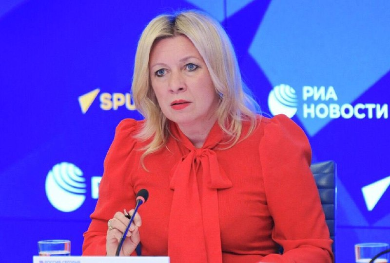

💢سخنگوی وزارت خارجه روسیه: مسکو آماده کمک به اجرای توافقات احتمالی میان ایران و آمریکا است

💢ماریا زاخارووا، سخنگوی وزارت امور خارجه روسیه گفت، روسیه کاملاً آماده است کمک‌های لازم را به تهران و واشنگتن برای اجرای تصمیماتی که ممکن است در جریان مذاکرات میان آن‌ها حاصل شود، ارائه دهد.

🫆:Tony

📌 @persian_trend_official
پرشین ترند | متفاوت‌ترین کانال نظامی

## Persian_Trend_Official — post 14571

  <a href="telegram/content/Persian_Trend_Official_14571_1779358574.mp4" target="_blank">🎬 Download video</a>

💢 لو رفتن موقعیت توسط نیروهای خودی و گیر افتادن ۴۸ ساعته و خفه شدن نیروهای سپاه پاسداران داخل تونل موشکی

🫆:Tony

📌 @persian_trend_official
پرشین ترند | متفاوت‌ترین کانال نظامی

## Persian_Trend_Official — post 14570

  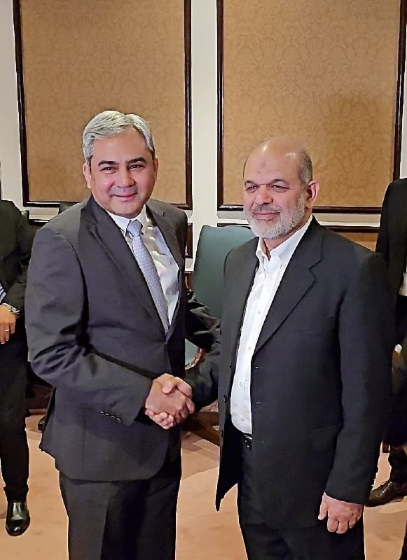

به بهانه امنیت اینترنت 80 میلیون ایرانی رو قطع میکنن !
اونوقت با پاکستانی ها دیدار میکنن !
بعد مه ترورش کردن میگن وحیدی رو از طریق اینترنت رد زنی کردن !!!

📌 @persian_trend_official
پرشین ترند | متفاوت‌ترین کانال نظامی

## Persian_Trend_Official — post 14569

بازارهای خلیج فارس با امید به توافق جمهوری اسلامی و آمریکا رشد کردند

خبرگزاری رویترز گزارش داد بازارهای سهام خلیج فارس در آغاز معاملات پنج‌شنبه ۳۱ اردیبهشت، تحت تاثیر امیدها به نزدیک شدن آمریکا و جمهوری اسلامی به توافقی برای پایان جنگ خاورمیانه و همچنین افزایش قیمت نفت، رشد کردند.

بر اساس این گزارش، سرمایه‌گذاران پس از سخنان دونالد ترامپ درباره قرار داشتن مذاکرات با جمهوری اسلامی در مراحل پایانی، نشانه‌های پیشرفت در گفت‌وگوها را دنبال می‌کنند.

ترامپ هم‌زمان هشدار داده اگر جمهوری اسلامی با توافق موافقت نکند، حملات بیشتری انجام خواهد شد.

شاخص بورس دبی یک درصد، شاخص ابوظبی ۰/۲ درصد و شاخص قطر ۰/۶ درصد افزایش یافتند. در مقابل، شاخص بورس عربستان سعودی اندکی کاهش یافت. قیمت نفت برنت نیز با رشد بیش از یک درصدی به ۱۰۶ دلار و ۲۹ سنت در هر بشکه رسید.

📌 @persian_trend_official
پرشین ترند | متفاوت‌ترین کانال نظامی

## RadioFarda — post 157414

  

🔸شبکه تلویزیونی سی‌ان‌ان ۳۱ اردیبهشت به نقل از چند مقام اطلاعاتی آمریکا نوشت که سپاه پاسداران انقلاب اسلامی «بسیار سریع‌تر از آن چه تصور می‌شد» در حال بازسازی قابلیت‌ها و شاخه‌هایی از صنایع نظامی است که در اثر حملات آمریکا و اسرائیل آسیب شدید دیده بود.

🔸این شبکه به نقل از دو مقام آشنا به ارزیابی اطلاعاتی آمریکا نوشته است که در شش هفته‌ای که از آتش‌بس می‌گذرد، سپاه بازسازی صنایع خود را آغاز کرده و از جمله بخشی از چرخه تولید پهپاد را بار دیگر از سر گرفته است.

🔸چهار منبع به سی‌ان‌ان گفته‌اند که بازیابی قابلیت‌های نظامی در ایران بلافاصله پس از قطع حملات آمریکا و اسرائیل،‌ از جمله جایگزینی سایت‌های موشکی و پرتابگرها، به معنای آن است که ایران «هم‌چنان تهدیدی چشمگیر برای متحدان منطقه‌ای» آمریکا به شمار می‌رود.

🔸در دو تا سه هفته اول جنگی که با حملات مشترک آمریکا و اسرائیل در روز ۹ اسفند ۱۴۰۴ آغاز شد، دو کشور اعلام می‌کردند، سایت‌های موشکی و سایت‌های تولید پهپاد از جمله مهم‌ترین اهداف حملات بی‌امان آنها بود و گزارش‌های متعددی از خسارت‌های عمده این زمینه که به ایران وارد آمد، منتشر کردند.

@RadioFarda

## RadioFarda — post 157413

  

🔸با افزایش امیدهای بازار جهانی به دستیابی به توافق صلح در خاورمیانه و همچنین عبور چندین کشتی از تنگه هرمز، سهام بازارهای آسیایی در روز پنج‌شنبه ۳۱ اردیبهشت جهش کرد.

🔸علاوه بر موضوع مذاکرات ایران و آمریکا، سود مالی فراتر از انتظار شرکت انویدیا و مذاکرات برای جلوگیری از اعتصاب برنامه‌ریزی‌شده کارگران شرکت سامسونگ نیز در جهش سهام در توکیو، سئول و دیگر بازارهای آسیایی تأثیرگذار بوده است.

🔸اتحادیه کارگری بزرگ‌ترین تولیدکننده تراشه حافظه جهان، پس از آن‌که مذاکرات بر سر پاداش‌ها شکست خورد و نگرانی‌هایی درباره اختلال احتمالی در تولید نیمه‌هادی‌ها ایجاد شد، قصد داشت از روز پنج‌شنبه اعتصاب را آغاز کند.

🔸با این حال این اتحادیه اواخر روز چهارشنبه اعلام کرد که اعتصاب به‌دلیل از سر گرفته شدن مذاکرات با مدیریت با حضور وزیر کار کره جنوبی، به حالت تعلیق درآمده است.

🔸دونالد ترامپ، رئیس‌جمهور آمریکا، روز چهارشنبه مذاکرات را در «مرز میان توافق و حملات دوباره» توصیف کرد.

🔸با اظهارات تازهٔ او امیدهای محتاطانه به‌سرعت در بازارهای مالی گسترش یافت، قیمت نفت بیش از پنج درصد کمتر شد و سهام آمریکا رشد کرد.

@RadioFarda

## RadioFarda — post 157412

  

🔸 فیلد مارشال عاصم منیر، رئیس ستاد ارتش پاکستان، در ادامه رایزنی‌ها در جریان مذاکرات ایران و آمریکا، امروز پنج‌شنبه، ۳۱ اردیبهشت، به تهران سفر می‌کند.

🔸 این دومین‌ بار است که عاصم منیر در جریان میانجی‌گری اسلام‌آباد میان ایران و آمریکا پس از جنگ اخیر به تهران سفر می‌کند.

🔸 خبرگزاری‌های رسمی ایران این خبر را یک روز پس از آن منتشر کردند که وزیر کشور پاکستان، برای دومین‌ بار طی هفته جاری وارد تهران شد.

🔸 محسن نقوی، وزیر کشور پاکستان، که روز ۲۶ اردیبهشت به ایران رفته و با مقام‌های ارشد جمهوری اسلامی دیدار کرده بود، بعد از چهار روز بار دیگر وارد تهران شد.

🔸 این سفرها در شرایطی انجام می‌شود که رئیس‌جمهور آمریکا ساعتی پیش اعلام کرد مذاکره با ایران در «مراحل پایانی» قرار دارد و افزود اگر ایران سند توافق را امضا نکند، ایالات متحده حملات نظامی را از سر خواهد گرفت.

🔸 اسماعیل بقائی، سخنگوی وزارت خارجه ایران روز چهارشنبه گفت که سفر دوباره وزیر کشور پاکستان در ایران برای «تسهیل مبادله پیام‌ها» بین تهران و واشینگتن انجام شده است.

@RadioFarda

## RadioFarda — post 157411

انتشار جزئیاتی از اختلاف ترامپ و نتانیاهو بر سر ایران؛ ترامپ: چند روز صبر می‌کنیم

🔸 رئیس‌جمهور آمریکا شامگاه چهارشنبه، ۳۰ اردیبهشت، گفت حاضر است «چند روز» برای پاسخ تازه ایران به پیشنهاد واشینگتن دربارهٔ توافق پایان جنگ صبر کند، اما هشدار داد که این پاسخ باید «صد درصد درست» باشد.

🔸 همزمان جزئیات بیشتری از آخرین مکالمهٔ تلفنی دونالد ترامپ با بنیامین نتانیاهو، نخست‌وزیر اسرائیل، در رسانه‌های آمریکا منتشر شده است که حاکی از اختلاف نظر این دو شریک جنگ با ایران است.

🔸 پس از آن که وب‌سایت خبری اکسیوس برای اولین بار از مکالمه «پرتنش» نتانیاهو با ترامپ در روز سه‌شنبه نوشت، حال شبکه تلویزیونی سی‌ان‌ان هم گزارش کرده است که «تنش» از اختلاف نظر این دو دربارهٔ شیوهٔ برخورد با ایران در روزها و هفته‌های آینده سرچشمه گرفته است.

🔸گزارش کامل را در وب‌سایت رادیو فردا می‌توانید بخوانید.

@RadioFarda

## RadioFarda — post 157410

  

🔸 گزارش‌ها حاکی است که فدراسیون جهانی فوتبال، فیفا، بار دیگر قصد دارد نمایش پرچم شیروخورشید را در جریان جام جهانی ۲۰۲۶ ممنوع کند. این اقدام جنجال‌های دوره جام جهانی قطر را دوباره زنده کرده و با واکنش ایرانیان خارج از کشور و چهره‌های مخالف جمهوری اسلامی روبه‌رو شده است.

🔸 روزنامه «اتلتیک» روز ۲۹ اردیبهشت گزارش داد که فیفا با استناد به آیین‌نامه رفتاری ورزشگاه‌ها، نمایش «بنرها، پرچم‌ها، پوشش‌ها و دیگر اقلامی را که ماهیتی سیاسی، توهین‌آمیز یا تبعیض‌آمیز دارند» در محل مسابقات ممنوع می‌کند.

🔸 برخلاف جام جهانی قطر که اجرای این محدودیت‌ها یکدست نبود، احتمال دارد این ممنوعیت در جام جهانی ۲۰۲۶ به‌صورت سراسری اعمال شود.

🔸 در این گزارش آمده است که فدراسیون فوتبال جمهوری اسلامی ایران فهرستی از خواسته‌ها را درباره حضور تیم ملی به فیفا ارائه کرده که از جمله شامل احترام به پرچم رسمی جمهوری اسلامی ایران بوده است.

@RadioFarda

## RadioFarda — post 157408

🔸ایتامار بن‌ گویر، وزیر امنیت ملی اسرائیل در شبکه اجتماعی ایکس ویدیویی از اعضای بازداشت‌شده کاروان کمک‌رسانی به غزه منتشر کرده که با انتقادهای زیادی همراه شده است.

🔸در این ویدئو دیده می‌شود که به اعضای این کاروان دستبند زده شده و آنها بر روی زمین زانو زده‌اند. هم‌چنین تصاویری از برخوردهای خشونت‌آمیز با آن‌ها دیده می‌شود.

🔸بن گویر که به‌عنوان یک چهره سیاسی راست افراطی شناخته می‌شود ضمن انتشار این ویدئو نوشته است: «ما این‌گونه حامیان تروریسم را می‌پذیریم»

🔸این ویدئو با انتقاد وزیر خارجه اسرائیل و مقامات چندین کشور مواجه شده، از جمله جورجا ملونی، نخست‌وزیر ایتالیا، ضمن محکوم کردن این اقدامات خواستار عذرخواهی شده است.

@RadioFarda

## IranianMinds — post 20484

  <a href="telegram/content/IranianMinds_20484_1779358578.mp4" target="_blank">🎬 Download video</a>

اکانت اسرائیل به فارسی:

درخشش پرچم شیر‌ و خورشید در کنار پرچم کشورهای دیگر در شهر اشدود در اسرائیل.

@IranianMinds

## IranianMinds — post 20483

🔴 تایمز اسرائیل:

ایران در جریان آتش‌بس از فرصت برای جابه‌جایی لانچرهای موشکی و آماده‌سازی برای دور جدید درگیری استفاده کرده

@IranianMinds

## IranianMinds — post 20482

  <a href="telegram/content/IranianMinds_20482_1779358579.mp4" target="_blank">🎬 Download video</a>

ویدیویی از عروسی یک‌ زوج‌ جانفدا ، فقط اگه تونستید حدس بزنید عروس‌ کدومه جایزه دارید.

@IranianMinds

## IranianMinds — post 20481

🔴 والا نیوز

منابع اسرائیلی می‌گویند آمریکایی‌ها در مذاکرات با ایران یک قدم به جلو برداشته‌اند، بنابراین برآوردها این است که حمله‌ای به ایران در ۲۴ ساعت آینده تکرار نخواهد شد

@IranianMinds

## IranianMinds — post 20480

ثبت نام کن ۵۰۰ هزارتومان جایزه بگیر
نیازی هم به واریز نیست
تنها سایت مورد #تایید ما با بونوس های واقعی:

🌐
🌐 Winro.io

## IranianMinds — post 20479

  <a href="telegram/content/IranianMinds_20479_1779358580.webm" target="_blank">🎬 Download video</a>

🎯شانستو #رایگان امتحان کن 
⚠️

🤔 میدونستی توی #وینرو میتونی رایگان شرط ببندی؟

👍تنها کاری که باید بکنی اینه که عضو سایتش بشید و 
🤩
🤩
🤩 هزارتومان جایزه بگیرید بدون نیاز به واریز

💖تنها سایت مورد اعتماد ما با بونوس های کاملا واقعی و رویایی:

🌐 Winro.io

🌐 Winro.io
کانال بونوس های رایگان r31

📱 @winro_io

## IranianMinds — post 20478

  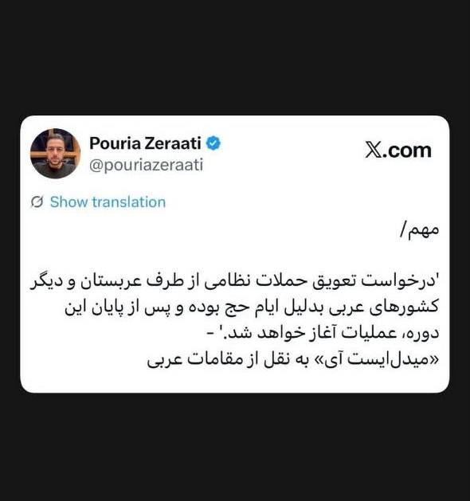

🔴 توییت پوریا زراعتی خبرنگار ایران اینترنشنال

@IranianMinds

## IranianMinds — post 20477

  

زندگی در ایران عزیزمون اینطوری شده که اگه «یه خرید» بری و برگردی؛ «یه دهک» جابجا میشی!

@IranianMinds

## IranianMinds — post 20476

  

🔴 از ۷ اکتبر تا به امروز رو باهم یه مرور دوباره بکنیم:

@IranianMinds

## IranianMinds — post 20475

  

🔴 شریعتمداری :

باید یه قانون‌ تصویب کنیم که تنگه هرمز تا زمانی که ترامپ کشته نشه بسته بمونه !

@IranianMinds

## BBCPersian — post 281686

🔻جنجال ناوگان کمک به غزه؛ لهستان کاردار اسرائیل را احضار کرد

وزیر امور خارجه لهستان روز پنج‌شنبه اعلام کرد که کاردار اسرائیل را به‌دلیل بازداشت فعالان، از جمله شهروندان لهستانی، احضار کرده و خواستار آزادی فوری آن‌ها و عذرخواهی شده است.

رادوسلاو سیکورسکی در شبکه‌های اجتماعی نوشت: «لهستان رفتار نمایندگان مقامات اسرائیلی با فعالان ناوگان صمود را که توسط ارتش اسرائیل بازداشت شده‌اند، از جمله شهروندان لهستانی را به‌شدت محکوم می‌کند.»

انتشار ویدیویی از رفتار ایتار بن‌گویر، وزیر امنیت ملی اسرائیل با بازداشت شدگان ناوگان کمک‌رسانی به غزه واکنش‌های بین‌المللی را به همراه داشته است.

https://bbc.in/4fwMLUO

@BBCPErsian

## BBCPersian — post 281685

  <a href="telegram/content/BBCPersian_281685_1779358582.mp4" target="_blank">🎬 Download video</a>

🎶 آرین کشیشی موزیسینی چندوجهی و بین‌المللی است؛ نوازنده برجسته گیتار بیس، آهنگساز و تهیه‌کننده‌ای که از دل تهران به صحنه‌های حرفه‌ای اروپا رسیده و امروز در آمستردام فعالیت می‌کند.

او در سبک‌های متنوعی از جمله جز، فیوژن، پاپ، راک، کلاسیک، فلامنکو و موسیقی فولکلور ایرانی و ارمنی تجربیات متنوعی دارد و با هنرمندانی چون همایون شجریان، علیرضا قربانی، سهراب پورناظری، ظافر یوسف (نوازنده عود اهل تونس) و آنتونیو ری (گیتاریست اسپانیایی) همکاری کرده است.

مجموعه این همکاری‌ها و تجربه‌ها به شکل‌گیری صدای منحصربه‌فرد او انجامیده است.

آرین در سال ۲۰۱۵ پروژه شخصی خود را راه‌اندازی کرد که بر تولید موسیقی جز و فیوژن با حضور موسیقیدانان بین‌المللی متمرکز است.

نخستین آلبوم شخصی او با نام Self-Reflection در سال ۲۰۲۳ منتشر شد؛ اثری که نوعی تأمل درونی و خودبازاندیشی موسیقایی است و از خلال آن تجربه‌ها و هویت چندفرهنگی‌اش را واکاوی می‌کند.

اجرای چند قطعه از این آلبوم در جشنواره جز لندن را در «رنگ‌آهنگ» این هفته ببینید.

@BBCPersian

## BBCPersian — post 281684

🔻وزیر امور خارجه لهستان روز پنج‌شنبه اعلام کرد که کاردار اسرائیل را به‌دلیل بازداشت فعالان، از جمله شهروندان لهستانی، احضار کرده و خواستار آزادی فوری آن‌ها و عذرخواهی شده است.

رادوسلاو سیکورسکی در شبکه‌های اجتماعی نوشت: «لهستان رفتار نمایندگان مقامات اسرائیلی با فعالان ناوگان صمود را که توسط ارتش اسرائیل بازداشت شده‌اند، از جمله شهروندان لهستانی را به‌شدت محکوم می‌کند.»

انتشار ویدیویی از رفتار ایتار بن‌گویر، وزیر امنیت ملی اسرائیل با بازداشت شدگان ناوگان کمک‌رسانی به غزه واکنش‌های بین‌المللی را به همراه داشته است.
https://bbc.in/4ur2Joh
@BBCPersian

## BBCPersian — post 281683

🔻 ارزش روپیه هند به دلیل جنگ ایران به پایین‌ترین سطح تاریخی خود رسید

وزیر بازرگانی هند اعلام کرد که این کشور در حال بررسی مجموعه‌ای از اقدامات برای مقابله با کاهش ارزش روپیه، پول ملی هند است و وضعیت بازار را به‌دقت زیر نظر دارد.

پیوش گویال روز پنج‌شنبه گفت: «ما شرایط را رصد می‌کنیم و چندین اقدام در دست بررسی است. وضعیت در سطح جهانی بسیار چالش‌برانگیز است.»

اظهارات او در حالی مطرح می‌شود که ارزش روپیه هند در روزهای اخیر بارها به پایین‌ترین سطح تاریخی خود رسیده و از زمان آغاز جنگ آمریکا و اسرائیل علیه ایران که باعث افزایش قیمت نفت خام شده، بیش از ۶ درصد تضعیف شده است.

https://bbc.in/4nOXA72
@BBCPersian

## BBCPersian — post 281673

سارا گرین و سایمون تولت
شغل,بخش پادکست سرویس جهانی بی‌بی‌سی
🔻وقتی در بالاترین سطح برخی از بزرگ‌ترین شرکت‌های دنیا جابه‌جایی قدرت اتفاق می‌افتد، بیشتر مردم اصلا متوجه نمی‌شوند.
اگر محصولات خوب عمل کنند، خدمات به‌درستی ارائه شود و قفسه‌های فروشگاه‌ها پر باشند، اینکه چه کسی در اتاق هیئت‌مدیره می‌نشیند خبرساز نمی‌شود. اما وقتی پای سامسونگ در میان باشد، دودمان خانوادگی پشت آن آنقدر پیچیده است و شرکت آنقدر برای اقتصاد کره جنوبی حیاتی است که خبرساز می‌شود.
در سال ۲۰۱۷، لی جه یونگ، وارث سامسونگ که با نام جی‌وای لی نیز شناخته می‌شود، به دلیل نقشش در یک رسوایی فساد که رئیس‌جمهور کشور را نیز ساقط کرد، زندانی شد.
ادامه مطلب را در لینک زیر بخوانید:
https://bbc.in/4fz83RN

📸GettyImages/ Bloomberg via
Getty Images/ AFP via Getty Images/ LightRocket via Getty Images

@BBCPersian

## BBCPersian — post 281672

🔻 حملات هوایی اسرائیل به مناطقی در جنوب لبنان

شبکه تلویزیونی الجزیره گزارش کرده که اسرائیل حملات هوایی متعددی را به حومه شهر تول در جنوب لبنان انجام داده است.

این حمله در ادامه حملات شبانه به شهرهای کفر دونین، فرون، سربینه و طیر دبا است.

حملات اسرائیل همچنین مناطقی در نزدیکی شهر النمیریه در جنوب لبنان را هدف قرار داده است.

حملات اسرائیل علیرغم تمدید «آتش بس» بین اسرائیل و لبنان در هفته گذشته انجام می‌شود.

https://bbc.in/4dHdjjR
@BBCPersian

## BBCPersian — post 281671

🔻 افزایش قیمت نفت همزمان با زمزمه‌های شروع مجدد جنگ در خاورمیانه

پس از دو روز کاهش، قیمت نفت با توجه به نگرانی‌ها در خصوص از سرگیری جنگ و عرضه نفت، افزایش یافته است.

تا بامداد امروز به وقت لندن در روز پنجشنبه، قیمت نفت خام برنت با ۸۱ سنت افزایش به ۱۰۵/۸۳ دلار در هر بشکه رسید، در حالی که قیمت نفت وست تگزاس اینترمدیت آمریکا با ۹۷ سنت افزایش به ۹۹/۲۳ دلار رسید.

این تغییر روند در بحبوحه نگرانی‌های مداوم در مورد نقض آتش‌بس جنگ ایران رخ می‌دهد، در حالی که کاهش موجودی نفت خام ایالات متحده به نگرانی‌ها در مورد کاهش ذخایر جهانی افزوده است.

https://bbc.in/4dBfvcB
@BBCPersian

## BBCPersian — post 281670

  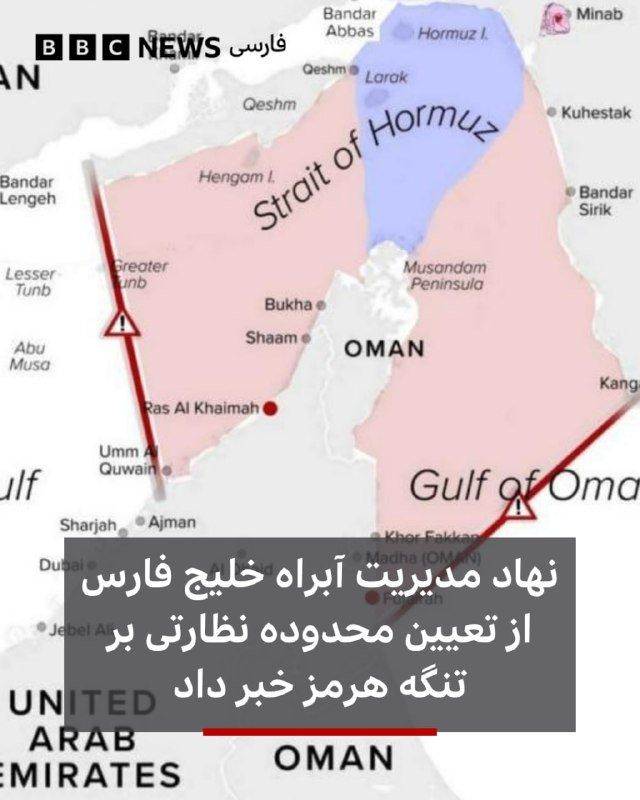

🔻بر اساس اعلام حساب رسمی «نهاد مدیریت آبراه خلیج‌فارس» در شبکه اجتماعی ایکس، جمهوری اسلامی ایران محدوده نظارتی مدیریت تنگه هرمز را به‌صورت رسمی تعیین کرده است.

طبق این اعلام، این محدوده از «خط اتصال کوه مبارک در ایران و جنوب فجیره در امارات در شرق تنگه» تا «خط اتصال انتهای جزیره قشم در ایران و ام‌القیوین در امارات در غرب تنگه» تعریف شده است.

به گفته این نهاد تردد شناورها برای عبور از تنگه هرمز در این محدوده، نیازمند هماهنگی با «مدیریت آبراه خلیج‌فارس» و دریافت مجوز از این نهاد است.

نهاد «مدیریت آبراه خلیج فارس» پس از جنگ ایران و در جریان بحران تنگه هرمز ایجاد شده است.

ایران از زمان شروع جنگ آمریکا و اسرائیل با این کشور، تنگه هرمز را بسته است و باعث اختلال در تردد کشتی‌ها شده است.
https://bbc.in/3Rls5Fy
📸PGSA
@BBCPersian

## BBCPersian — post 281669

🔻یک نهاد حقوقی حامی فلسطینی‌ها گفته است که فعالان بازداشت‌شده از ناوگان کمک‌رسانی به غزه، نیروهای اسرائیلی را به رفتار خشونت‌آمیز و شکنجه روانی متهم کرده‌اند.

سه نفر از آن‌ها مجبور شدند به بیمارستان منتقل شوند، هرچند بعدا از بیمارستان مرخص شدند.

وکلا ده‌ها مورد مشکوک به شکستگی دنده و مشکلات تنفسی را ثبت کرده‌اند؛ آسیب‌هایی که احتمال می‌رود در پی اصابت گلوله‌های لاستیکی ایجاد شده باشد.

مقام‌های اسرائیلی تاکنون در این باره اظهار نظری نکرده‌اند.

ایتامار بن‌گویر، وزیر امنیت ملی اسرائیل، پس از انتشار ویدیویی که در آن فعالان منتقل‌شده به زندان را به تمسخر می‌گیرد، با موج گسترده‌ای از انتقادها روبه‌رو شده است.

بنیامین نتانیاهو، نخست‌وزیر اسرائیل، گفته است که رفتار او با ارزش‌های اسرائیلی همخوانی ندارد.

این اقدام وزیر امنیت ملی اسرائیل همچنین با واکنش‌های گسترده‌ای روبرو شده است.
https://bbc.in/4eURa3N
@BBCPersian

## BBCPersian — post 281668

  

‌ ‌ ‌ ‌
رسانه‌های ایران گفته‌اند که فیلد مارشال عاصم منیر،‌ فرمانده ارتش پاکستان امروز به تهران سفر می‌کند.

براساس این گزارش‌ها این سفر در ادامه گفت‌و‌گوها و رایزنی‌ها با مقامات ایران صورت می گیرد.

پاکستان در مذاکرات ایران و آمریکا نقش میانجی را دارد.

دیروز محسن نقوی، وزیر کشور پاکستان برای دومین بار در هفته جاری به تهران سفر کرد. او در این سفر با اسکندرمومنی، وزیر کشور و همچنین مسعود پزشکیان، رئیس جمهور گفت‌و‌گو کرده است.

گفته شده است که آقای نقوی در این دیدار پیام‌های مقامات پاکستان د رمورد اهمیت ادامه گفت‌و‌گوها را به مقامات ایران منتقل کرد.

فرمانده ارتش پاکستان پیشتر و در ۲۸ فروردین هم به تهران سفر کرده بود.

https://bbc.in/3RTCqZh
📷Reuters
@BBCPersian

## BBCPersian — post 281667

🔻آنتونیو کاستا، رئیس شورای اروپا، می‌گوید که «از رفتار بن گویر، وزیر اسرائیلی با اعضای ناوگان دریایی وحشت‌زده شده است.»

آقای کاستادر پستی در شبکه اجتماعی ایکس نوشت: «این رفتار کاملاً غیرقابل قبول است. ما خواستار آزادی فوری آنها هستیم.»

ایتامار بن‌گویر،‌ وزیر امنیت ملی اسرائیل که از جناح راست تندرو این کشور است در ویدیویی و در حالی که پرچم بزرگی از اسرائیل را در دست دارد، به زبان عبری به آن‌ها می‌گوید: «به اسرائیل خوش آمدید، این ما هستیم که صاحب اختیاریم.»

انتشار این ویدئو واکنش‌های زیادی را در پی داشت از جمله جورجا ملونی، نخست‌وزیر ایتالیا، و پدرو سانچز، نخست‌وزیر اسپانیا نیز این اقدام را محکوم کرده‌اند.
https://bbc.in/3Rdii4i
@BBCPersian

## Dirty_Kids — post 389865

‏این دوس‌دختر سابقم هردفعه به یه بهانه‌ای سعی میکنه با من ارتباط برقرار کنه؛ یه بار زنگ میزنه میگه وسایلمو بفرست، یه بار میگه انقد ریلزای کسشر نفرس، یه بار میگه اون صد میلیون که ازم قرض گرفتی رو کی پس میدی؟ نمیدونم کی میخواد ازم مووآن کنه.

@Dirty_Kids 👻

## Dirty_Kids — post 389864

  <a href="telegram/content/Dirty_Kids_389864_1779358585.mp4" target="_blank">🎬 Download video</a>

نه رشیدپور بی‌شرف، بازار اعتصاب كرد، پهلوى رو صدا زد، پهلوى براى اولين بار فراخوان داد، رژيم،ايرانی كش جمهوری اسلامی، مردم رو قتل عام كرد.
اصن بر فرض مردم گول خوردن، شما چرا ۵۰٫۰۰۰ نفر رو کشتید بیشرفا؟؟؟

@Dirty_Kids 👻

## Dirty_Kids — post 389863

  

🌪وقتی اینترنت طوفانیه فقط کافیه بادبان ها رو بکشی

⚫️100 هزار تومان تخفیف خرید اول 
🎁

⚫️پایین ترین قیمت گیگی 180 هزار تومان
🌐 

⚫️پورسانت %10 دائمی برای هر معرفی
💼

با بادبان، میتونی یه اتصال سریع، پایدار و امن
همراه با پشتیبانی ۲۴ ساعته داشته باشی
🚀

🛒کد تخفیف: badban4k

بادبان راهتو باز می‌کنه
⛵️
R31

🛡@BadBan_VPN | کانال 

🤖@BadBan_VPNBot | ربات 

📞@BadBan_VPNSupport | پشتیبانی

## Dirty_Kids — post 389862

  <a href="telegram/content/Dirty_Kids_389862_1779358587.mp4" target="_blank">🎬 Download video</a>

🔴 شما ببین محمدرضا شاه کی بود که بعد از ۵۰ سال حتی طرفدارای جمهوری اسلامی ازش تعریف و شاه خطابش میکنن.

@Dirty_Kids 👻

## Dirty_Kids — post 389861

  

شما بای دیفالت توی هر عروسی بری یکی با قیافه علی شادمان هست که از پادگان مرخصی گرفته خودشو برسونه عروسی، معمولا هم بدمست بازی در میارن.

@Dirty_Kids 👻

## Dirty_Kids — post 389859

پس‌از اینکه حجاب تو تجمعات حکومتی آزاد شد، کرکتر منچیکو (منچ آنلاین) هم تو مایکت کشف حجاب کرد :)))

@Dirty_Kids 👻

## Dirty_Kids — post 389858

  <a href="telegram/content/Dirty_Kids_389858_1779358587.mp4" target="_blank">🎬 Download video</a>

حمله واشقانی به شهبازی

مملکت مگه صاحاب نداره؟ خیلی کار احمقانه‌ای کردی
گلنوش خسروی ملی پوش فوتبال: از حرف مجری تلویزیون ترسیده بودیم و به ما می‌گفتن اگه برگردیم اتفاقی برای ما می‌افتد

+ کص‌ننه جفتتون

@Dirty_Kids 👻

## Dirty_Kids — post 389857

  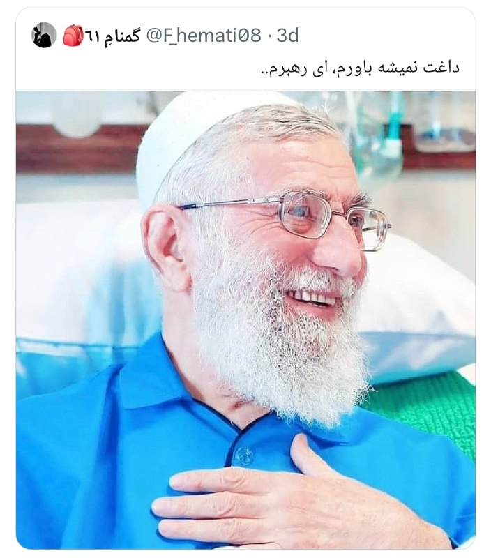

داغش؟ یارو سه ماهه تو فریزره، الان دیگه باید برفکش رو باور کنی.

@Dirty_Kids 👻

## Dirty_Kids — post 389856

  <a href="telegram/content/Dirty_Kids_389856_1779358589.mp4" target="_blank">🎬 Download video</a>

من هرروز صبح:

@Dirty_Kids 👻

## Hranews — post 113073

یک زن در تهران توسط مرد مورد علاقه‌اش به قتل رسید

❗️
❗️
❗️
❗️
❗️– مردی در تهران، زن مورد علاقه‌اش را با خوراندن قرص برنج به #قتل رساند. متهم بازداشت و پس از حدود دو ماه به این اقدام اعتراف کرد.

ادامه مطلب

↘️
@hranews_bot تماس ✉️ - @Hranews کانال هرانا 🆑

## Hranews — post 113072

  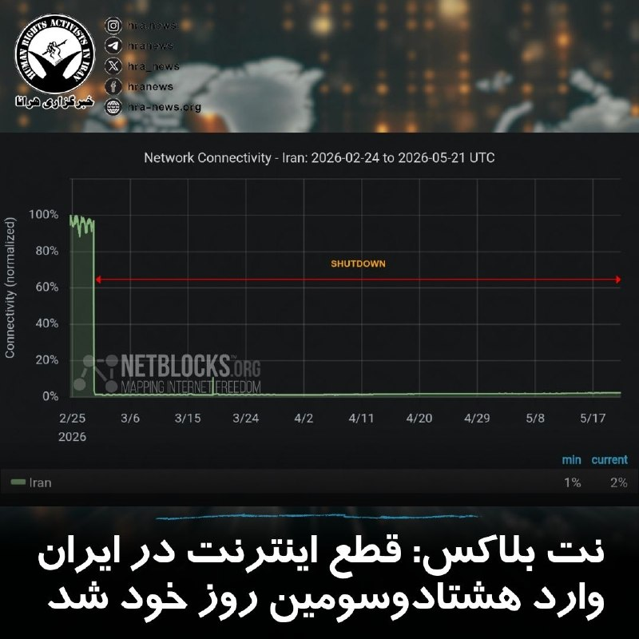

بر اساس آخرین داده‌های نت‌ بلاکس، معیارهای پایش نشان می‌دهد که #قطع_اینترنت در ایران اکنون وارد هشتادوسومین روز خود شده و دسترسی به شبکه‌های بین‌المللی برای بیش از ۱۹۶۸ ساعت به‌طور گسترده مسدود مانده است. این نهاد ناظر بر وضعیت دسترسی به اینترنت در جهان تاکید می‌کند که اینترنت آزاد و باز، عنصری بنیادین برای حفاظت از حق حیات، آزادی و پاسخگویی عمومی به‌شمار می‌رود.

↘️
@hranews_bot تماس ✉️ - @Hranews کانال هرانا 🆑

## Hranews — post 113071

زن و مردی در تهران به شلاق و تبعید محکوم شدند

❗️
❗️
❗️
❗️
❗️– یک زن جوان و مردی که به عنوان ماساژور فعالیت داشت، در پی رسیدگی قضایی به اتهامات مرتبط با رابطه خارج از چارچوب زناشویی، توسط دادگاه کیفری استان تهران به مجازات #شلاق و #تبعید محکوم شدند.

ادامه مطلب

↘️
@hranews_bot تماس ✉️ - @Hranews کانال هرانا 🆑

## Hranews — post 113070

  

دستکم ۱۲ شهروند توسط نیروهای امنیتی بازداشت شدند

❗️
❗️
❗️
❗️
❗️– طی روزهای اخیر، محمد گودرزی، فرزاد فرداد، ستار بابایی، محسن دغاغله، سبحان اسپروینی، علی رجائی، امیرمهدی جلالی، احمد قائدی رحمتی، رجبعلی چیلان، ابوالفضل مجردی، رضا روشنی و عرفان عباسی‌فر، توسط نیروهای امنیتی در شهرهای مختلف بازداشت شده‌اند. همچنان اطلاعی از وضعیت و سرنوشت این افراد در دست نیست.

به گزارش خبرگزاری هرانا، ارگان خبری مجموعه فعالان حقوق بشر در ایران، دستکم ۱۲ شهروند در شهرهای مختلف توسط نیروهای امنیتی بازداشت شدند.

هویت این افراد، محمد گودرزی، فرزاد فرداد، ستار بابایی، محسن دغاغله، سبحان اسپروینی، علی رجائی، امیرمهدی جلالی، احمد قائدی رحمتی، رجبعلی چیلان، ابوالفضل مجردی، رضا روشنی و عرفان عباسی‌فر، توسط هرانا احراز شده است.

ادامه مطلب

#محمد_گودرزی #فرزاد_فرداد #ستار_بابایی
#محسن_دغاغله #سبحان_اسپروینی #علی_رجائی
#امیرمهدی_جلالی #احمد_قائدی_رحمتی #رجبعلی_چیلان
#ابوالفضل_مجردی #رضا_روشنی #عرفان_عباسی‌فر

↘️
@hranews_bot تماس ✉️ - @Hranews کانال هرانا 🆑

## Hranews — post 113069

  

رامین زله و کریم معروف‌پور اعدام شدند

❗️
❗️
❗️
❗️
❗️– قوه قضاییه اعلام کرد که سحرگاه امروز، رامین زله و کریم معروف‌پور، بابت اتهاماتی از جمله عضویت در گروه‌های مخالف نظام و اقدام مسلحانه اعدام شدند. بر اساس داده‌های گردآوری‌شده توسط هرانا، همزمان با آغاز درگیری‌های نظامی، روند صدور و اجرای احکام #اعدام در پرونده‌های سیاسی و امنیتی افزایش یافته و تاکنون ۳۴ زندانی با این اتهامات در این بازه زمانی اعدام شده‌اند.

ادامه مطلب

#رامین_زله #کریم_معروف‌پور

↘️
@hranews_bot تماس ✉️ - @Hranews کانال هرانا 🆑

## manototv — post 105714

  <a href="telegram/content/manototv_105714_1779358591.mp4" target="_blank">🎬 Download video</a>

انور قرقاش، مشاور سیاست خارجی رئیس امارات متحده عربی، در حساب ایکس خود نوشت جمهوری اسلامی پس از تجاوز و شکست نظامی آشکار، در تلاش است واقعیتی جدید را بر منطقه تحمیل کند، اما تلاش برای کنترل تنگه هرمز یا تعرض به حاکمیت دریایی امارات «چیزی جز رویاپردازی نیست.»
قرقاش افزود کشورهای عربی خلیج فارس دهه‌ها به «زورگویی‌های ایران» عادت کرده‌اند؛ تا جایی که این رفتار به بخشی از فضای سیاسی منطقه تبدیل شده و شکاف عمیقی میان شعارهای تهاجمی تهران و ادعاهای دوستی ایجاد کرده است.
او همچنین تأکید کرد هر کشوری که خواهان همزیستی با جهان عرب است باید بداند اعتماد از دست رفته و بازسازی آن نه با شعار، بلکه با احترام به حاکمیت کشورها، زبان مسئولانه و پایبندی واقعی به اصول حسن همجواری ممکن خواهد بود.

## manototv — post 105713

  <a href="telegram/content/manototv_105713_1779358591.mp4" target="_blank">🎬 Download video</a>

بر اساس داده‌های مرکز پایش اینترنت نت‌بلاکس، خاموشی اینترنت در ایران اکنون وارد هشتادوسومین روز خود شده است.
نت‌بلاکس اعلام کرد دسترسی به شبکه‌های بین‌المللی برای بیش از ۱۹۶۸ ساعت به‌طور گسترده مسدود بوده است. این نهاد تأکید کرد اینترنت آزاد و باز نقشی اساسی در حفاظت از جان، آزادی و پاسخگویی عمومی دارد.

## manototv — post 105712

  <a href="telegram/content/manototv_105712_1779358591.mp4" target="_blank">🎬 Download video</a>

وزیران خارجه استرالیا و بلژیک در واکنش به ویدیوی منتشرشده از نحوه برخورد نیروهای اسرائیلی با فعالان «ناوگان آزادی» حامیان غزه، از احضار سفیران اسرائیل خبر دادند. در این ویدیو ده‌ها فعال حامی غزه با دستان بسته روی زمین زانو زده‌اند و ایتامار بن‌گویر، وزیر امنیت ملی اسرائیل، در حالی که پرچم این کشور را در دست دارد، به آن‌ها می‌گوید: «به اسرائیل خوش آمدید.»
ینی وانگ، وزیر خارجه استرالیا، این تصاویر را «غیرقابل قبول» توصیف کرد و گفت «رفتار تحقیرآمیز با بازداشت‌شدگان را محکوم می‌کند». وزیر خارجه بلژیک نیز تصاویر منتشرشده را «عمیقاً نگران‌کننده» خواند و اعلام کرد شماری از شهروندان بلژیک در میان بازداشت‌شدگان هستند.
همزمان جورجا ملونی، نخست‌وزیر ایتالیا، و پدرو سانچز، نخست‌وزیر اسپانیا، نیز این اقدام را محکوم کرده‌اند

## manototv — post 105711

  <a href="telegram/content/manototv_105711_1779358593.mp4" target="_blank">🎬 Download video</a>

سی‌ان‌ان به نقل از منابع اطلاعاتی آمریکا گزارش داد جمهوری اسلامی بازسازی زیرساخت‌های نظامی و تولید پهپاد را سریع‌تر از برآوردهای اولیه از سر گرفته است.
بر اساس این گزارش، ایران در جریان آتش‌بس شش‌هفته‌ای که از اوایل آوریل آغاز شد، بخشی از تولید پهپادهای خود را دوباره راه‌اندازی کرده است. منابع آگاه گفته‌اند این موضوع نشان می‌دهد تهران در حال بازسازی سریع توان نظامی آسیب‌دیده خود در حملات آمریکا و اسرائیل است.
چهار منبع مطلع نیز به سی‌ان‌ان گفته‌اند ارزیابی نهادهای اطلاعاتی آمریکا نشان می‌دهد روند بازسازی ارتش ایران بسیار سریع‌تر از آن چیزی است که پیش‌تر تخمین زده می‌شد
به گفته این منابع، بازسازی پایگاه‌های موشکی، سکوهای پرتاب و ظرفیت تولید سامانه‌های تسلیحاتی نشان می‌دهد ایران همچنان در صورت ازسرگیری حملات، تهدیدی جدی برای متحدان منطقه‌ای آمریکا خواهد بود.
یکی از مقام‌های آمریکایی نیز گفته است برخی برآوردهای اطلاعاتی نشان می‌دهد ایران ممکن است ظرف شش ماه توان کامل حملات پهپادی خود را بازیابی کند.

## manototv — post 105710

  <a href="telegram/content/manototv_105710_1779358593.mp4" target="_blank">🎬 Download video</a>

رسانه‌های اسرائیل به نقل از سی‌ان‌ان گزارش دادند تماس تلفنی اخیر دونالد ترامپ و بنیامین نتانیاهو درباره ایران، «پرتنش» بوده است. بر اساس این گزارش، نتانیاهو خواهان ازسرگیری حملات به ایران شده اما ترامپ خواستار زمان بیشتر برای ادامه دیپلماسی بوده است.
به گزارش رسانه‌های اسرائیل، نتانیاهو گفته تعلل آمریکا به سود ایران است، در حالی که ترامپ تأکید کرده ترجیح می‌دهد فرصت بیشتری به مسیر دیپلماتیک داده شود.
همزمان، وال‌استریت ژورنال گزارش داد اسرائیل نسبت به پایبندی جمهوری اسلامی به هرگونه توافق هسته‌ای تردید دارد و مقام‌های اسرائیلی از آنچه «وقت‌کشی دیپلماتیک ایران» می‌خوانند ابراز نارضایتی کرده‌اند.

دو طرف است

## manototv — post 105709

  <a href="telegram/content/manototv_105709_1779358593.mp4" target="_blank">🎬 Download video</a>

روزنامه تلگراف در گزارشی به واحد مخفی دلفین‌های نیروی دریایی آمریکا پرداخت؛ واحدی که از دوران جنگ سرد برای شناسایی مین‌های دریایی و کمک به عملیات مین‌روبی ایجاد شده است.
بر اساس این گزارش، دلفین‌های پوزه‌بطری با استفاده از توانایی مکان‌یابی صوتی، مین‌ها و اجسام زیر آب را با دقت بالا شناسایی کرده و محل آن‌ها را به نیروهای نظامی اطلاع می‌دهند تا به‌صورت ایمن خنثی شوند.
تلگراف تأکید کرده این دلفین‌ها برای منفجر کردن مین‌ها آموزش نمی‌بینند، بلکه وظیفه آن‌ها شناسایی تهدیدها و کمک به باز نگه داشتن مسیرهای دریایی است.
این گزارش همزمان با افزایش تنش‌ها در تنگه هرمز منتشر شده و به نقش احتمالی این واحد ویژه در تأمین امنیت کشتیرانی در من اشاره می‌کند.

## manototv — post 105708

  <a href="telegram/content/manototv_105708_1779358594.mp4" target="_blank">🎬 Download video</a>

دومین زمین‌لرزه در کمتر از ۱۰ ساعت گذشته، دریای خزر در حوالی شهرستان مرزی آستارا را لرزاند. بنا بر گزارش رسانه‌های داخلی، این زمین‌لرزه ۳.۸ ریشتر قدرت داشته است.
هنوز گزارشی از خسارات احتمالی یا تلفات منتشر نشده است.

## manototv — post 105707

  <a href="telegram/content/manototv_105707_1779358594.mp4" target="_blank">🎬 Download video</a>

وب‌سایت وای‌نت به نقل از یک مقام ارشد اسرائیلی گزارش داد که «جنگ بعدی با ایران، آخرین جنگ نخواهد بود» و تا زمانی که جمهوری اسلامی در قدرت باشد، احتمال تکرار درگیری‌ها وجود دارد.
این مقام گفته است باید «انتظارات عمومی بازتنظیم شود» زیرا حتی در صورت حمله‌ای دیگر، تهدیدها علیه اسرائیل پایان نخواهد یافت. به گفته او، در صورت ادامه وضعیت کنونی، ممکن است درگیری‌ها هر سال یا حتی در بازه‌های کوتاه‌تر تکرار شوند.
این مقام اسرائیلی همچنین مدعی شد هدف از این سیاست، مهار تهدید هسته‌ای و برنامه موشک‌های بالستیک ایران علیه موجودیت اسراییل است.

## alonews — post 121513

  <a href="telegram/content/alonews_121513_1779358595.webm" target="_blank">🎬 Download video</a>

👈خبرگزاری آلمان: کمیسیون اروپا به دلیل جنگ علیه ایران، پیش‌بینی خود از رشد اقتصادی اتحادیه اروپا در سال ۲۰۲۶ را کاهش داد.

✅ @AloNews خبر جنگ

## alonews — post 121512

  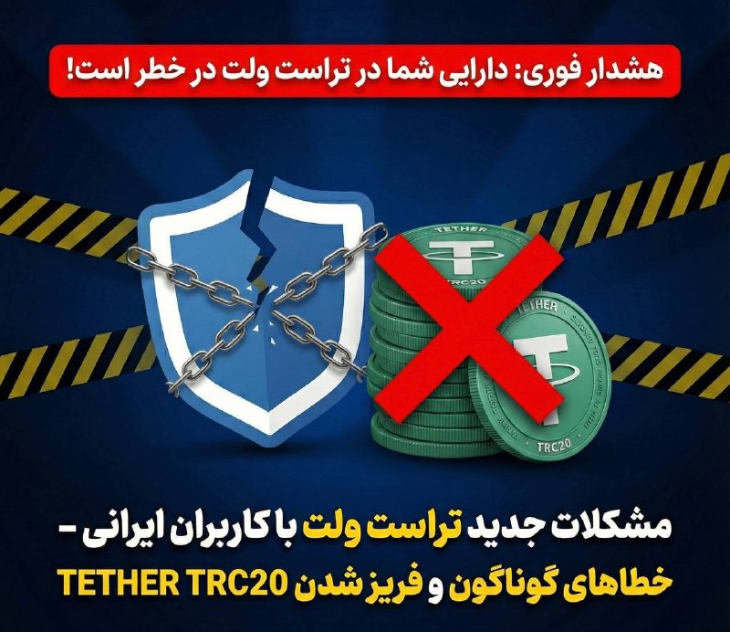

🔴غیرفعال شدن تراست ولت و فریز تتر برای ایرانیان !

بعداجرایی شدن تحریم ها جدید امریکا و بستن حسابای بانکی حال نوبت شناسایی و غیرفعال کردن ولت های ایرانی هست و طبق اعلام مقامات امریکایی ، این کار برای جلوگیری از پولشویی دولت ایران انجام میشود و بیش از ۱ میلیون ولت شناسایی شده است که به زودی مسدود خواهند شد
نکات مهم برای ایمن نگه داشتن دارای های شما تو کانال قرار دادیم حتما رعایت کنید

آموزش رفع مشکل

https://t.me/arrad_group/2450

## alonews — post 121511

  <a href="telegram/content/alonews_121511_1779358596.webm" target="_blank">🎬 Download video</a>

👈داده‌های کشتیرانی LSEG و مؤسسه کپلر نشان می‌دهد سه ابرنفتکش حامل ۶ میلیون بشکه نفت‌خام قطر، کویت و عراق، پس از بیش از دو ماه انتظار، از مسیر ترانزیتی مورد تأیید ایران عبور کرده و راهی بازارهای آسیایی شده‌اند.

✅ @AloNews خبر جنگ

## alonews — post 121510

  <a href="telegram/content/alonews_121510_1779358596.mp4" target="_blank">🎬 Download video</a>

👈 وزارت دفاع بریتانیا اعلام کرد که جنگنده‌ سوخو۳۵ روسیه چندین بار و به طور خطرناک دو هواپیمای شناسایی بریتانیایی را بر فراز دریای سیاه رهگیری کردند

✅ @AloNews خبر جنگ

## alonews — post 121509

  <a href="telegram/content/alonews_121509_1779358596.webm" target="_blank">🎬 Download video</a>

👈وزارت خارجه روسیه: بحران ایران تنها از طریق کانال‌های دیپلماتیک که منافع ایران را در نظر بگیرد، قابل حل است.

✅ @AloNews خبر جنگ

## alonews — post 121508

  <a href="telegram/content/alonews_121508_1779358596.webm" target="_blank">🎬 Download video</a>

👈 عضو شورای عالی فضای مجازی: رئیس جمهور نتوانست مشکل قطع اینترنت را حل کند، معاونش هم نمی‌تواند!

🔴«محمد سرافراز»، عضو شورای عالی فضای مجازی، تشکیل ستاد راهبری فضای مجازی برای حل مشکل اینترنت برای حل مشکل قطع اینترنت را بی‌فایده دانست و گفت:
وقتی رئیس جمهور نتوانست مشکل قطع اینترنت را حل کند، معاون ایشان هم نمی‌تواند.

🔴رئیس‌جمهور هم نخواسته و هم نتوانسته از اختیاراتی که در قانون اساسی پیش‌بینی شده، به طور کامل استفاده کند و به سوگندی که برای اجرای قانون اساسی خورده، به نظر من پایبند نبوده.

🔴مسئول نهایی قطع اینترنت و سیم‌کارت سفید و اینترنت طبقاتی کسانی هستند که در بالاترین رده‌های حکمرانی تصمیم‌سازی و تصمیم‌گیری می‌کنند ولی پاسخگو نیستند.

✅ @AloNews خبر جنگ

## alonews — post 121507

  <a href="telegram/content/alonews_121507_1779358596.webm" target="_blank">🎬 Download video</a>

👈وزیر دفاع روسیه: ایران تنها کسی است که سرنوشت ذخایر اورانیوم خود را تعیین می‌کند و روسیه آماده کمک به تهران و واشنگتن در اجرای راه‌حل‌های احتمالی است.

✅ @AloNews خبر جنگ

## alonews — post 121506

  <a href="telegram/content/alonews_121506_1779358597.webm" target="_blank">🎬 Download video</a>

👈علی قلهکی تا حدودی متن توافق احتمالی را منتشر کرد ...

✅ @AloNews خبر جنگ

## alonews — post 121505

  <a href="telegram/content/alonews_121505_1779358597.webm" target="_blank">🎬 Download video</a>

👈سفیر ایران در پاکستان: من صمیمانه قدردان اقدام انسان‌دوستانه و خیرخواهانه دولت محترم پاکستان در پیگیری آزادی ۲۰ ملوان ایرانی هستم که به دلیل توقیف کشتی‌شان در آب‌های سنگاپور در وضعیت خطرناکی قرار داشتند.

🔴در این رابطه، مایلم از تلاش‌های خستگی‌ناپذیر جناب نخست‌وزیر محترم، محمد شهباز شریف، و وزارت امور خارجه پاکستان، به‌ویژه جناب آقای اسحاق دار، معاون نخست‌وزیر و وزیر امور خارجه محترم، و دیگر نهادهای مرتبط تشکر کنم.

🔴این ملوانان پس از تلاش‌های دیپلماتیک از سنگاپور به اسلام‌آباد منتقل شدند و چند ساعت پیش به میهن عزیزشان بازگشتند.

✅ @AloNews خبر جنگ

## alonews — post 121504

  <a href="telegram/content/alonews_121504_1779358597.webm" target="_blank">🎬 Download video</a>

🔴فوری / یدیعوت آحارانوت به نقل از یک مقام امنیتی اسرئیل: ما ممکن است جنگ‌هایی را با سرعت بیشتری علیه ایران آغاز کنیم تا تهدیدی ایجاد نکنند

✅ @AloNews خبر جنگ

## alonews — post 121503

  <a href="telegram/content/alonews_121503_1779358597.webm" target="_blank">🎬 Download video</a>

👈ورود ناو هواپیمابر «نیمیتز» به کارائیب همزمان با تشدید تنش‌ها با کوبا

✅ @AloNews خبر جنگ

## alonews — post 121502

  <a href="telegram/content/alonews_121502_1779358597.webm" target="_blank">🎬 Download video</a>

👈الجزیره به نقل از یک منبع پاکستانی:
مقامات ایرانی از پاکستان خواسته‌اند تا مهلتی برای ارزیابی و بررسی معیارهای آمریکایی برای مذاکره دریافت کند.

🔴 اورانیوم غنی‌شده، گره اصلی در مذاکرات آمریکا و ایران است.

🔴 فرمانده ارتش هنوز در پاکستان است و سفر او به ایران بستگی به نتایج سفر وزیر کشور دارد.

✅ @AloNews خبر جنگ

## alonews — post 121501

  <a href="telegram/content/alonews_121501_1779358597.mp4" target="_blank">🎬 Download video</a>

👈رامی گرا رئیس پیشین سرویس اروپای موساد: کل این داستان غیرقابل باورست. احمدی‌نژاد هرگز به عنوان یک رهبر انقلاب معرفی نشده بود

✅ @AloNews خبر جنگ

## alonews — post 121500

  <a href="telegram/content/alonews_121500_1779358599.webm" target="_blank">🎬 Download video</a>

👈منبع پاکستانی به الجزیره : گره اصلی مذاکرات آمریکا و ایران سر اورانیوم غنی‌شده‌ست

✅ @AloNews خبر جنگ

## alonews — post 121499

  <a href="telegram/content/alonews_121499_1779358599.webm" target="_blank">🎬 Download video</a>

👈تایمز اسرائیل: ایران در جریان آتش‌بس از فرصت برای جابه‌جایی لانچرهای موشکی و آماده‌سازی برای دور جدید درگیری استفاده کرده است

✅ @AloNews خبر جنگ

## alonews — post 121498

  <a href="telegram/content/alonews_121498_1779358599.webm" target="_blank">🎬 Download video</a>

👈بر اساس گزارش‌های تایید نشده،
عربستان سعودی از دولت ترامپ خواسته است هرگونه اقدام نظامی علیه ایران را تا پس از عید قربان به تعویق بیندازد

✅ @AloNews خبر جنگ

## alonews — post 121497

  <a href="telegram/content/alonews_121497_1779358599.webm" target="_blank">🎬 Download video</a>

👈 هگست به چین سفر می‌کند

🔴 به گزارش SCMP، پنتاگون قصد دارد ظرف چند هفته آینده یک هیئت عالی‌رتبه را به چین اعزام کند تا مقدمات سفر احتمالی پیت هگست را فراهم کند.

🔴 این اولین سفر یک وزیر جنگ ایالات متحده به چین در تقریباً هشت سال گذشته خواهد بود.

✅ @AloNews خبر جنگ

## alonews — post 121496

  <a href="telegram/content/alonews_121496_1779358599.webm" target="_blank">🎬 Download video</a>

👈ایسنا: ایران در حال پاسخ به متن ارسال شده از سوی آمریکا است

🔴متن ایران در حال گفت و گو‌ در تهران بر سر چارچوب کلان، برخی جزییات و اقدامات اعتمادساز به عنوان تضمین است.

🔴متن ارسالی به میزانی شکاف‌ها را کم کرده است اما کمتر شدن شکاف‌ها نیازمند پایان یافتن وسوسه جنگ در سمت واشنگتن است.

🔴ورود ژنرال عاصم منیر به تهران، به منظور کم کردن این شکاف‌ها و رسیدن به لحظه اعلام رسمی پذیرش یادداشت تفاهم است

✅ @AloNews خبر جنگ

## alonews — post 121495

  <a href="telegram/content/alonews_121495_1779358599.webm" target="_blank">🎬 Download video</a>

👈الحدث به نقل از یک منبع دیپلماتیک: تهران در حال بررسی متن آمریکایی است و هنوز پاسخ خود را ارائه نکرده است. 
🔴واسطه پاکستانی در حال تلاش برای نزدیک کردن دیدگاه‌های ایران و آمریکا است. 
🔴کار بر روی چارچوبی برای یک توافق موقت بین تهران و واشنگتن در جریان است.…

## alonews — post 121494

  <a href="telegram/content/alonews_121494_1779358600.webm" target="_blank">🎬 Download video</a>

👈 صدای انفجار در منطقه سوران در استان اربیل، شمال عراق شنیده شد

✅ @AloNews خبر جنگ

<!-- MSG END -->

<!-- NAV START -->

<a href="https://github.com/adamapplecoding/dlrl/blob/main/telegram/content/archive_1.md" style="display:inline-block; padding:6px 12px; margin:0 4px; background-color:#2ea44f; color:white; text-decoration:none; border-radius:4px; font-weight:bold;">صفحه بعد</a>

<!-- NAV END -->
