# خواننده تلگرام

<!-- TOP_NAV START -->

<a href="https://github.com/adamapplecoding/dlrl/blob/main/telegram/content/archive_1.md" style="display:inline-block; padding:6px 12px; margin:0 4px; background-color:#2ea44f; color:white; text-decoration:none; border-radius:4px; font-weight:bold;">صفحه بعد</a>

<!-- TOP_NAV END -->

<!-- MSG START -->

---
📅 بروزرسانی: 1405/02/25 14:39
---

## VahidOOnLine — post 240293

  <a href="telegram/content/VahidOOnLine_240293_1778843373.mp4" target="_blank">🎬 Download video</a>

⭕️نخست وزیر هند در امارات: باز نگه داشتن تنگه هرمز بالاترین اولویت ماست

♦️نارندرا مودی، نخست‌وزیر هند، روز جمعه در آغاز سفر پنج‌کشوری خود وارد امارات متحده عربی شد، سفری که تحت تاثیر نگرانی‌ها از پیامدهای جنگ ایران بر بازار انرژی و زنجیره‌های تامین جهانی قرار گرفته است.

مودی که در بدو ورود با اسکورت جنگنده‌های نظامی همراهی شد، از سوی محمد بن زاید آل نهیان، رئیس امارات، مورد استقبال رسمی قرار گرفت.

مودی در دیدار با رئیس دولت امارات، با اشاره به اهمیت این آبراه هرمز گفت: «آزاد، باز و ایمن نگه داشتن تنگه هرمز بالاترین اولویت ما است و در این زمینه پایبندی به قوانین بین‌المللی ضروری است.»

وزارت خارجه هند اعلام کرد امارات و هند به توافق‌های راهبردی در حوزه نفت و گاز دست یافته‌اند و ابوظبی متعهد شده پنج میلیارد دلار در هند سرمایه‌گذاری کند، هرچند جزئیات بیشتری ارائه نشده است.

این سفر بخشی از تلاش گسترده‌تر هند برای گسترش شراکت‌های اقتصادی و راهبردی و کاهش وابستگی‌ها در شرایط تحولات ژئوپلیتیک ارزیابی می‌شود. مودی پس از امارات به هلند، سوئد، نروژ و ایتالیا سفر خواهد کرد.
‌🇸🇦 Indypersian

🤖 @VahidOOnLine

## VahidOOnLine — post 240292

  <a href="telegram/content/VahidOOnLine_240292_1778843375.mp4" target="_blank">🎬 Download video</a>

♦️عباس عراقچی، وزیر امور خارجه جمهوری اسلامی ایران، روز جمعه ۲۵ اردیبهشت ماه، در نشست خبری در دهلی‌نو اعلام کرد تهران پس از اظهارات اخیر دونالد ترامپ مبنی بر رد پیشنهاد تهران، پیام‌هایی از طرف آمریکا دریافت کرده که نشان می‌دهد واشنگتن همچنان خواهان ادامه گفتگوها و تعامل است.
عراقچی با اشاره به گزارش‌ها درباره رد شدن پیشنهاد یا پاسخ ایران از سوی آمریکا گفت: «اینکه مطرح شده آمریکا پیشنهاد یا پاسخ ایران را رد کرده، مربوط به چند روز پیش است؛ زمانی که آقای ترامپ در پیامی اعلام کرد این پیشنهاد غیرقابل قبول است.»
او افزود: «اما پس از آن، ما مجددا پیام‌هایی از طرف آمریکایی‌ها دریافت کردیم که مایل به ادامه گفتگوها و تعامل هستند.»
رسانه‌های ایران روز جمعه به‌نقل از تهران‌تایمز، نشریه انگلیسی‌زبان سازمان تبلیغات اسلامی‌گزارش داده بودند که آمریکا پیشنهاد ۱۴ ماده‌ای جمهوری اسلامی را رد کرده است‌.
‌🇸🇦 Indypersian

🤖 @VahidOOnLine

## VahidOOnLine — post 240291

  

تهران‌تایمز گزارش داد دولت آمریکا به پیشنهاد مکتوب جمهوری اسلامی درباره پایان جنگ پاسخ داده و پیشنهاد ۱۴ ماده‌ای تهران را رد کرده است.

بر اساس این گزارش، آمریکا با رد پیشنهادهای جمهوری اسلامی، بار دیگر مواضع خود، به‌ویژه در ارتباط با پرونده هسته‌ای را تکرار کرده است.

این روزنامه گزارش داد جمهوری اسلامی پیشنهاد خود را بر پایه روندی دو مرحله‌ای ارائه کرده بود؛ مرحله نخست به پایان جنگ در همه جبهه‌ها منجر می‌شد و در صورت برآورده شدن شروط تهران، مرحله دوم مذاکرات درباره موضوع هسته‌ای آغاز می‌شد.
‌🏁 🇬🇧 IranintlTV

🤖 @VahidOOnLine

## VahidOOnLine — post 240290

  

♦️عباس عراقچی، وزیر امور خارجه جمهوری اسلامی ایران، روز جمعه اعلام کرد تهران از هرگونه کمک برای حل بحران خاورمیانه، به‌ویژه از سوی چین، استقبال می‌کند.
عراقچی در جمع خبرنگاران در دهلی‌نو گفت: «از هر کشوری که توانایی کمک داشته باشد، قدردانی می‌کنیم؛ به‌ویژه چین.»
وزیر امور خارجه ایران با اشاره به روابط تهران و پکن افزود: «ما روابط بسیار خوبی با چین داریم و شریک راهبردی یکدیگر هستیم.»
او همچنین گفت: «می‌دانیم که چینی‌ها نیت خوبی دارند، بنابراین هر اقدامی که از سوی آن‌ها برای کمک به دیپلماسی انجام شود، از سوی جمهوری اسلامی مورد استقبال قرار خواهد گرفت.»
اظهارات عراقچی در حالی مطرح می‌شود که چین پیش‌تر خواستار برقراری آتش‌بس پایدار در خاورمیانه و بازگشایی سریع مسیرهای کشتیرانی شده بود.
پکن در دو روز گذشته میزبان دیدار تاریخی دونالد ترامپ، رئیس جمهوری آمریکا و همتای چینی‌اش، شی جی‌پینگ بود.
‌🇸🇦 Indypersian

🤖 @VahidOOnLine

## VahidOOnLine — post 240289

  

بلومبرگ به نقل از منابع آگاه گزارش داد امارات متحده عربی پس از آغاز حملات جمهوری اسلامی به کشورهای حوزه خلیج فارس، تلاش کرد کشورهای همسایه از جمله عربستان سعودی و قطر را برای مشارکت در یک پاسخ نظامی هماهنگ به حملات تهران متقاعد کند، اما با رد این درخواست از سوی آنها روبه‌رو شد.

به گفته این منابع، محمد بن زاید، رییس امارات متحده عربی مجموعه‌ای از تماس‌ها را با رهبران منطقه از جمله محمد بن سلمان، ولیعهد عربستان سعودی، برقرار کرد.

این منابع افزودند محمد بن زاید بر این باور بود که پاسخ گروهی کشورهای منطقه به ایران می‌تواند بازدارندگی ایجاد کند.
‌🏁 🇬🇧 IranintlTV

🤖 @VahidOOnLine

## VahidOOnLine — post 240288

  <a href="telegram/content/VahidOOnLine_240288_1778843379.mp4" target="_blank">🎬 Download video</a>

⭕️حمله پهپادی اوکراین به ساختمانی در ریازان روسیه سه کشته برجا گذاشت

♦️ویدیویی که روز جمعه در شبکه اجتماعی تلگرام منتشر شد، ساختمان مسکونی در حال سوختن و ستون‌های غلیظ دود در آسمان شهر ریازان روسیه را پس از حمله پهپادی اوکراین نشان می‌دهد.

خبرگزاری رویترز ضمن تایید این ویدیو، به نقل از پاول مالکوف، فرماندار منطقه ریازان گزارش کرد این حمله روز جمعه ۲۵ اردیبهشت رخ داده است و در جریان آن علاوه بر کشته شدن سه نفر، چند برج مسکونی و یک محوطه صنعتی آسیب دیده‌اند.
‌🇸🇦 Indypersian

🤖 @VahidOOnLine

## VahidOOnLine — post 240287

  

عباس عراقچی، وزیر خارجه جمهوری اسلامی، در یک نشست خبری در حاشیه اجلاس بریکس گفت جمهوری اسلامی در تلاش است آتش‌بس، «اگرچه بسیار ناپایدار است»، حفظ شود و به دیپلماسی فرصت داده شود.

او افزود: «به آمریکایی‌ها اعتماد نداریم و فقط در صورتی به مذاکرات علاقه‌مندیم که طرف مقابل جدی باشد.»

وزیر خارجه جمهوری اسلامی، در ادامه اظهاراتش گفت مذاکرات کنونی با آمریکا «از نبود اعتماد رنج می‌برد».

او همچنین گفت همه کشتی‌ها می‌توانند از تنگه هرمز عبور کنند، «به‌جز آن‌هایی که با ما در جنگ هستند».
‌🏁 🇬🇧 IranintlTV

🤖 @VahidOOnLine

## VahidOOnLine — post 240286

  <a href="telegram/content/VahidOOnLine_240286_1778843381.mp4" target="_blank">🎬 Download video</a>

یکی از مخاطبان ایران‌اینترنشنال که از بندرعباس پیام فرستاده، می‌گوید قیمت کالاها به‌شدت افزایش یافته و صف‌های طولانی در جایگاه‌های سوخت، زندگی روزمره مردم را مختل کرده است. او می‌گوید این شرایط در شهری رخ می‌دهد که قطب تجارت، صنعت و نفت و گاز ایران به شمار می‌رود. این پیام با هوش مصنوعی خوانده شده است.
‌🏁 🇬🇧 IranintlTV

🤖 @VahidOOnLine

## VahidOOnLine — post 240285

  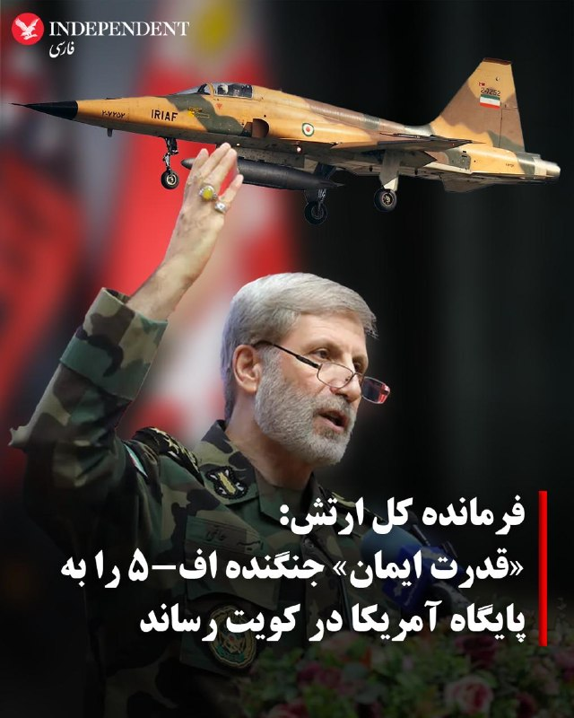

♦️امیر حاتمی، فرمانده کل ارتش جمهوری اسلامی، روز جمعه ۲۵ اردیبهشت ماه گفت «قدرت ایمان» جنگنده اف-۵ ایران را به مواضع نیروهای آمریکایی در کویت رسانده و از «پیشرفته‌ترین سامانه‌های پدافندی زمین‌پایه و هوایی» آنها عبور کرده است.
پیشتر شبکه خبری ان‌بی‌سی نیوز گزارش کرده بود که در روزهای ابتدایی جنگ یک جنگنده اف‌ــ۵ ایرانی توانسته است از سامانه‌های پدافندی عبور کند و پایگاه کمپ بوهرینگ در کویت را هدف قرار دهد.
جنگنده‌های ۶۰ ساله اف-۵ ارتش ایران، در دوره محمدرضا شاه خریداری شدند.
حاتمی در ادامه گفت: «نیروهای مسلح با تمام قوا از تمامیت ارضی، استقلال کشور و نظام جمهوری اسلامی ایران پاسداری خواهند کرد.»
‌🇸🇦 Indypersian

🤖 @VahidOOnLine

## VahidOOnLine — post 240284

  

کاظم غریب‌آبادی، معاون وزیر خارجه جمهوری اسلامی، امارات متحده عربی را به همکاری با آمریکا و اسرائیل در حملات علیه جمهوری اسلامی متهم کرد و گفت تهران در چارچوب «حق دفاع مشروع» به پایگاه‌ها و تاسیسات مورد استفاده آمریکا در امارات حمله کرده است.
‌🏁 🇬🇧 IranintlTV

🤖 @VahidOOnLine

## VahidOOnLine — post 240283

  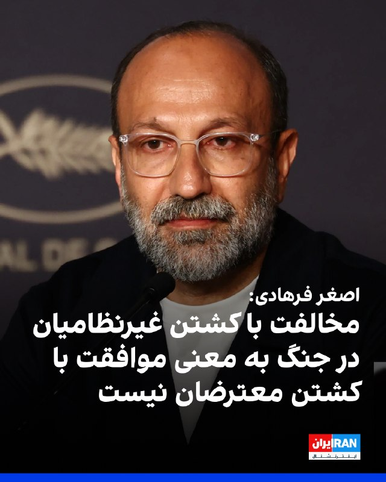

اصغر فرهادی در پاسخ به خبرنگار ایران‌اینترنشنال، کشته شدن معترضان «بی‌گناه» در جریان انقلاب ملی ایرانیان را محکوم کرد و گفت مخالفت با کشته شدن بی‌گناهان و غیرنظامیان در جنگ به معنی موافقت با کشته شدن معترضان نیست.

فرهادی در نشست خبری فیلم «داستان‌های موازی» در جشنواره کن گفت: «ماه‌های گذشته و اواخر دورانی که مشغول ساختن این فیلم بودم، دو اتفاق بسیار دردناک در کشورم رخ داد.»

این کارگردان ایرانی گفت: «هر دو بسیار دردناک است و هیچ‌گاه فراموش نخواهد شد. مخالفت با کشته شدن بی‌گناهان و غیرنظامیان به معنی موافقت با کشته شدن گروهی دیگر در خیابان‌ها نیست.»

فرهادی ادامه داد: «همدلی با کشته‌شدگان در خیابان‌ها نیز به معنی همدلی نکردن با کسانی که در جنگ کشته شدند نیست. به نظرم کشته شدن هر انسانی یک جنایت است؛ چه در جنگ، چه در اعدام و چه کشتن معترضان.»

او در پایان گفت بسیار دردناک است که در قرن حاضر با وجود این همه پیشرفت، همچنان شاهد کشته شدن انسان‌های بی‌گناه هستیم.
‌🏁 🇬🇧 IranintlTV

🤖 @VahidOOnLine

## VahidOOnLine — post 240282

  

اصغر فرهادی در پاسخ به خبرنگار ایران‌اینترنشنال، کشته شدن معترضان «بی‌گناه» در جریان انقلاب ملی ایرانیان را محکوم کرد و گفت مخالفت با کشته شدن بی‌گناهان و غیرنظامیان در جنگ به معنی موافقت با کشته شدن معترضان نیست.

فرهادی در نشست خبری فیلم «داستان‌های موازی» در جشنواره کن گفت: «ماه‌های گذشته و اواخر دورانی که مشغول ساختن این فیلم بودم، دو اتفاق بسیار دردناک در کشورم رخ داد.»

این کارگردان ایرانی گفت: «هر دو بسیار دردناک است و هیچ‌گاه فراموش نخواهد شد. مخالفت با کشته شدن بی‌گناهان و غیرنظامیان به معنی موافقت با کشته شدن گروهی دیگر در خیابان‌ها نیست.»

فرهادی ادامه داد: «همدلی با کشته‌شدگان در خیابان‌ها نیز به معنی همدلی نکردن با کسانی که در جنگ کشته شدند نیست. به نظرم کشته شدن هر انسانی یک جنایت است؛ چه در جنگ، چه در اعدام و چه کشتن معترضان.»

او در پایان گفت بسیار دردناک است که در قرن حاضر با وجود این همه پیشرفت، همچنان شاهد کشته شدن انسان‌های بی‌گناه هستیم.
‌🏁 🇬🇧 IranintlTV

🤖 @VahidOOnLine

## VahidOOnLine — post 240281

  

امیر حاتمی، فرمانده‌ کل ارتش جمهوری اسلامی، گفت: «این قدرت ایمان است که می‌تواند دشمن را چنان دچار آشفتگی کند که حتی به‌اشتباه، هواپیماهای خودی را هدف قرار دهد.»

او گفت آنچه موجب اطمینان ما به پیروزی و توانمندی می‌شود، ایمان و اعتقاد است؛ ما هر سال در دهه محرم، شاهد یک مانور عظیم ایمانی هستیم. قدرت اصلی ما نیز همین قدرت ایمانی است.

او افزود: «این قدرت ایمانی است که می‌تواند یک جنگنده اف-۵ را به فراز مواضع نیروهای آمریکایی در کویت برساند، در حالی‌ که آن‌ها از پیشرفته‌ترین سامانه‌های پدافندی زمین‌پایه و هوایی برخوردارند.»
‌🏁 🇬🇧 IranintlTV

🤖 @VahidOOnLine

## VahidOOnLine — post 240280

  

♦️روزنامه نیویورک پست، روز جمعه در گزارشی اعلام کرد، دونالد ترامپ در جریان سفر دو روزه‌اش به پکن، برخلاف عادت همیشگی‌، تلفن همراه شخصی‌اش را همراه نداشت.
بر اساس این گزارش، رئیس‌جمهوری آمریکا و اعضای هیئت همراه، به دلایل امنیتی و برای مقابله با تهدیدهای سایبری، از استفاده از دستگاه‌های شخصی منع شدند و به‌جای آن از گوشی‌ها و حساب‌های موقت موسوم به «دستگاه‌های پاک» استفاده کردند؛ ابزارهایی با قابلیت‌های محدود که برای کاهش خطر نفوذ و سرقت اطلاعات طراحی شده‌اند.
به گزارش نیویورک پست، تلفن‌ها و وسایل شخصی حاضران در این سفر دو روزه در هواپیمای ویژه ریاست‌جمهوری «ایر فورس وان» و درون «کیف‌های فارادی» نگهداری می‌شدند. این کیف‌ها تمامی سیگنال‌ها از جمله جی‌پی‌اس، وای‌فای، بلوتوث و آر‌اف‌آی‌دی (RFID) را مسدود می‌کنند.
هواپیمای ایرفورس وان صرف‌نظر از اینکه در کجا مستقر باشد، قلمرو ایالات متحده محسوب می‌شود. این هواپیما که عملا به‌عنوان یک مرکز پروازی نگهداری اطلاعات فوق‌محرمانه (SCIF) عمل می‌کند، از روش‌های دیگری نیز برای محافظت از داده‌ها و اطلاعات استفاده می‌کند.
‌🇸🇦 Indypersian

🤖 @VahidOOnLine

## VahidOOnLine — post 240279

روایت شما از زندگی در آتش‌بس- جمعه ۲۵ اردیبهشت ۱۴۰۵

🔹 وقتی مردم اینترنت ندارند، کسب‌وکارها با اینترنت پرو خدمات خود را به چه کسی نشان دهند؟
🔹 من یه دختر ۲۳ ساله‌ام. هیچ آینده‌ای ندارم. همه‌چی صد برابر شده. از خیلی از چیزام زدم که فقط زنده بمونم. خیلیا شرایط سخت‌تری نسبت به من دارن. تکلیف ما چی میشه؟ هنوزم امیدوارم ولی تا کی؟ وقتی از قحطی مردیم میخوان وارد عمل بشن؟
🔹 از کرمانشاه پیام می‌دم. ما بچه‌های پایه‌ی هفتم تا دهم هنوز مشخص نیست که امتحان‌هامون حضوریه یا غیرحضوری. واقعاً این موضوع رو اعصابمونه. امیدوارم هرچی سریع‌تر اوضاع‌مون مشخص بشه.
🔹 این‌قدر کمبود دارو هست که حتی دارو با نسخه هم به صورت کامل داده نمی‌شه، چه برسه به صورت آزاد. از هر قرص یک بسته میدن.
🔹 یکی ما رو توجیه کنه ما مردم ایران هزینه چه چیزی رو داریم پرداخت می‌کنیم؟ برای چی داریم این همه فشار اقتصادی و نگرانی و چک کردن ته‌مانده حساب بانکی و قیمت طلا و دلار و کالاها رو تحمل می‌کنیم؟ نقش ما توی به‌وجود آمدن این مناقشه چی بوده؟ نابود شدیم
‌🏁 🇬🇧 IranintlTV

🤖 @VahidOOnLine

## VahidOOnLine — post 240278

  

هند در پایان نشست سالانه وزیران خارجه بریکس در دهلی‌نو، به جای انتشار بیانیه مشترک، «بیانیه رییس نشست» را منتشر کرد و اعلام کرد میان برخی اعضا درباره وضعیت خاورمیانه اختلاف‌نظر وجود دارد.

بر اساس گزارش رویترز، جمهوری اسلامی و امارات متحده عربی در جنگ تهران با آمریکا و اسرائیل در دو سوی مقابل قرار دارند؛ جنگی که در جریان آن، جمهوری اسلامی بیش از هر کشور دیگر حوزه خلیج فارس، امارات متحده عربی را هدف قرار داده است.
‌🏁 🇬🇧 IranintlTV

🤖 @VahidOOnLine

## VahidOOnLine — post 240277

روایت شما از زندگی در آتش‌بس- جمعه ۲۵ اردیبهشت ۱۴۰۵

🔹 بندرعباس، تمامی کالاها به شدت گران شده و در جایگاه‌های سوخت صف‌های کیلومتری هست. متأسفانه زندگی روزمره مردم مختل شده، شهری که قطب تجارت و صنعت و نفت و گاز است.
🔹 ساکن یکی از شهرهای نزدیک مشهد هستم. ما به هیچ ابرقدرتی نیاز نداریم و منتظر فراخوان شاه هستیم. پاینده ایران.
🔹 دانش‌آموز پایه دهم انسانی هستم. خوشبختانه امسال امتحان‌ها نهایی نیست، اما خیلی نگران سال آینده هستم، چون امسال ما هیچی یاد نگرفتیم و شرایط یادگیری افتضاح بوده. تو مدرسه غیردولتی هم درس می‌خوانم.
🔹 از مشهد پیام می‌دهم. واقعاً ما از این بلاتکلیفی خسته شدیم، گرونی بیداد می‌کند، دخل و خرج‌مان با هم همخوانی ندارد، باید ده نفر کار کنیم که یک نفر بتواند بخورد.
🔹 نیم‌قرن است که کل دنیا، مخصوصاً اروپا، فقط گفتند فلان کار جمهوری اسلامی را محکوم می‌کنیم و فایده‌ای نداشت. هر روز جمهوری اسلامی پُرروتر هم شد. نمی‌شود از یک دیوانه زنجیری توقع داشت با حرف آرام بگیرد.
‌🏁 🇬🇧 IranintlTV

🤖 @VahidOOnLine

## VahidOOnLine — post 240276

  <a href="telegram/content/VahidOOnLine_240276_1778843386.mp4" target="_blank">🎬 Download video</a>

یک شهروند در پیامی به ایران اینترنشنال به سایر شهروندان توصیه می‌کند که اینترنت حکومتی «پرو» را نخرند و آن ‌را خیانت به مردم ایران دانست. پیام او با هوش مصنوعی خوانده شده است.
‌🏁 🇬🇧 IranintlTV

🤖 @VahidOOnLine

## VahidOOnLine — post 240275

  

تجربیات شما از قطع برق و آب و افزایش قیمت قبض‌ها چیست؟ روی لینک زیر کلیک کنید و پیام‌های خود از طریق مدیا‌بات برای ما بفرستید. 
t.me
پیام‌های شما به صورت زیر‌نویس در تلویزیون و همچنین در بخش‌های مختلف‌ خبری منتشر خواهد شد.
‌🏁 🇬🇧 IranintlTV

🤖 @VahidOOnLine

## VahidOOnLine — post 240274

  <a href="telegram/content/VahidOOnLine_240274_1778843388.mp4" target="_blank">🎬 Download video</a>

نارندرا مودی، نخست‌وزیر هند، روز جمعه ۲۵ اردیبهشت در جریان سفر به ابوظبی، با انتشار پیامی در شبکه اجتماعی ایکس نوشت: «دوستی میان هند و امارات بسیار نیرومند است.»

مودی در این سفر با شیخ محمد بن زاید، رئیس امارات متحده عربی، دیدار کرد. محور گفتگوهای دو طرف، گسترش روابط دوجانبه، همکاری‌های انرژی، همکاری‌های دفاعی و تحولات منطقه‌ای اعلام شده است.

این سفر در شرایطی انجام می‌شود که تنش‌های منطقه‌ای و نگرانی‌ها درباره امنیت مسیرهای انرژی، اهمیت همکاری میان هند و امارات را افزایش داده است. امارات یکی از شرکای مهم هند در حوزه انرژی و تجارت به شمار می‌رود و ابوظبی و دهلی نو در سال‌های اخیر روابط اقتصادی و راهبردی خود را گسترش داده‌اند.
‌🏁 🇬🇧 ManotoTV

🤖 @VahidOOnLine

## WithYashar — post 11280

ترامپ وسط‌ پرواز به فاکس‌نیوز : «من دیگر خیلی بیشتر از این صبر نخواهم کرد. آنها باید توافق را امضا کنند.»
«مواد هسته‌ای» ایران، ممکنه به چین یا آمریکا تحویل داده شه!
@withyashar

## WithYashar — post 11279

ترامپ وسط پرواز به فاکس نیوز :
اما در نهایت فکر می‌کنم الان آخرین چیزی که دنیا نیاز دارد جنگ است، مخصوصاً جنگی که هزاران کیلومتر دورتر است.

شی درباره مسائل مختلفی مثل ، حملات سایبری و جاسوسی صحبت کرد. گفت هم آن‌ها جاسوسی می‌کنند و هم ما. این یک واقعیت است و همه این کار را انجام می‌دهند، اما معمولاً درباره‌اش صحبت نمی‌شود.

او گفت آمریکا در چین جاسوسی می‌کند. من گفتم ما هم همین کار را انجام می‌دهیم. این یک واقعیت است و مسئله‌ای است که همه طرف‌ها درگیر آن هستند
@withyashar

## WithYashar — post 11278

ترامپ وسط پرواز به فاکس نیوز :
شین گفت برخورد شما قوی‌تر از قبل بوده، چون ما با انها(حکومت ایران) رابطه داریم و ما درباره این موضوع صحبت کردیم. من گفتم این مثل جنگ است و حق با من بود. موضوع قدرت بود و همه با آن درگیر شدیم. این موضوع روی رابطه ما تأثیر گذاشت، اما قبل و بعد از آن رابطه خوبی داشتیم و الان هم رابطه‌مان قوی است. حتی به جایی رفتم که او زندگی می‌کند، که اتفاق نادری است. با هم ناهار خوردیم و درک خوبی بین ما وجود دارد. فکر می‌کنم او معتقد است اتفاقات مثبتی بین دو کشور در حال رخ دادن است
@withyashar

## WithYashar — post 11277

ترامپ وسط پرواز به فاکس نیوز :
نیویورک تایمز هم گزارش‌هایی داده بود درباره تحریم شرکت‌های چینی که نفت ایران می‌خرند. درباره آن صحبت کردیم و بعداً هم صحبت خواهیم کرد
@withyashar

## WithYashar — post 11276

ترامپ وسط پرواز به فاکس نیوز : شین گفته جنگ باید متوقف شود. من چنین حرفی نمی‌زنم. فکر می‌کنم او آدم خوبی است، اما از بعضی حرف‌هایش خوشم نیامد. مثلاً گفته کشتی‌ها باید بعد از پایان کار نفت متوقف شوند. ما هم از نظر نظامی تقریباً کار را تمام کرده‌ایم، اما هنوز کامل نشده است.
ما حدود ۷۰ تا ۷۵ درصد کار را انجام داده‌ایم، نه همه‌اش را. برمی‌گردیم و بقیه را هم تمام می‌کنیم. بعضی بخش‌ها هنوز باقی مانده است. توان موشکی و پرتابگرهای موشک هنوز به طور کامل از بین نرفته‌اند، هرچند گفته می‌شود حدود ۸۰ درصد آن‌ها نابود شده است. تولید موشک هم بیشتر آن از بین رفته است
@withyashar

## WithYashar — post 11275

## WithYashar — post 11274

خبرنگار الجزیره:
تهران به‌طور رسمی پاسخ واشنگتن به پیشنهاد خود را دریافت کرده و ایالات متحده تمامی شروط ایران رو رد کرده.
@withyashar

## WithYashar — post 11273

😂😂🙌🏾 @withyashar

## WithYashar — post 11272

ترامپ در تروث : پژوهشگر چینی به CNN گفت که به نشست ترامپ و شی نمره «۹.۹۹ از ۱۰» می‌دهد.
@withyashar

## WithYashar — post 11271

  

محمد قنطاری، کاردار جدید سوریه در واشنگتن دی سی😬🍔
@withyashar

## WithYashar — post 11270

@withyashar part3

## WithYashar — post 11269

  

😂😂🙌🏾 @withyashar

## mwarmonitor — post 9118

🇺🇸رئیس جمهور ترامپ در حال صحبت با مطبوعات در هواپیمای ایر فورس وان در مسیر انکوریج، آلاسکا، ۱۵ مه ۲۰۲۶ @mwarmonitor

## mwarmonitor — post 9117

🇺🇸رئیس جمهور ترامپ در حال صحبت با مطبوعات در هواپیمای ایر فورس وان در مسیر انکوریج، آلاسکا، ۱۵ مه ۲۰۲۶

@mwarmonitor

## mwarmonitor — post 9116

🦠«یک شیوع جدید از ویروس بسیار مسری ابولا در استان اییتوری در شرق کنگو تأیید شده است، به گفته نهاد اصلی بهداشت عمومی آفریقا. تاکنون ۲۴۶ مورد مشکوک و ۶۵ مرگ ثبت شده است.»

@mwarmonitor

## mwarmonitor — post 9115

🔴«بلومبرگ گزارش داد که امارات متحده عربی تلاش کرد عربستان سعودی و قطر را برای هماهنگی یک پاسخ مشترک علیه ایران در جریان جنگ هماهنگ کند، اما موفق نشد؛ به گفته افرادی مطلع از موضوع.»

@mwarmonitor

## mwarmonitor — post 9114

🇮🇷«وزیر امور خارجه عراقچی: همه کشتی‌ها می‌توانند از تنگه هرمز عبور کنند، به‌جز آن‌هایی که با ما در حال جنگ هستند.»

📝دفعه قبل که گفته بود «تنگه هرمز باز است»، سپاه هم ظاهراً در واکنشی کاملاً رسمی گفته بود:
«گُه زیاد نخور، برای دستگاه گوارشت خوب نیست!»

@mwarmonitor

## mwarmonitor — post 9113

  

چین یک سالن رقص (تالار تشریفات) دارد، پس ایالات متحده هم باید داشته باشد! این سالن در دست احداث است، از برنامه زمان‌بندی جلوتر است و بهترین مرکز در نوع خود در سراسر ایالات متحده خواهد بود. از تمام حمایت‌هایی که برای پیشبرد این پروژه از من صورت گرفته متشکرم. افتتاح برنامه‌ریزی شده حدود سپتامبر ۲۰۲۸ خواهد بود. مردی که با او قدم می‌زنم رئیس‌جمهور شی، از چین است؛ یکی از رهبران بزرگ جهان!

رئیس‌جمهور دونالد جی. ترامپ

@mwarmonitor

## mwarmonitor — post 9112

🔴 ارتش اسرائیل (IDF) حملات خود را علیه زیرساخت‌های حزب‌الله در داخل و اطراف شهر صور در جنوب لبنان آغاز کرده است.

🔹در پی به‌صدا درآمدن آژیرها در اوایل امروز در شمال اسرائیل، تعدادی پهپاد انفجاری در داخل خاک اسرائیل و در نزدیکی مرز اسرائیل–لبنان سقوط کردند. گزارشی از تلفات یا مجروحان اعلام نشده است.

@mwarmonitor

## mwarmonitor — post 9111

  

✈️🚨وضعیت اضطراری تانکر در حین پرواز

✈️یکی از تانکرهای KC-46A «پگاسوس» که از فرودگاه بن‌گوریون تل‌آویو (LLBG) برخاسته، وضعیت اضطراری در حین پرواز اعلام کرده و کد ۷۷۰۰ را مخابره می‌کند. تانکرهای KC-46 مستقر در این پایگاه معمولاً با علائم فراخوان «YETI» پرواز می‌کنند.

KC-46A «YETI??» 18-46054 AE5FA1

@mwarmonitor

## mwarmonitor — post 9110

  <a href="telegram/content/mwarmonitor_9110_1778843391.mp4" target="_blank">🎬 Download video</a>

📝 کارشناسان دوزاری و جیره‌خوار صداوسیما طوری از «دستان خالی» ترامپ در پکن قرقره می‌کنند که انگار دیپلماسی یعنی همان وحشی‌گری فرقه رذل شما در نیویورک که برای جابه‌جایی خریدهای حقیرانه‌تان باید کاروان کامیون راه می‌انداختید! بله، از نظر این اراذل گشنه‌چشم، توافق برای رفاه و اقتصاد مردم یعنی ضعف، اما غارت فروشگاه‌های یانکی‌ها و پر کردن خندق بلا با سوغاتی یعنی اقتدار!

🔸ترامپ دست‌خالی برگشت چون مثل شما گدای برند نبود که هواپیما را تبدیل به وانتبار کند؛ اما شما که وسط جفتک‌اندازی‌های رسانه‌ای از «موضع قدرت» نطق می‌کنید، یادتان رفته که لاشه متعفن رهبرتان، با آن همه ادعای پوشالی، فعلاً در یخچال بستنی میهن در حال تجزیه شدن است؟ تفاوت در همین اوج ذلت است: یکی برای رفاه مردمش توافق می‌کند و دیگری آن‌قدر ذلیل و حقیر است که حتی جنازه‌اش هم بین بستنی عروسکی و فالوده، با خفت تمام در حال متلاشی شدن است تا ثابت کند کل هیمنه این فرقه، به اندازه یک فریزر لبنیاتی هم دوام ندارد!

@mwarmonitor

## mwarmonitor — post 9109

🔴ابراهیم عزیزی، رییس کمیسیون امنیت ملی مجلس، از تدوین طرحی با عنوان «اقدام متقابل نیروهای نظامی و امنیتی جمهوری اسلامی» خبر داد که در آن پرداخت پاداش ۵۰ میلیون یورویی برای کشتن دونالد ترامپ، رییس‌جمهوری آمریکا، پیش‌بینی شده است.

📝ترامپ در راه بازگشت از چین، در حالی که طعم قدرت مطلق زیر زبانش است، با دیدن این طرحِ مضحکِ ۵۰ میلیون یورویی، فقط یک پوزخند به ریشِ کلِ این نظامِ مفلوک می‌زند. او می‌داند این زوزه‌های مجلس، ناله از سرِ وحشتِ موجوداتی است که حس می‌کنند طنابِ دارِ تاریخ دور گردن‌شان سفت شده است.

🔸​آن «بچه شیعه‌های رافضی» و مزدورانِ دوزاری که با مغزهای شست‌وشو داده شده، به طمعِ پاداشی که حتی سیستم بانکیِ داغانِ خودشان هم توانِ جابه‌جایی‌اش را ندارد، خوابِ «رسالت دینی» می‌بینند، نمی‌دانند که ترامپِ عصبانی، نقشه‌ی آخرت‌شان را خیلی وقت است کشیده. او برمی‌گردد تا نه فقط این طرح‌های کاغذی، بلکه کلِ بساطِ این سیرکِ ولایی را به توالتِ تاریخ بسپارد. برای این پادوهای بی‌مغز، بهشت و حوری در کار نیست؛ ترامپ چنان جهنمی روی زمین برایشان می‌سازد که پودر شدن توسط پهپادهای سنتکام، در برابرش مثل یک نوازشِ لطیف باشد. او می‌آید تا با یک حرکت، کلِ این لجن‌زار و مزدورانِ پست‌فطرتش را چنان به گُه بکشد که حتی نامی از این «اقدام متقابل» مضحک در تاریخ باقی نماند.

@mwarmonitor

## pm_afshaa — post 90776

  <a href="telegram/content/pm_afshaa_90776_1778843392.webm" target="_blank">🎬 Download video</a>

🔴ترامپ: من از رئیس جمهور چین نخواستم که به ایران برای باز کردن تنگه هرمز فشار بیاورد.

💧 Rainbet.com the #1 Non-KYC Crypto Casino & Sportsbook @rainbetcom

😁 @Pm_Afshaa

## pm_afshaa — post 90775

  <a href="telegram/content/pm_afshaa_90775_1778843393.webm" target="_blank">🎬 Download video</a>

🔴ترامپ به فاکس‌ نیوز: من دیگر خیلی بیشتر از این صبر نخواهم کرد. آنها باید توافق رو امضا کنند. مواد هسته‌ای ایران، ممکنه به چین یا آمریکا تحویل داده شه!

💧 Rainbet.com the #1 Non-KYC Crypto Casino & Sportsbook @rainbetcom

😁 @Pm_Afshaa

## pm_afshaa — post 90774

  

پس از سفر ترامپ و تیم اقتصادیش به چین، بازار سهام آمریکا باز هم رکورد تاریخی زد و حدود بیست درصد رشد رو تجربه کرد

💧 Rainbet.com the #1 Non-KYC Crypto Casino & Sportsbook @rainbetcom

😁 @Pm_Afshaa

## pm_afshaa — post 90773

وای‌نت: امارات متحده عربی تلاش کرد کشورهای همسایه رو برای حمله مشترک به جمهوری اسلامی متقاعد کنه.

💧 Rainbet.com the #1 Non-KYC Crypto Casino & Sportsbook @rainbetcom

😁 @Pm_Afshaa

## pm_afshaa — post 90772

  <a href="telegram/content/pm_afshaa_90772_1778843394.webm" target="_blank">🎬 Download video</a>

🔴ویکتور گائو، پژوهشگر چینی:
نشست ترامپ و شی ۹.۹۹ از ۱۰ بود. این دیدار بسیار موفق، دقیق برنامه‌ریزی‌شده و در عین حال پر از هیجان و خودجوشی بود؛ واقعا یک لحظه تاریخی.

سفر ترامپ به چین «گامی مهم در مسیر درست» برای روابط دو کشوره.

💧 Rainbet.com the #1 Non-KYC Crypto Casino & Sportsbook @rainbetcom

😁 @Pm_Afshaa

## pm_afshaa — post 90771

  <a href="telegram/content/pm_afshaa_90771_1778843394.webm" target="_blank">🎬 Download video</a>

🔴کانال 11 اسرائیل: گزینه حملات هدفمند به زیرساخت‌های انرژی در ایران روی میزه.

💧 Rainbet.com the #1 Non-KYC Crypto Casino & Sportsbook @rainbetcom

😁 @Pm_Afshaa

## pm_afshaa — post 90770

  <a href="telegram/content/pm_afshaa_90770_1778843395.webm" target="_blank">🎬 Download video</a>

🔴وای‌نت: اسرائیل خودش رو برای احتمال ازسرگیری اقدام نظامی آمریکا علیه جمهوری اسلامی آماده می‌کنه و رهبران سیاسی به ارتش دستور دادن آمادگی‌های لازم رو در نظر بگیرن.

💧 Rainbet.com the #1 Non-KYC Crypto Casino & Sportsbook @rainbetcom

😁 @Pm_Afshaa

## pm_afshaa — post 90769

  <a href="telegram/content/pm_afshaa_90769_1778843395.webm" target="_blank">🎬 Download video</a>

🔴خبرنگار الجزیره:
تهران به‌طور رسمی پاسخ واشنگتن به پیشنهاد خود را دریافت کرده و ایالات متحده تمامی شروط ایران رو رد کرده.

💧 Rainbet.com the #1 Non-KYC Crypto Casino & Sportsbook @rainbetcom

😁 @Pm_Afshaa

## DEJradio — post 4648

  <a href="telegram/content/DEJradio_4648_1778843396.webm" target="_blank">🎬 Download video</a>

🚨
⭕️ گزارش منابع حقوق بشری درباره تزریق مواد کشنده به زندانیان

منابع اپوزیسیون و نهادهای ناظر حقوق بشر در ایران گزارش می‌دهند که مقام‌های زندان در حال تزریق مواد کشنده ناشناخته به زندانیان هستند. این داروها اغلب به کف پا یا بین انگشتان پای زندانیان تزریق‌ می‌شود. این مواد سمی چند روز بعد از تزریق باعث سکته قلبی مرگبار می‌شود و مرگ را طبیعی جلوه می‌دهد.

بر اساس پژوهش‌های گسترده‌ای که به وسیله کمیته مبارزه برای آزادی زندانیان سیاسی در ایران انجام شده بود، استفاده از «شکنجه دارویی» در سال‌های ۲۰۲۲-۲۰۲۳ هم‌زمان با خیزش انقلابی علیه جمهوری اسلامی به طرز نگران‌کننده‌ای افزایش یافته است.
این روش اکنون به الگوی گسترده‌تری از مرگ‌های مشکوک در بازداشت، تبدیل شده است؛ موضوعی که نگرانی‌ها درباره وجود یک راهبرد حذف مخفیانه برای کاهش آمار آشکار اعدام با طناب دار و در عین حال حفظ فشار سرکوبگرانه را افزایش داده است.

به‌دلیل محدودیت دسترسی و ادامه قطعی‌های اینترنت، هیچ تأیید مستقلی برای این گزارش‌ها وجود ندارد؛ با این حال، این ادعاها یادآور تحقیقات پیشین درباره تزریق‌های اجباری هستند.

#زندانی_سیاسی #شکنجه_دارویی
@DEJradio

## DEJradio — post 4647

  <a href="telegram/content/DEJradio_4647_1778843396.mp4" target="_blank">🎬 Download video</a>

🔺🎥 فاجعه زیست‌محیطی در جزیره مارو؛ مرگ گونه‌های مختلف جانوری در اثر آلودگی نفتی

#جزیره_مارو #آلودگی_نفتی
@DEJradio

## DEJradio — post 4644

  <a href="telegram/content/DEJradio_4644_1778843398.webm" target="_blank">🎬 Download video</a>

🔺📷 پیام یک شهروند:

با این گرونی‌ها تن ماهی خریدم داخلش مگس بود!

یک شهروند با ارسال تصاویری نوشت: "
سلام، توی این وضعیت با این قیمت‌ها،
تن ماهی گرفتیم دونه‌ای ۱۹۵ تومن وجه رایج مملکت،
داخلش مگس بوده با شرکت‌شون چندین مرتبه تماس گرفتیم هیچ‌کس حتی جواب تلفنو نمیده ما اول ریختیم داخل بشقاب بعد متوجه مگس کنسرو شده شدیم!!
مجدد برگردوندیم داخل قوطی و بشقابو با اسید شستیم
زنگ زدم به خظ مشریان شبنم حتی جواب هم ندادن
از سازمان بهداشت هم که عملا نباید توقع داشت."

#تورم #سازمان_بهداشت
@DEJradio

## DEJradio — post 4643

  <a href="telegram/content/DEJradio_4643_1778843398.webm" target="_blank">🎬 Download video</a>

🚨
🔸 چرا برخی از جریان‌های چپ ایرانی با جریان ملی همراه نیست؟

*پژمان گلچین، پژوهشگر فلسفه

#چپ #جریان_ملی
@DEJradio

## DEJradio — post 4642

  <a href="telegram/content/DEJradio_4642_1778843399.webm" target="_blank">🎬 Download video</a>

🔺📷 تفنگداران آمریکایی راپل از هلی‌کوپتر روی عرشه ناو «یو‌ا‍س‌اس تریبپولی» را تمرین کردند

تفنگداران دریایی ایالات متحده از یگان ۳۱ تفنگداران دریایی، تمرین فرود روی عرشه کشتی کردند. براساس گزارش سنتکام این نیروها از یک بالگرد MH-60S Sea Hawk روی عرشه ناو «یو‌ا‍س‌اس تریبپولی» تمرین راپل کردند.
تریپولی یکی از بیش از ۲۰ ناو جنگی است که از محاصره ایالات متحده علیه ایران پشتیبانی می‌کند. از زمان آغاز این محاصره، نیروهای سنتکام ۷۲ کشتی تجاری را تغییر مسیر داده و ۴ کشتی را از کار انداخته‌اند.

#جنگ #محاصره_دریایی
@DEJradio

## DEJradio — post 4641

  <a href="telegram/content/DEJradio_4641_1778843399.mp4" target="_blank">🎬 Download video</a>

🚨📢 "چیزی برای خوردن نداریم، فرزندان ما گرسنه‌اند

پیام شهروندان به مقامات حکومت: "چیزی برای خوردن نداریم، فرزندان ما گرسنه‌اند"

#تورم #ایران
@DEJradio

## DEJradio — post 4640

  <a href="telegram/content/DEJradio_4640_1778843401.webm" target="_blank">🎬 Download video</a>

🔺🎤 تهدید هسته‌ای تهران و هشدارهای ترامپ

گفت‌وگو با شایان سمیعی، کارشناس امنیت ملی

#ترامپ #تهران
@DEJradio

## IranIntlTV — post 337309

  <a href="telegram/content/IranIntlTV_337309_1778843401.mp4" target="_blank">🎬 Download video</a>

برد کوپر، فرمانده ستاد فرماندهی مرکزی ایالات متحده، سنتکام، تایید کرد تخریب یک مدرسه در ایران که مقام‌های جمهوری اسلامی مدعی کشته شدن ۱۷۵ نفر در آن هستند، ممکن است بر اثر اصابت یک بمب آمریکایی رخ داده باشد. او گفت این حادثه همچنان در دست بررسی است و ارتش آمریکا مسئولیت آن را نپذیرفته است.
جزییات بیشتر با علی شیرازی، عضو تحریریه ایران‌اینترنشنال
@iranintltv

## IranIntlTV — post 337308

  <a href="telegram/content/IranIntlTV_337308_1778843403.mp4" target="_blank">🎬 Download video</a>

عصر ۲۶ فروردین به پارکینگی در مجاورت دفتر ایران‌اینترنشنال در شمال لندن با دو کوکتل مولوتوف حمله شد. دادگاه اولد‌بِیلی لندن اعلام کرد رسیدگی به پرونده سه متهم این حمله آغاز شده است. اویسین مک‌گینس ۲۱ ساله، ناتان دان ۱۹ ساله و یک پسر ۱۶ ساله به اتهام پرتاب مواد آتش‌زا و به خطر انداختن جان مردم در این دادگاه محاکمه می‌شوند.
@iranintltv

## IranIntlTV — post 337307

  <a href="telegram/content/IranIntlTV_337307_1778843404.mp4" target="_blank">🎬 Download video</a>

ارتش تایوان روز چهارشنبه ۱۳ مه در شهرستان کینمن یک رزمایش با آتش واقعی برگزار کرد که در آن سناریوی دفاع در برابر تلاش نیروهای دشمن برای پیاده‌سازی در این جزیره شبیه‌سازی شد. به گزارش یوت دیلی نیوز، رسانه وابسته به وزارت دفاع تایوان، این رزمایش در نزدیکی فرودگاه کینمن برگزار شد و شامل استفاده از موشک‌های جاولین، هویتزرها، تانک‌های M60A3 و نفربرهای زرهی CM21 بود.
@iranintltv

## IranIntlTV — post 337306

  

تهران‌تایمز گزارش داد دولت آمریکا به پیشنهاد مکتوب جمهوری اسلامی درباره پایان جنگ پاسخ داده و پیشنهاد ۱۴ ماده‌ای تهران را رد کرده است.

بر اساس این گزارش، آمریکا با رد پیشنهادهای جمهوری اسلامی، بار دیگر مواضع خود، به‌ویژه در ارتباط با پرونده هسته‌ای را تکرار کرده است.

این روزنامه گزارش داد جمهوری اسلامی پیشنهاد خود را بر پایه روندی دو مرحله‌ای ارائه کرده بود؛ مرحله نخست به پایان جنگ در همه جبهه‌ها منجر می‌شد و در صورت برآورده شدن شروط تهران، مرحله دوم مذاکرات درباره موضوع هسته‌ای آغاز می‌شد.
https://iranintl.com/202605157552

## IranIntlTV — post 337305

  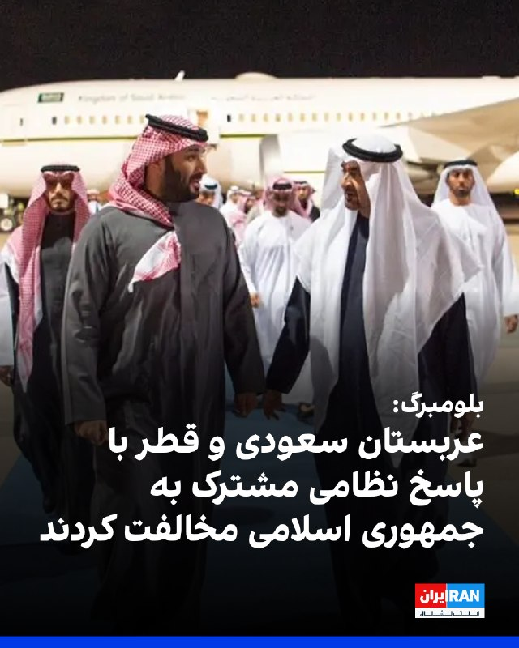

بلومبرگ به نقل از منابع آگاه گزارش داد امارات متحده عربی پس از آغاز حملات جمهوری اسلامی به کشورهای حوزه خلیج فارس، تلاش کرد کشورهای همسایه از جمله عربستان سعودی و قطر را برای مشارکت در یک پاسخ نظامی هماهنگ به حملات تهران متقاعد کند، اما با رد این درخواست از سوی آنها روبه‌رو شد.

به گفته این منابع، محمد بن زاید، رییس امارات متحده عربی مجموعه‌ای از تماس‌ها را با رهبران منطقه از جمله محمد بن سلمان، ولیعهد عربستان سعودی، برقرار کرد.

این منابع افزودند محمد بن زاید بر این باور بود که پاسخ گروهی کشورهای منطقه به ایران می‌تواند بازدارندگی ایجاد کند.
https://iranintl.com/202605157589

## IranIntlTV — post 337304

  <a href="telegram/content/IranIntlTV_337304_1778843406.mp4" target="_blank">🎬 Download video</a>

اصغر فرهادی، کارگردان ایرانی، در نشست خبری فیلم «داستان‌های موازی» در جشنواره کن به لی‌لی نیکفر، خبرنگار ایران‌اینترنشنال، گفت کشته شدن تعداد زیادی از معترضان «بی‌گناه» در جریان اعتراضات دی‌ماه و همچنین کشته شدن غیرنظامیان در جنگ دردناک بود.

او افزود مخالفت با کشته شدن بی‌گناهان و غیرنظامیان در جنگ به معنی موافقت با کشته شدن معترضان نیست. فرهادی گفت کشته شدن هر انسانی جنایت است؛ چه در جنگ، چه با اعدام و چه در اعتراضات.
@iranintltv

## IranIntlTV — post 337303

  

عباس عراقچی، وزیر خارجه جمهوری اسلامی، در یک نشست خبری در حاشیه اجلاس بریکس گفت جمهوری اسلامی در تلاش است آتش‌بس، «اگرچه بسیار ناپایدار است»، حفظ شود و به دیپلماسی فرصت داده شود.

او افزود: «به آمریکایی‌ها اعتماد نداریم و فقط در صورتی به مذاکرات علاقه‌مندیم که طرف مقابل جدی باشد.»

وزیر خارجه جمهوری اسلامی، در ادامه اظهاراتش گفت مذاکرات کنونی با آمریکا «از نبود اعتماد رنج می‌برد».

او همچنین گفت همه کشتی‌ها می‌توانند از تنگه هرمز عبور کنند، «به‌جز آن‌هایی که با ما در جنگ هستند».
https://iranintl.com/202605155857

## IranIntlTV — post 337302

  <a href="telegram/content/IranIntlTV_337302_1778843408.mp4" target="_blank">🎬 Download video</a>

سرخط خبرهای جمعه ۲۵ اردیبهشت
@iranintltv

## IranIntlTV — post 337301

  <a href="telegram/content/IranIntlTV_337301_1778843409.mp4" target="_blank">🎬 Download video</a>

یکی از مخاطبان ایران‌اینترنشنال که از بندرعباس پیام فرستاده، می‌گوید قیمت کالاها به‌شدت افزایش یافته و صف‌های طولانی در جایگاه‌های سوخت، زندگی روزمره مردم را مختل کرده است. او می‌گوید این شرایط در شهری رخ می‌دهد که قطب تجارت، صنعت و نفت و گاز ایران به شمار می‌رود. این پیام با هوش مصنوعی خوانده شده است.

## IranIntlTV — post 337300

  

کاظم غریب‌آبادی، معاون وزیر خارجه جمهوری اسلامی، امارات متحده عربی را به همکاری با آمریکا و اسرائیل در حملات علیه جمهوری اسلامی متهم کرد و گفت تهران در چارچوب «حق دفاع مشروع» به پایگاه‌ها و تاسیسات مورد استفاده آمریکا در امارات حمله کرده است.
https://iranintl.com/202605156930

## IranIntlTV — post 337299

  

اصغر فرهادی در پاسخ به خبرنگار ایران‌اینترنشنال، کشته شدن معترضان «بی‌گناه» در جریان انقلاب ملی ایرانیان را محکوم کرد و گفت مخالفت با کشته شدن بی‌گناهان و غیرنظامیان در جنگ به معنی موافقت با کشته شدن معترضان نیست.

فرهادی در نشست خبری فیلم «داستان‌های موازی» در جشنواره کن گفت: «ماه‌های گذشته و اواخر دورانی که مشغول ساختن این فیلم بودم، دو اتفاق بسیار دردناک در کشورم رخ داد.»

این کارگردان ایرانی گفت: «هر دو بسیار دردناک است و هیچ‌گاه فراموش نخواهد شد. مخالفت با کشته شدن بی‌گناهان و غیرنظامیان به معنی موافقت با کشته شدن گروهی دیگر در خیابان‌ها نیست.»

فرهادی ادامه داد: «همدلی با کشته‌شدگان در خیابان‌ها نیز به معنی همدلی نکردن با کسانی که در جنگ کشته شدند نیست. به نظرم کشته شدن هر انسانی یک جنایت است؛ چه در جنگ، چه در اعدام و چه کشتن معترضان.»

او در پایان گفت بسیار دردناک است که در قرن حاضر با وجود این همه پیشرفت، همچنان شاهد کشته شدن انسان‌های بی‌گناه هستیم.
https://iranintl.com/202605152301

## IranIntlTV — post 337297

  

امیر حاتمی، فرمانده‌ کل ارتش جمهوری اسلامی، گفت: «این قدرت ایمان است که می‌تواند دشمن را چنان دچار آشفتگی کند که حتی به‌اشتباه، هواپیماهای خودی را هدف قرار دهد.»

او گفت آنچه موجب اطمینان ما به پیروزی و توانمندی می‌شود، ایمان و اعتقاد است؛ ما هر سال در دهه محرم، شاهد یک مانور عظیم ایمانی هستیم. قدرت اصلی ما نیز همین قدرت ایمانی است.

او افزود: «این قدرت ایمانی است که می‌تواند یک جنگنده اف-۵ را به فراز مواضع نیروهای آمریکایی در کویت برساند، در حالی‌ که آن‌ها از پیشرفته‌ترین سامانه‌های پدافندی زمین‌پایه و هوایی برخوردارند.»
https://iranintl.com/202605153296

## IranIntlTV — post 337296

  <a href="telegram/content/IranIntlTV_337296_1778843412.mp4" target="_blank">🎬 Download video</a>

علی‌حسین قاضی‌زاده، عضو تحریریه ایران‌اینترنشنال، گفت جمهوری اسلامی در طول ۴۰ روز عملیات نظامی آمریکا و اسرائیل در حال فروختن نفت بود. او افزود در صورت ازسرگیری این عملیات، ترکیب محاصره دریایی و اقدام نظامی می‌تواند برای جمهوری اسلامی مهلک باشد.
@iranintltv

## IranIntlTV — post 337295

روایت شما از زندگی در آتش‌بس- جمعه ۲۵ اردیبهشت ۱۴۰۵

🔹 وقتی مردم اینترنت ندارند، کسب‌وکارها با اینترنت پرو خدمات خود را به چه کسی نشان دهند؟
🔹 من یه دختر ۲۳ ساله‌ام. هیچ آینده‌ای ندارم. همه‌چی صد برابر شده. از خیلی از چیزام زدم که فقط زنده بمونم. خیلیا شرایط سخت‌تری نسبت به من دارن. تکلیف ما چی میشه؟ هنوزم امیدوارم ولی تا کی؟ وقتی از قحطی مردیم میخوان وارد عمل بشن؟
🔹 از کرمانشاه پیام می‌دم. ما بچه‌های پایه‌ی هفتم تا دهم هنوز مشخص نیست که امتحان‌هامون حضوریه یا غیرحضوری. واقعاً این موضوع رو اعصابمونه. امیدوارم هرچی سریع‌تر اوضاع‌مون مشخص بشه.
🔹 این‌قدر کمبود دارو هست که حتی دارو با نسخه هم به صورت کامل داده نمی‌شه، چه برسه به صورت آزاد. از هر قرص یک بسته میدن.
🔹 یکی ما رو توجیه کنه ما مردم ایران هزینه چه چیزی رو داریم پرداخت می‌کنیم؟ برای چی داریم این همه فشار اقتصادی و نگرانی و چک کردن ته‌مانده حساب بانکی و قیمت طلا و دلار و کالاها رو تحمل می‌کنیم؟ نقش ما توی به‌وجود آمدن این مناقشه چی بوده؟ نابود شدیم

## IranIntlTV — post 337294

  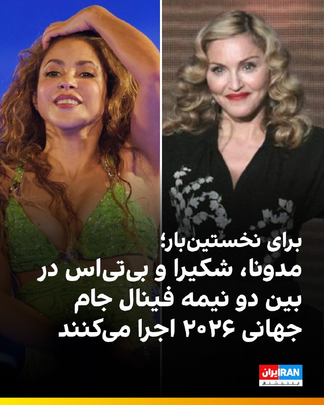

🔻مدونا، شکیرا و گروه موسیقی بی‌تی‌اس اجرای بین دو نیمه فینال جام جهانی ۲۰۲۶ را برعهده خواهند داشت؛ اجرایی که برای نخستین بار در تاریخ فینال جام جهانی برگزار می‌شود. جام جهانی ۲۰۲۶ به میزبانی مشترک آمریکا، کانادا و مکزیک برگزار می‌شود و دیدار نهایی آن ۲۸ تیر در نیوجرسی انجام خواهد شد.

🔹بی‌بی‌سی گزارش داد که این برنامه حدود ۱۱ دقیقه طول خواهد کشید. پیش‌تر گزارش‌هایی منتشر شده بود که احتمال دارد زمان اجرای بین دو نیمه از ۱۵ دقیقه فراتر رود؛ در حالی که قوانین فوتبال تاکید دارد فاصله بین دو نیمه نباید بیش از ۱۵ دقیقه باشد.

🔹شکیرا، خواننده کلمبیایی، قرار است آهنگ رسمی جام جهانی با عنوان «دای دای» را منتشر کند؛ قطعه‌ای با همکاری برنا بوی، خواننده نیجریه‌ای. او پیش‌تر نیز آهنگ «واکا واکا» را برای جام جهانی ۲۰۱۰ آفریقای جنوبی خوانده بود. مدونا نیز در آستانه انتشار پانزدهمین آلبوم خود با نام «اعترافات ۲» قرار دارد.

🔹اعضای گروه بی‌تی‌اس پس از سه سال وقفه برای انجام خدمت نظام وظیفه، فعالیت مشترک خود را از سر گرفته‌اند و هنگام اجرای فینال جام جهانی در میانه تور جهانی خود خواهند بود.

@iranintltvsport

## IranIntlTV — post 337293

  <a href="telegram/content/IranIntlTV_337293_1778843414.mp4" target="_blank">🎬 Download video</a>

ایلان ماسک، مدیرعامل تسلا، و تیم کوک، مدیرعامل اپل، روز پنج‌شنبه ۱۴ مه در ضیافت رسمی مجللی که شی جین‌پینگ، رئیس‌جمهوری چین، به افتخار دونالد ترامپ، رئیس‌جمهوری آمریکا، در پکن برگزار کرد، در حال گرفتن عکس دیده شدند. ماسک و کوک از جمله مدیران ارشدی هستند که در سفر ترامپ با هدف حل‌وفصل مسائل میان آمریکا و چین او را همراهی می‌کنند. شی در این ضیافت که مقام‌های ارشد و مدیران تجاری در آن حضور داشتند، روابط چین و آمریکا را مهم‌ترین رابطه در جهان توصیف کرد. ترامپ نیز در سخنرانی خود از شی دعوت کرد تا در ۲۴ سپتامبر از کاخ سفید دیدار کند.
@iranintltv

## IranIntlTV — post 337292

  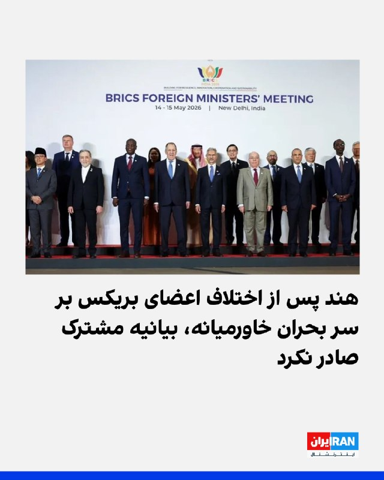

هند در پایان نشست سالانه وزیران خارجه بریکس در دهلی‌نو، به جای انتشار بیانیه مشترک، «بیانیه رییس نشست» را منتشر کرد و اعلام کرد میان برخی اعضا درباره وضعیت خاورمیانه اختلاف‌نظر وجود دارد.

بر اساس گزارش رویترز، جمهوری اسلامی و امارات متحده عربی در جنگ تهران با آمریکا و اسرائیل در دو سوی مقابل قرار دارند؛ جنگی که در جریان آن، جمهوری اسلامی بیش از هر کشور دیگر حوزه خلیج فارس، امارات متحده عربی را هدف قرار داده است.
https://iranintl.com/202605150594

## IranIntlTV — post 337291

روایت شما از زندگی در آتش‌بس- جمعه ۲۵ اردیبهشت ۱۴۰۵

🔹 بندرعباس، تمامی کالاها به شدت گران شده و در جایگاه‌های سوخت صف‌های کیلومتری هست. متأسفانه زندگی روزمره مردم مختل شده، شهری که قطب تجارت و صنعت و نفت و گاز است.
🔹 ساکن یکی از شهرهای نزدیک مشهد هستم. ما به هیچ ابرقدرتی نیاز نداریم و منتظر فراخوان شاه هستیم. پاینده ایران.
🔹 دانش‌آموز پایه دهم انسانی هستم. خوشبختانه امسال امتحان‌ها نهایی نیست، اما خیلی نگران سال آینده هستم، چون امسال ما هیچی یاد نگرفتیم و شرایط یادگیری افتضاح بوده. تو مدرسه غیردولتی هم درس می‌خوانم.
🔹 از مشهد پیام می‌دهم. واقعاً ما از این بلاتکلیفی خسته شدیم، گرونی بیداد می‌کند، دخل و خرج‌مان با هم همخوانی ندارد، باید ده نفر کار کنیم که یک نفر بتواند بخورد.
🔹 نیم‌قرن است که کل دنیا، مخصوصاً اروپا، فقط گفتند فلان کار جمهوری اسلامی را محکوم می‌کنیم و فایده‌ای نداشت. هر روز جمهوری اسلامی پُرروتر هم شد. نمی‌شود از یک دیوانه زنجیری توقع داشت با حرف آرام بگیرد.

## IranIntlTV — post 337290

  <a href="telegram/content/IranIntlTV_337290_1778843415.mp4" target="_blank">🎬 Download video</a>

یک شهروند در پیامی به ایران اینترنشنال به سایر شهروندان توصیه می‌کند که اینترنت حکومتی «پرو» را نخرند و آن ‌را خیانت به مردم ایران دانست. پیام او با هوش مصنوعی خوانده شده است.

## IranIntlTV — post 337289

  

تجربیات شما از قطع برق و آب و افزایش قیمت قبض‌ها چیست؟ روی لینک زیر کلیک کنید و پیام‌های خود از طریق مدیا‌بات برای ما بفرستید. 
https://t.me/intlmedia_bot
پیام‌های شما به صورت زیر‌نویس در تلویزیون و همچنین در بخش‌های مختلف‌ خبری منتشر خواهد شد.

## Shin_Persian — post 6010

  

DefenceGeek 🇬🇧 ✓ @DefenceGeek Fri, 15 May 2026 09:32:18 UTC Tanker In-Flight Emergency #FreeIran‌ --- Operation EPIC FURY / Project FREEDOM --- One of the KC-46A "Pegasus" tanker from Tel Aviv Ben Gurion (LLBG) airport is declaring an in-flight emergency…

## Shin_Persian — post 6009

DefenceGeek 🇬🇧 ✓ @DefenceGeek
Fri, 15 May 2026 09:32:18 UTC

Tanker In-Flight Emergency #FreeIran‌
--- Operation EPIC FURY / Project FREEDOM ---

One of the KC-46A "Pegasus" tanker from Tel Aviv Ben Gurion (LLBG) airport is declaring an in-flight emergency and squawking 7700. KC-46s from this base are usually "YETI" callsigns

KC-46A "YETI??" 18-46054 #AE5FA1

@MATA_osint

فارسی

وضعیت اضطراری سوخت‌رسان در حین پرواز #FreeIran‌
--- عملیات خشم حماسی / پروژه آزادی ---

یکی از هواپیماهای سوخت‌رسان KC-46A «پگاسوس» از فرودگاه بن گوریون تل‌آویو (LLBG) وضعیت اضطراری در حین پرواز اعلام کرده و کد ۷۷۰۰ (squawk 7700) را مخابره می‌کند. سوخت‌رسان‌های KC-46 این پایگاه معمولاً با شناسه رادیویی «YETI» فعالیت می‌کنند.

KC-46A "YETI??" 18-46054 #AE5FA1

@MATA_osint

𝕏 · @shin_persian

## Shin_Persian — post 6008

  

DefenceGeek 🇬🇧 ✓ @DefenceGeek Fri, 15 May 2026 08:02:32 UTC The Tanker Shuffle Continues #FreeIran‌ --- Operation EPIC FURY / Project FREEDOM --- As has been the case on most days during the ceasefire, the US tanker fleet (numbering over 220 aircraft)…

## Shin_Persian — post 6007

DefenceGeek 🇬🇧 ✓ @DefenceGeek
Fri, 15 May 2026 08:02:32 UTC

The Tanker Shuffle Continues #FreeIran‌
--- Operation EPIC FURY / Project FREEDOM ---

As has been the case on most days during the ceasefire, the US tanker fleet (numbering over 220 aircraft) across Europe and CENTCOM continues to shuffle around, with harder worked airframes being rotated out and replaced. So far today:

KC-135R "RCH736" 57-1486 #AE041D (EGUN -> LLBG)
KC-135R "?" 61-0300 #AE0689 (LLBG -> EDDS)
KC-135R "RCH314" 62-3521 #AE0485 (LFOA -> EDDS -> ?)
KC-135T "RCH559" 59-1471 #AE07A5 (CONUS -> EDDS)

@MATA_osint

فارسی

جابه‌جایی تانکرهای سوخت‌رسان ادامه دارد #FreeIran‌
--- عملیات خشم حماسی (Operation EPIC FURY) / پروژه آزادی (Project FREEDOM) ---

همانطور که در اکثر روزهای آتش‌بس صادق بوده است، ناوگان تانکرهای ایالات متحده (با بیش از ۲۲۰ هواپیما) در سراسر اروپا و سنتکام (ستاد فرماندهی مرکزی ایالات متحده - CENTCOM) به جابه‌جایی‌های خود ادامه می‌دهند و بدنه‌های پروازی که فشار کاری بیشتری داشته‌اند، از چرخه خارج و جایگزین می‌شوند. موارد ثبت شده تا این لحظه از امروز:

KC-135R "RCH736" 57-1486 #AE041D (فرودگاه ای‌جی‌یو‌ان -> فرودگاه بن گوریون)
KC-135R "?" 61-0300 #AE0689 (فرودگاه بن گوریون -> فرودگاه اشتوتگارت)
KC-135R "RCH314" 62-3521 #AE0485 (پایگاه هوایی اورو -> فرودگاه اشتوتگارت -> ?)
KC-135T "RCH559" 59-1471 #AE07A5 (ایالات متحده -> فرودگاه اشتوتگارت)

@MATA_osint

𝕏 · @shin_persian

## ManotoTV — post 105478

  <a href="telegram/content/ManotoTV_105478_1778843418.mp4" target="_blank">🎬 Download video</a>

نارندرا مودی، نخست‌وزیر هند، روز جمعه ۲۵ اردیبهشت در جریان سفر به ابوظبی، با انتشار پیامی در شبکه اجتماعی ایکس نوشت: «دوستی میان هند و امارات بسیار نیرومند است.»

مودی در این سفر با شیخ محمد بن زاید، رئیس امارات متحده عربی، دیدار کرد. محور گفتگوهای دو طرف، گسترش روابط دوجانبه، همکاری‌های انرژی، همکاری‌های دفاعی و تحولات منطقه‌ای اعلام شده است.

این سفر در شرایطی انجام می‌شود که تنش‌های منطقه‌ای و نگرانی‌ها درباره امنیت مسیرهای انرژی، اهمیت همکاری میان هند و امارات را افزایش داده است. امارات یکی از شرکای مهم هند در حوزه انرژی و تجارت به شمار می‌رود و ابوظبی و دهلی نو در سال‌های اخیر روابط اقتصادی و راهبردی خود را گسترش داده‌اند.

## ManotoTV — post 105477

  <a href="telegram/content/ManotoTV_105477_1778843418.mp4" target="_blank">🎬 Download video</a>

عباس عراقچی، وزیر خارجه جمهوری اسلامی، در گفتگو با رسانه دولتی هند گفت «هیچ راه‌حل نظامی‌ای وجود ندارد» و افزود ایالات متحده باید این واقعیت را درک کند.

او گفت آمریکا «دست‌کم دو بار» جمهوری اسلامی را آزموده و اکنون به این نتیجه رسیده است که «راه‌حل نظامی وجود ندارد».

عراقچی مهم‌ترین مشکل در روند کنونی را «پیام‌های متناقض» از سوی مقام‌های آمریکایی دانست و گفت این پیام‌ها از طریق اظهارنظرها، مصاحبه‌ها و مواضع مختلف دریافت می‌شود.

## ManotoTV — post 105476

  <a href="telegram/content/ManotoTV_105476_1778843419.mp4" target="_blank">🎬 Download video</a>

رسانه دولتی اسرائیل گزارش داد ایال زامیر، رئیس ستاد ارتش اسرائیل، در جریان جنگ با ایران به امارات متحده عربی سفر کرده است.
بر اساس این گزارش، او همراه با چند مقام نظامی اسرائیل با مقام‌های اماراتی، از جمله محمد بن زاید، رئیس امارات، دیدار کرده است. ارتش اسرائیل تاکنون واکنشی به این گزارش نشان نداده است.
این گزارش پس از آن منتشر می‌شود که بنیامین نتانیاهو نیز گفته بود در زمان جنگ به امارات سفر کرده؛ ادعایی که از سوی امارات رد شد. همچنین گزارش‌هایی درباره سفر رؤسای سازمان‌های اطلاعاتی و امنیتی اسرائیل به امارات در زمان جنگ منتشر شده است.
در همین حال، مقام‌های آمریکایی تأیید کرده‌اند اسرائیل یک سامانه پدافند موشکی را به همراه نیروهای نظامی برای راه‌اندازی آن به امارات منتقل کرده است.

## FarsiVOA — post 217812

🔺۱۸۲۰ ساعت انزوای دیجیتال؛ میلیاردها تومان خسارت و افزایش نگرانی‌های روانی

▪️ایران در حالی وارد هفتاد و هفتمین روز از محدودیت‌ها و اختلال گسترده اینترنت بین‌المللی شده است که به گفته نت‌بلاکس، نهاد پایش دسترسی به اینترنت، مجموع ساعات قطعی یا اختلال شدید به بیش از هزار و ۸۲۴ ساعت رسیده است.

▪️بر اساس گزارش‌ها، در طول جنگ ۱۲ روزه، اینترنت در ایران ۹ روز قطع بوده است. همچنین در جریان اعتراضات دی‌ماه، این اختلال به ۲۱ روز رسیده و از ۹ اسفند تا امروز نیز ۷۷ روز محدودیت ثبت شده است.

▪️در مجموع، این دوره‌ها حدود ۱۰۷ روز خاموشی یا اختلال اینترنتی را شامل می‌شود؛ به این معنا که شهروندان ایرانی تقریباً یک‌سوم روزهای ۱۱ ماهه گذشته را در شرایط دسترسی محدود به اینترنت سپری کرده‌اند.

⬇️ بیشتر بخوانید:
https://ir.voanews.com/a/8150370.html

## FarsiVOA — post 217811

  

عضو کمیسیون انرژی مجلس شورای اسلامی، مصرف روزانه بنزین کشور را حدود ۱۳۰ تا ۱۳۵ میلیون لیتر بنزین عنوان و اعلام کرد که توان «تولید و تأمین» بنزین، تنها روزانه حدود ۱۱۰ تا ۱۱۵ میلیون‌ لیتر است.

رمضانعلی سنگدوینی، به خبرگزاری تسنیم وابسته به سپاه گفته است که این «ناترازی ۲۰ میلیون لیتری» در شرایط فعلی، مدیریت مصرف سوخت را به یک ضرورت جدی تبدیل کرده است.

به گفته او، فقط تهران روزانه حدود ۲۰ میلیون لیتر بنزین نیاز دارد.

پیشتر محمدصادق معتمدیان، استاندار تهران، اعلام کرده بود که در حمله اسرائیل به مخازن انرژی در تهران طی جنگ ۴۰ روزه، ۷۰ تا ۸۰ میلیون لیتر سوخت از بین رفت.
@FarsiVOA

## FarsiVOA — post 217810

🔺روسیه و اوکراین ۲۰۵ زندانی و اسیر را مبادله کردند

▪️روسیه و اوکراین هر کدام ۲۰۵ زندانی و اسیر را روز جمعه در چهارچوب ابتکار دونالد ترامپ رئیس‌جمهور آمریکا مبادله کردند.

▪️در چهارچوب ابتکار دونالد ترامپ، قرار است طرفین مناقشه هر کدام هزار زندانی و اسیر آزاد کنند.

▪️ماه گذشته در دو مرحله مجموعاً ۳۶۸ زندانی مبادله شد.

⬇️ بیشتر بخوانید:
https://ir.voanews.com/a/8150369.html

## FarsiVOA — post 217809

  

خبرگزاری رویترز به نقل از منابع امنیتی گزارش داد که دو پهپاد روز جمعه مقر یکی از احزاب کرد ایرانی مخالف جمهوری اسلامی را در شمال اربیل در اقلیم کردستان عراق هدف قرار دادند.

این خبرگزاری نام این حزب و همچنین توضیحات بیشتری درباره خسارات یا تلفات احتمالی این حمله پهپادی منتشر نکرد.

پیشتر حزب دموکرات کردستان ایران، از احزاب کرد مخالف جمهوری اسلامی، با انتشار بیانیه‌ای حملات اخیر به خانواده‌های این حزب را محکوم و بر حق دفاع مشروع تأکید کرده است.

طی بیش از دو ماه گذشته، هم‌زمان با جنگ آمریکا-اسرائیل علیه جمهوری اسلامی و حتی در دوره آتش‌بسی که بیش از یک ماه از برقراری آن می‌گذرد، جمهوری اسلامی و گروه‌های نیابتی وابسته به آن در عراق موج گسترده‌ای از حملات موشکی و پهپادی به اقلیم کردستان عراق را آغاز کرده‌اند.

به گزارش نهادهای حقوق بشری، بخش عمده این حملات که توسط سپاه پاسداران انجام شده، اردوگاه‌ها و مقرهای احزاب اپوزیسیون کُرد ایرانی و کمپ‌های پناهجویان/پناهندگان در استان‌های سلیمانیه و اربیل را هدف قرار داده است.
@FarsiVOA

## FarsiVOA — post 217808

  

رسانه دولتی امارات از آغاز احداث یک خط لوله جدید برای دور زدن تنگه هرمز خبر داد.

بر اساس این گزارش، تصمیم برای توسعه یک خط لوله به بندر فجیره در دریای عمان طی اجلاس مدیران شرکت ملی نفت ابوظبی و ولیعهد این کشور گرفته شده و این پروژه تا سال ۲۰۲۷ به بهره‌برداری خواهد رسید.

امارات هم‌اکنون نیز یک خط لوله با ظرفیت انتقال روزانه ۱.۹ میلیون بشکه نفت به بندر فجیره دارد و با احداث خط لوله جدید، این ظرفیت دو برابر خواهد شد.

این کشور ظرفیت تولید روزانه نزدیک به پنج میلیون بشکه نفت دارد، اما به خاطر انسداد تنگه هرمز توسط جمهوری اسلامی، ماه گذشته تنها دو میلیون بشکه تولید انجام داد. امارات از ابتدای ماه جاری از اوپک خارج شد تا تولید نفت خود را با دست بازتری افزایش دهد.
@FarsiVOA

## FarsiVOA — post 217807

🔺مهم‌ترین دستاوردهای سفر ترامپ به چین چه بود؟

▪️دونالد ترامپ، رئیس‌جمهور آمریکا، که پس از یک سفر سه‌روزه، پکن را به مقصد واشنگتن ترک کرد، از پیشرفت‌های تجاری میان دو کشور خبر داده است.

▪️او روز جمعه گفت که درباره ایران هم با رئیس‌جمهور چین، گفت‌وگو کرده و هر دو رهبر درباره عدم دستیابی تهران به سلاح هسته‌ای و باز بودن تنگه‌ها نظر مشابهی دارند.

▪️ترامپ روز پنج‌شنبه نیز گفت شی توافق کرده سفارش ۲۰۰ فروند هواپیمای بوئینگ را نهایی کند.

▪️کاخ سفید اعلام کرده که رهبران آمریکا و چین درباره راه‌های تقویت همکاری اقتصادی میان دو کشور، از جمله گسترش دسترسی شرکت‌های آمریکایی به بازار چین و افزایش سرمایه‌گذاری چین در صنایع ایالات متحده، تبادل نظر کردند.

⬇️ بیشتر بخوانید:
https://ir.voanews.com/a/8150368.html

## DW_Farsi — post 124722

  

🔶 ترامپ: روند نابودی نظامی ایران ادامه خواهد داشت

دونالد ترامپ، رئیس ‌جمهور ایالات متحده آمریکا، در یک پست طولانی در شبکه اجتماعی خود تروث سوشال، هنگام فهرست کردن آنچه موفقیت‌های دولتش خواند، از "درهم‌کوبیدن نظامی ایران" نام برد.

او در ادامه جمله مربوط به ایران، داخل پرانتز نوشت: «ادامه دارد»؛ عبارتی که به گفته ناظران سیاسی ممکن است نشان‌دهنده این باشد که او پس از بازگشت از سفرش به چین در روز جمعه، جنگ علیه جمهوری اسلامی را از سر بگیرد.

همزمان برخی منابع خبری اسرائیلی گزارش داده‌اند که در اسرائیل این باور وجود دارد که ترامپ، پس از بازگشت از سفرش به چین در پایان هفته، درباره ازسرگیری جنگ علیه ایران تصمیم خواهد گرفت.

بر اساس اعلام منابع اسرائیلی، رئیس ‌جمهور آمریکا با دو گزینه اصلی روبه‌رو است: ازسرگیری درگیری‌ها، همان‌طور که گفته می‌شود بنیامین نتانیاهو، نخست‌وزیر اسرائیل، این گزینه را ترجیح می‌دهد، یا گزینه دوم یعنی ازسرگیری محاصره تنگه هرمز در چارچوب آنچه عملیات آمریکایی "پروژه آزادی" توصیف شده است.

در عین حال، بر اساس گزارش شبکه ۱۲ اسرائیل (کان)، ترامپ همچنین ممکن است در پایان سفر تاریخی خود به چین تصمیم بگیرد که "هیچ تصمیمی" نگیرد.

در همین راستا منابع اسرائیلی به روزنامه هاآرتص گفته‌اند اگرچه در حال حاضر، وضعیت هشدار غیرعادی وجود ندارد، اما احتمال ازسرگیری درگیری‌ها در روزهای آینده همچنان وجود دارد.

@dw_farsi

## DW_Farsi — post 124721

  

🔶 رویترز از حمله پهپادی به مقر یک حزب کرد ایرانی در اربیل خبر داد

خبرگزاری رویترز به نقل از منابع امنیتی، از حمله دو پهپاد به یک مقر احزاب کرد ایرانی مخالف جمهوری اسلامی در شمال اربیل در اقلیم کردستان عراق خبر داد.
این خبرگزاری نوشت که این حمله توسط دو پهپاد روز جمعه صورت گرفته است. با این حال رویترز نام این حزب را ذکر نکرده و جزئیات بیشتری در خصوص خسارات و تلفات احتمالی این حمله منتشر نکرده است.

پیش از این این، حزب دموکرات کردستان ایران از حمله پهپادی مجدد جمهوری اسلامی به کمپ‌های این حزب در شامگاه چهارشنبه، ۲۳ اردیبهشت‌ماه ۱۴۰۵، ساعت ۲۱:۳۰ به وقت محلی خبر داده بود.

بر اساس اطلاعیه این حزب، جمهوری اسلامی در این حمله با دو پهپاد، کمپ "جژنیکان" متعلق به حزب دموکرات کردستان ایران در نزدیکی اربیل را هدف قرار داد که گفته شده "محل استقرار خانواده‌ها و پناهجویان این حزب است".

این کمپ به گفته حزب دموکرات کردستان از ابتدای جنگ۴۰ روزه، "تاکنون بارها هدف حملات مستقیم قرار گرفته است".

حزب دموکرات کردستان پیش از این اعلام کرده بود که حکومت ایران از زمان آغاز درگیری‌ها با آمریکا و اسرائیل، "با بیش از ۱۲۶ فروند موشک و پهپاد، کمپ‌های مدنی، مراکز درمانی و نهادهای آموزشی حزب دموکرات کوردستان ایران را هدف قرار داده است".

@dw_farsi

## DW_Farsi — post 124720

  

🔶 رئیس کمیسیون امنیت ملی مجلس: ۵۰ میلیون یورو پاداش برای کشتن ترامپ

ابراهیم عزیزی، رئیس کمیسیون امنیت ملی و سیاست خارجی مجلس در شورای اسلامی، در اظهار نظری درباره طرح جمهوری اسلامی برای اقدامات بعدی جنگ در برابر آمریکا مدعی شد: «چند طرح را از زمان شروع جنگ سوم، آماده کردیم که طرح اقدام متقابل توسط نیروهای نظامی و امنیتی از جمله آنها است.»

عزیزی با اشاره به طرحی با عنوان "اقدام متقابل توسط نیروهای نظامی و امنیت" گفت: «پیش بینی کرده‌ایم که دولت به هر فرد حقیقی و حقوقی که این رسالت دینی (کشتن ترامپ) را انجام دهد به عنوان پاداش ۵۰ میلیون یورو بپردازد.»

او همچنین خواستار هدف قرار گرفتن دونالد ترامپ، رئیس جمهور آمریکا، بنیامین نتانیاهو، نخست‌وزیر اسرائیل و همچنین فرمانده سنتکام شد و گفت این افراد "باید مورد برخورد و اقدام متقابل قرار بگیرند".

رئیس کمیسیون امنیت ملی و سیاست خارجی مجلس در شورای اسلامی همچنین مدعی شد: «ما این حق را با پایان جنگ و پیروزی‌هایی که در جنگ به دست آوردیم، جدا می‌دانیم.»

عزیزی گفت همان‌طور که ترامپ دستور کشتن علی خامنه‌ای، رهبر پیشین جمهوری اسلامی را صادر کرده، خود او "باید به دست هر مسلمان و آزاده‌ای مورد برخورد قرار بگیرد."

@dw_farsi

## DW_Farsi — post 124719

🔶 عربستان خواهان پیمان عدم تعرض با ایران شد

 عربستان سعودی در گفت‌وگو با متحدان خود، ایده یک پیمان عدم تعرض میان ایران و کشورهای خاورمیانه را مطرح کرده است؛ طرحی که به گفته دیپلمات‌ها، می‌تواند پس از پایان جنگ آمریکا و اسرائیل با ایران، به یکی از چارچوب‌های اصلی برای مدیریت تنش‌های منطقه‌ای تبدیل شود. فایننشال تایمز گزارش داد ریاض گفته است برای این ایده، "فرایند هلسینکی" در اروپا را به‌عنوان یک الگوی ممکن در نظر دارد؛ مدلی که در دهه ۱۹۷۰ به کاهش تنش میان بلوک‌های رقیب در دوران جنگ سرد کمک کرد.

 کشورهای عربی خلیج فارس از آغاز جنگ نگران بوده‌اند که در پایان درگیری، با ایرانی ضعیف‌تر اما تندروتر در همسایگی خود روبه‌رو شوند؛ آن هم در شرایطی که احتمال کاهش حضور نظامی آمریکا در منطقه نیز مطرح است. در چنین فضایی، ایده یک پیمان عدم تعرض از نگاه ریاض فقط یک ابتکار دیپلماتیک نیست، بلکه تلاشی برای جلوگیری از دور تازه‌ای از بی‌ثباتی است.

دیپلمات‌های غربی گفته‌اند این طرح فقط یکی از چند ایده‌ای است که روی میز قرار دارد، اما در پایتخت‌های اروپایی و در نهادهای اتحادیه اروپا از آن استقبال شده است. از نگاه حامیان این ایده، چنین چارچوبی می‌تواند هم مانع درگیری‌های آینده شود و هم برای تهران نوعی تضمین فراهم کند که خود نیز هدف حمله قرار نخواهد گرفت.

@dw_farsi

## DW_Farsi — post 124718

  

🔶 پاداش اف‌بی‌آی برای یافتن مامور آمریکایی متهم به جاسوسی برای ایران

دفتر میدانی اف‌بی‌آی در واشنگتن اعلام کرد برای اطلاعاتی که به دستگیری و پیگرد قضایی مونیکا ویت، عضو سابق نیروهای نظامی ایالات متحده آمریکا و مامور ضدجاسوسی، منجر شود، ۲۰۰ هزار دلار جایزه تعیین کرده است.

او در فوریه ۲۰۱۹ از سوی هیئت منصفه فدرال در ناحیه کلمبیا به اتهام جاسوسی، از جمله انتقال اطلاعات دفاع ملی به جمهوری اسلامی متهم شده بود.

ویت، متخصص سابق اطلاعاتی نیروی هوایی ایالات متحده آمریکا در دوره خدمت فعال و مامور ویژه سابق دفتر تحقیقات ویژه نیروی هوایی، بین سال‌های ۱۹۹۷ تا ۲۰۰۸ در ارتش خدمت کرد و سپس تا سال ۲۰۱۰ به عنوان پیمانکار دولت ایالات متحده آمریکا فعالیت داشت. خدمت نظامی و فعالیت قراردادی او دسترسی به اطلاعات محرمانه و فوق محرمانه مرتبط با اطلاعات خارجی و ضدجاسوسی، از جمله نام‌های واقعی نیروهای مخفی جامعه اطلاعاتی ایالات متحده آمریکا، را برای او فراهم کرده بود.

ویت در سال ۲۰۱۳ به ایران گریخت. بر اساس کیفرخواست، او پس از آن اطلاعاتی را در اختیار حکومت ایران قرار داد و اطلاعات و برنامه‌های حساس و طبقه‌بندی‌شده دفاع ملی ایالات متحده آمریکا را در معرض خطر قرار داد.

بر اساس اعلام اف‌بی‌آی، ویت عمدا اطلاعاتی را ارائه کرده که جان نیروهای آمریکایی و خانواده‌های آن‌ها را که در خارج از کشور مستقر بودند، به خطر انداخته است. همچنین گفته می‌شود او از طرف حکومت ایران تحقیقاتی انجام داده تا آن‌ها بتوانند همکاران سابق او در دولت ایالات متحده آمریکا را هدف قرار دهند.

به گفته اف‌بی‌آی، فرار ویت به ایران برای سپاه پاسداران انقلاب اسلامی سودمند بوده است. در بیانیه اف‌بی‌آی آمده است که سپاه دارای بخش‌هایی است که مسئول جمع‌آوری اطلاعات، جنگ نامتقارن و ارائه پشتیبانی مستقیم به چند سازمان تروریستی هستند که شهروندان و منافع ایالات متحده آمریکا را هدف قرار می‌دهند.

اگرچه برای جرایم ادعایی ویت، کیفرخواست صادر شده، اما او همچنان متواری است. اف‌بی‌آی می‌گوید همچنان فعالانه برای یافتن ویت و "کشاندن او به پای میز عدالت" تلاش می‌کند.

در همین راستا دنیل ویرزبیتسکی، مامور ویژه مسئول بخش ضدجاسوسی و سایبری دفتر میدانی اف‌بی‌آی در واشنگتن، اعلام کرد: «گفته می‌شود مونیکا ویت بیش از یک دهه پیش با فرار به ایران و ارائه اطلاعات دفاع ملی به حکومت ایران، سوگند خود به قانون اساسی را نقض کرده و احتمالا همچنان به فعالیت‌های مخرب آن‌ها کمک می‌کند.»

او افزود: «اف‌بی‌آی این موضوع را فراموش نکرده و معتقد است در این مقطع مهم از تاریخ ایران، فردی وجود دارد که چیزی درباره محل اختفای او می‌داند. اف‌بی‌آی می‌خواهد از شما بشنود تا بتوانید به ما برای دستگیری ویت و کشاندن او به پای میز عدالت کمک کنید.»

@dw_farsi

## DW_Farsi — post 124717

  

🔶 الهه و الناز محمدی برنده جایزه "شجاعت در روزنامه‌نگاری" شدند

بنیاد بین‌المللی رسانه زنان (IWMF) برنگان سی‌وهفتمین دوره سالانه جوایز "شجاعت در روزنامه‌نگاری" را معرفی کرد.

این جایزه از زنانی تقدیر می‌کند که تحت شرایط خطرناک و فشار شدید برای آشکار کردن حقیقت گزارش تهیه می‌کنند.

برندگان سال ۲۰۲۶ شامل الهه و الناز محمدی، خواهران ایرانی و خبرنگاران رسانه‌های چاپی؛ جورجیا فورت، خبرنگار تلویزیونی از ایالات متحده آمریکا؛ و نای مین نی (با استفاده از نام مستعار)، خبرنگار دیجیتال از میانمار هستند.

فرنچی می کامپیو، خبرنگار فیلیپینی که درباره خشونت حکومتی در فیلیپین گزارش تهیه می‌کند و اکنون در همان کشور زندانی است، جایزه "والیس آننبرگ برای عدالت برای زنان روزنامه‌نگار" بنیاد بین‌المللی رسانه زنان در سال ۲۰۲۶ را دریافت کرد؛ این جایزه‌ که هر سال به روزنامه‌نگاری اعطا می‌شود که به ناحق بازداشت، زندانی یا محبوس شده باشد.

برندگان جایزه شجاعت امسال از میان نامزدهایی از ۵۳ ملیت انتخاب شدند. به گفته ناظران، این امر نشان‌دهنده کاهش آزادی مطبوعات در جهان است و با ترکیبی از فشارهای حقوقی، ارعاب جنسیتی و هدف‌گیری دیجیتال تشدید شده است.

الیزا لیس مونوز، رئیس بنیاد بین‌المللی رسانه زنان با اشاره به برندگان جوایز امسال شجاعت در روزنامه‌نگاری گفت: «جرم‌انگاری حقیقت‌گویی همان چیزی است که شجاعت را به آینده روزنامه‌نگاری تبدیل می‌کند. برای زنانی که جرات گزارشگری دارند، خود روزنامه‌نگاری در حال بازتعریف شدن به‌عنوان عملی قابل مجازات است.»

او افزود: «ما دیگر در جهانی از سرکوب واکنشی زندگی نمی‌کنیم، بلکه در جهانی از بازدارندگی پیش‌دستانه هستیم؛ جایی که خودِ گزارشگری به یک مسئولیت خطرناک تبدیل شده است. بنیاد بین‌المللی رسانه زنان با افتخار از الهه، الناز، فرنچی، جورجیا و نای، زنانی که با همان خطری زندگی می‌کنند که درباره آن گزارش تهیه می‌کنند، امسال با جوایز شجاعت تقدیر می‌کند.»

@dw_farsi

## Persian_Trend_Official — post 14185

  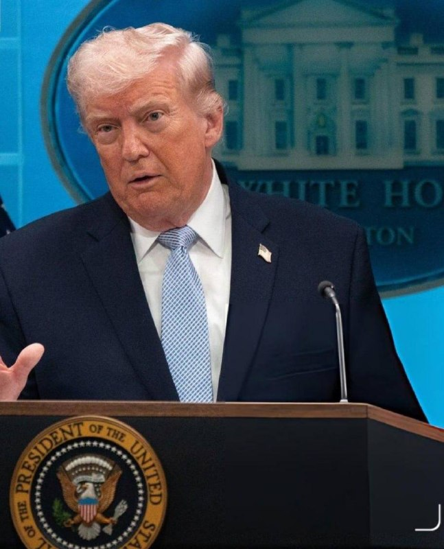

🔴رویترز به نقل از ترامپ

💢من هیچ مخالفتی با تعلیق برنامه هسته‌ای ایران به مدت ۲۰ سال ندارم، اما این باید یک تعهد واقعی باشد

🫆:Tony

📌 @persian_trend_official
پرشین ترند | متفاوت‌ترین کانال نظامی

## Persian_Trend_Official — post 14184

  <a href="telegram/content/Persian_Trend_Official_14184_1778843424.mp4" target="_blank">🎬 Download video</a>

💢عراقچی: خبر رد پیشنهاد جمهوری اسلامی توسط آمریکا برای چند روز پیش هست/ پیام‌های از آمریکا گرفتیم که مایل به ادامه گفتگو و تعامل هستند

🔹وزیر امورخارجه در نشست خبری:

💢اینکه مطرح شده آمریکا پیشنهاد یا پاسخ ایران را رد کرده مربوط به چند روز پیش هست که آقای ترامپ توییت زد و گفت که غیر قابل قبول هست و ولی بعد از ما مجدد پیام‌هایی را از طرف آمریکایی‌ها گرفتیم که مایل به ادامه گفتگوها و ادامه تعامل هستند.

💢اینکه امروز چطوری دوباره این موضوع در رسانه‌ها برجسته شده، من اطلاع ندارم ولی قضیه مربوط به چند روز پیش هست.

🫆:Tony

📌 @persian_trend_official
پرشین ترند | متفاوت‌ترین کانال نظامی

## Persian_Trend_Official — post 14183

  <a href="telegram/content/Persian_Trend_Official_14183_1778843425.mp4" target="_blank">🎬 Download video</a>

💢ضیافت شام پکن، لحظه‌ای که شی جین ‌پینگ برای چند دقیقه میز رو ترک می‌کنه…

▪️دونالد ترامپ هم از فرصت استفاده می‌کنه و می‌ره سراغ دفترچه شخصی شی جین پینگ 😁

🫆:Tony

📌 @persian_trend_official
پرشین ترند | متفاوت‌ترین کانال نظامی

## Persian_Trend_Official — post 14182

🔴وزیر امور خارجه عباس عراقچی اعلام کرده که پیام‌های متناقض از سوی واشنگتن روند مذاکرات را پیچیده کرده است.

او در اظهاراتی که از سوی رسانه رسمی ایران منتشر شده، تأکید کرده ایران مسئول اختلالات در تنگه هرمز نیست و آغازگر جنگ هم نبوده و صرفاً در حال دفاع از خود است.

💢عراقچی همچنین موضع تهران را تکرار کرده که تنگه هرمز برای عبور کشتی‌های کشور‌های «دوست» باز است، به شرط هماهنگی با مقامات ایرانی، اما برای کشور‌های «دشمن» محدود خواهد بود.

🫆:Tony

📌 @persian_trend_official
پرشین ترند | متفاوت‌ترین کانال نظامی

## Persian_Trend_Official — post 14181

  <a href="telegram/content/Persian_Trend_Official_14181_1778843427.webm" target="_blank">🎬 Download video</a>

🔴 الجزیره: آمریکا تمامی شروط ایران را رد کرده است

💢خبرنگار الجزیره گزارش داد تهران به‌صورت رسمی پاسخ واشینگتن به پیشنهاد ارائه‌شده از سوی ایران را دریافت کرده است.

بر اساس این گزارش:

▪️ ایالات متحده تمامی شروط مطرح‌شده از سوی ایران را رد کرده است

🫆:Tony

📌 @persian_trend_official
پرشین ترند | متفاوت‌ترین کانال نظامی

## Persian_Trend_Official — post 14180

💢رئیس ستاد کل ارتش اسرائیل در جریان جنگ ایران به طور مخفیانه به امارات متحده عربی سفر کرد و با شیخ محمد بن زاید دیدار کرد — که به فهرست فزاینده‌ای از مقامات ارشد اسرائیلی پیوست که سفرهای مخفیانه در زمان جنگ به ابوظبی داشتند.

💢امارات متحده عربی همچنان این دیدارها را انکار می‌کند.

🫆:Tony

📌 @persian_trend_official
پرشین ترند | متفاوت‌ترین کانال نظامی

## Persian_Trend_Official — post 14179

  <a href="telegram/content/Persian_Trend_Official_14179_1778843427.webm" target="_blank">🎬 Download video</a>

🔴 آمریکا برای اطلاعات درباره واحد تولید پهپاد سپاه جایزه تعیین کرد

💢وزارت خارجه آمریکا اعلام کرد برای دریافت اطلاعات درباره ۶ فرد مرتبط با واحد تولید پهپاد نیروی قدس سپاه پاسداران جایزه مالی تعیین کرده است.

بر اساس بیانیه واشینگتن:

▪️ این افراد با شرکت «کیمیا پارت سیوان» مرتبط هستند
▪️ آمریکا مدعی است این مجموعه در آزمایش، توسعه و تأمین پهپادها نقش دارد
▪️ اطلاعات درباره این افراد، همکاران یا شبکه‌های مالی آن‌ها می‌تواند مشمول جایزه شود

💢برنامه پاداش امنیتی وزارت خارجه آمریکا اعلام کرده میزان این جایزه تا ۱۵ میلیون دلار خواهد بود.

💢در متن منتشرشده آمده است:

▪️ «به ما کمک کنید به منابع مالی سپاه ضربه بزنیم»

🫆:Tony

📌 @persian_trend_official
پرشین ترند | متفاوت‌ترین کانال نظامی

## RadioFarda — post 157208

  

🔸نشست وزیران خارجهٔ کشورهای عضو بریکس در دهلی‌نو، پایتخت هند، به‌دلیل اختلاف‌نظر میان اعضا به‌خصوص بین ایران و امارات متحدهٔ عربی بر سر جنگ ایران، بدون صدور بیانیهٔ مشترک پایان یافت.

🔸به‌گزارش رویترز، هند روز جمعه ۲۵ اردیبهشت اعلام کرد به‌جای بیانیهٔ مشترک، «بیانیهٔ رئیس» منتشر شده است، زیرا برخی اعضا دربارهٔ تحولات خاورمیانه دیدگاه‌های متفاوتی داشتند.

🔸گروه بریکس شامل برزیل، روسیه، هند، چین، آفریقای جنوبی، اتیوپی، مصر، ایران، امارات متحدهٔ عربی و اندونزی است.

🔸روز پنجشنبه رسانه‌های ایران از تنش لفظی در این نشست خبر دادند و نوشتند عباس عراقچی، وزیر خارجه ایران، امارات را به مشارکت مستقیم در جنگ آمریکا و اسرائیل علیه ایران متهم کرد و گفت میزبانی پایگاه‌های نظامی آمریکا از سوی ابوظبی و همکاری امنیتی این کشور با اسرائیل، آن را به بخشی از جنگ تبدیل کرده است.

🔸روزنامهٔ لبنانی الاخبار نوشت که در مقابل، هیئت اماراتی خواهان آن بود که هر بیانیهٔ نهایی، حملات موشکی جمهوری اسلامی ایران به این کشور و توقیف کشتی‌ها را محکوم کند، در حالی که تهران بر درج محکومیت صریح حملات آمریکا و اسرائیل اصرار داشت.

@RadioFarda

## RadioFarda — post 157207

  <a href="https://t.me/radiofarda/157207" target="_blank">📎 Download file</a>

🟥جمهوری اسلامی سوم؛ قدرت در ایران در دست کیست؟

🟡قدرت در ایران امروز از لولهٔ تفنگ سپاه عبور می‌کند، اما در همان‌جا شکل نهایی نمی‌یابد؛ در قرارگاه جنگ سازمان می‌گیرد، در شورای عالی امنیت ملی صورت‌بندی می‌شود، در حلقه‌های امنیتی پنهان پردازش می‌شود، در قوهٔ قضائیه به تهدید و مجازات تبدیل می‌شود، در مجلس و دولت لباس رسمی می‌پوشد و نهایتاً از بیت رهبر و شخص مجتبی خامنه‌ای است که مشروعیت می‌گیرد.
این قدرت متمرکز و آرام نیست؛ قدرتی است جنگی، اضطراری، استثنایی، چندپاره و چندلایه، خشن، و در جست‌وجوی یک مرکز تازه.
گزارش وحید پوراستاد را بشنوید

متن کامل این مطلب را اینجا بخوانید.

@RadioFarda

## RadioFarda — post 157205

انتقادها از تعطیل ماندن مجلس شورای اسلامی با وجود ادامه آتش‌بس بالا گرفت

🔸در روزهای اخیر انتقادها به ادامهٔ تعطیلی صحن علنی مجلس شورای اسلامی بیش از یک ماه پس از آغاز آتش‌بس میان ایران و آمریکا در میان نمایندگان مجلس بالا گرفته و در مواردی به جدل‌های لفظی هم رسیده است.

🔸با آغاز حمله مشترک آمریکا و اسرائیل به خاک ایران در روز ۹ اسفند ۱۴۰۴، ادارات و نهادها و مدارس و بانک‌ها در کشور به حالت تعطیل یا نیمه‌تعطیل درآمد.

🔸در حالی که بیش از ۷۰ روز از آغاز جنگ و بیش از یک ماه از آغاز آتش‌بس گذشته است،‌ این برخی از این مراکز و نهادها در ایران هنوز یا تعطیل هستند یا همچون مدارس به‌طور مجازی کار می‌کنند.

🔸در این میان، ادامهٔ تعطیلی کار مجلس، به‌عنوان یکی از مهم‌ترین نهادهای تصمیم‌گیری و قانونگذاری در کشور، اعتراض و انتقاد چند نمایندهٔ مجلس را به دنبال داشته است.

🔸مصطفی پوردهقان، دبیر دوم کمیسیون صنایع و معادن در مجلس، روز پنج‌شنبه، ۲۴ اردیبهشت، در گفت‌و‌گو با باشگاه خبرنگاران جوان تعطیل ماندن مجلس را «بدتر از» قطع اینترنت دانسته و گفته است:‌ «اکنون مجلس با بسیاری از وزرای دولت به لحاظ نظارتی هیچ ارتباط خاصی درخصوص عملکردشان ندارد.»

🔸او در ادامه گفت: «جلسه‌ وبیناری فقط در جهت استماع صحبت‌های آقای وزیر است و مجلس هیچ ابزاری برای اقناع یا عدم اقناع ندارد. ما الان در کمیسیون صنایع حدود ۳۰۰ سؤال از نمایندگان مختلف از وزیر صنعت و وزیر اقتصاد داریم، اما کدام‌یک را می‌توانیم مطرح کنیم؟»

🔸با شروع جنگ در ایران، آمریکا و به‌ویژه اسرائیل با اشراف اطلاعاتی قابل توجه دست به شناسایی و کشتن مقامات عالی‌رتبه جمهوری اسلامی زدند،؛ اقدامی که مخصوصاً در دو هفتهٔ اول جنگ بسیار نمود داشت و با کشتن علی خامنه‌ای و ده‌ها مقام لشکری و کشوری در روز اول حملات آغاز شد.

🔸نسخه کامل این گزارش را در وب‌سایت رادیوفردا بخوانید.

@RadioFarda

## RadioFarda — post 157204

  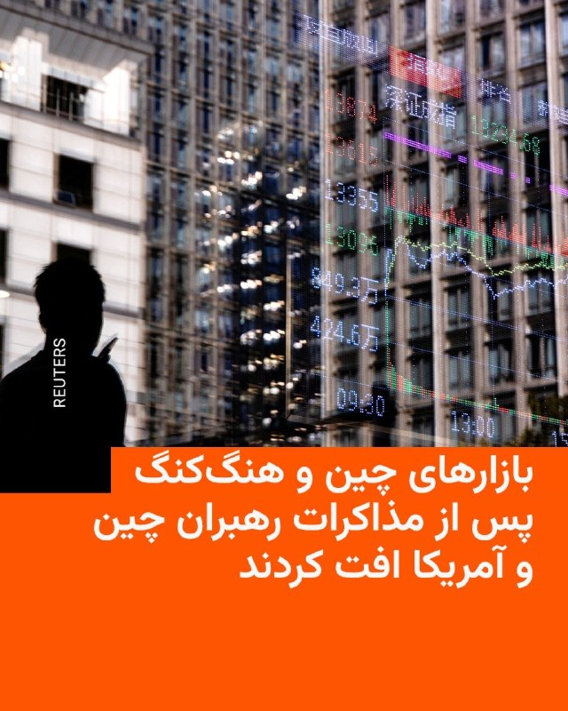

🔸 بازارهای سهام چین و هنگ‌کنگ پس از پایان نشست دو روزه میان دونالد ترامپ و شی جین‌پینگ، روسای جمهوری آمریکا و چین، با افت همراه شدند؛ نشستی که به گفته تحلیلگران نتوانست انتظارات سرمایه‌گذاران را برآورده کند.

🔸 بر اساس گزارش‌ها، با اعلام توافق برای خرید تنها ۲۰۰ فروند هواپیمای بوئینگ از سوی چین، این میزان کمتر از انتظار بازارها ارزیابی شد و سهام این شرکت را ۴ درصد کاهش داد.

🔸 این مذاکرات اگرچه بر موضوعاتی مانند تجارت، ایران و تایوان متمرکز بود، اما جزئیات مشخصی از توافق‌های بزرگ اقتصادی در آن اعلام نشد. در نتیجه، شاخص‌های اصلی چین کاهش یافتند و فضای احتیاط و ریسک‌گریزی بر بازارهای مالی غالب شد.

🔸 هنوز مشخص نیست آتش‌بس تجاری که در اکتبر امضا شده بود تمدید می‌شود یا نه.

@RadioFarda

## RadioFarda — post 157203

  

🔸امارات متحده عربی اعلام کرد این کشور ساخت یک خط لوله جدید نفتی را برای دو برابر کردن ظرفیت صادرات نفت از طریق بندر فجیره تا سال ۲۰۲۷ تسریع خواهد کرد. این اقدام توانایی ابوظبی برای دور زدن تنگه هرمز را به‌طور چشمگیری افزایش خواهد داد.

🔸دفتر رسانه‌ای دولت ابوظبی روز جمعه ۲۵ اردیبهشت اعلام کرد شیخ خالد بن محمد بن زاید، ولیعهد ابوظبی، به شرکت ملی نفت ابوظبی، ادنوک، دستور داده است اجرای پروژه خط لوله «غرب به شرق» را سرعت ببخشد. به‌گفتهٔ این نهاد، این خط لوله اکنون در حال ساخت است و انتظار می‌رود در سال ۲۰۲۷ به بهره‌برداری برسد.

🔸در بیانیهٔ دولت امارات اشاره‌ای به زمان‌بندی اولیه این پروژه نشده است.

🔸خط لولهٔ کنونی نفت خام ابوظبی، موسوم به «حبشان ـ فجیره»، ظرفیت انتقال روزانه تا یک میلیون و ۸۰۰ هزار بشکه نفت را دارد و نقش مهمی در افزایش صادرات مستقیم نفت امارات از سواحل دریای عمان ایفا کرده است.

@RadioFarda

## RadioFarda — post 157202

  <a href="telegram/content/RadioFarda_157202_1778843429.mp4" target="_blank">🎬 Download video</a>

🔸رئیس‌جمهور آمریکا، روز جمعه ۲۵ اردیبهشت گفت که در مورد ایران با شی جین‌پینگ، رئیس‌جمهور چین، گفت‌وگو کرده است و هر دو طرف هم‌نظر هستند که ایران نباید سلاح هسته‌ای داشته باشد و خواستار باز شدن تنگه‌ هرمز هستند.

🔸به گزارش رویترز، دونالد ترامپ ساعتی پیش از پایان سفر رسمی خود به چین گفت که صبر آمریکا درباره ایران رو به پایان است و تأکید کرد که تهران باید وارد توافق شود.

🔸بر اساس جمع‌بندی کاخ سفید از این دیدار، دو طرف بر ضرورت جلوگیری از نظامی‌سازی تنگه هرمز تأکید کرده‌اند.

🔸در مقابل، وزارت خارجه چین اعلام کرده که این کشور با ادامه جنگ ایران مخالف است و تأکید کرده این درگیری نباید هرگز آغاز می‌شد.

🔸ترامپ در گفت‌وگو با فاکس‌نیوز هم اعلام کرد که چین وعده داده از ارسال تجهیزات نظامی به ایران خودداری کند و در مقابل، پکن به دنبال افزایش خرید نفت از آمریکا برای کاهش وابستگی به مسیرهای انرژی منطقه‌ای است.

🔸در همین حال، تحلیلگران می‌گویند میزان همکاری واقعی چین در این پرونده همچنان محل تردید است؛ زیرا ایران برای پکن یک شریک مهم در حوزه انرژی و سیاست منطقه‌ای به شمار می‌رود.

@RadioFarda

## IranianMinds — post 20182

🔴 ترامپ:

ایران هرگز به سلاح هسته‌ای دست نخواهد یافت و تحت هیچ شرایطی فرصتی برای آن نخواهد داشت.

@IranianMinds

## IranianMinds — post 20181

  <a href="telegram/content/IranianMinds_20181_1778843431.mp4" target="_blank">🎬 Download video</a>

🔴 ترامپ درباره رهبر کره شمالی :

من رابطه خیلی خوبی با کیم جونگ‌اون دارم.

او به کشور ما احترام گذاشته است و من می‌خواهم همین احترام را ادامه دهد.

@IranianMinds

## IranianMinds — post 20180

🔴 ترامپ:

80 درصد از توان موشکی ایران نابود شده است

@IranianMinds

## IranianMinds — post 20179

  <a href="telegram/content/IranianMinds_20179_1778843432.mp4" target="_blank">🎬 Download video</a>

🔴 ترامپ در مورد توقف فعالیت هسته ای ایران:

۲۰ سال کافی است. اما میزان تضمینی که از طرف آن‌ها داده می‌شود… باید واقعاً ۲۰ سال باشد

@IranianMinds

## IranianMinds — post 20178

🔴 ترامپ:

در مورد تایوان هیچ تعهدی به رئیس جمهور چین ندادم.

@IranianMinds

## IranianMinds — post 20177

🔴 ترامپ:

رئیس‌ جمهور چین به من اطمینان داد که با داشتن سلاح هسته‌ای ایران مخالف است

@IranianMinds

## IranianMinds — post 20176

🔴 ترامپ به رویترز :

من مانعی ندارم که ایران برنامه هسته‌ای خود را برای ۲۰ سال متوقف کند، اما این باید یک تعهد واقعی باشد!

@IranianMinds

## IranianMinds — post 20175

  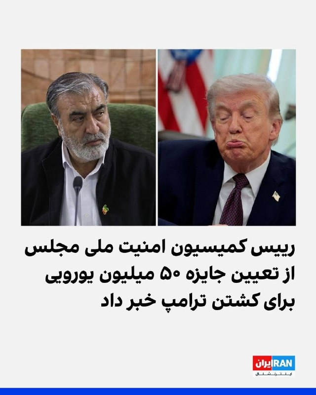

😂😂😂

@IranianMinds

## IranianMinds — post 20174

🔴 عراقچی:

موضوع اورانیوم غنی شده بسیار پیچیده است و ما با واشنگتن به تفاهم رسیدیم تا آن را به مرحله دیگری از مذاکرات موکول کنیم.

@IranianMinds

## IranianMinds — post 20172

🔴 عراقچی :

آمریکا با راه نظامی هرگز نمیتونه مارو شکست بده و به اهدافش برسه ، ولی اگه دیپلماسی رو امتحان میکرد شاید متفاوت بود

@IranianMinds

## IranianMinds — post 20171

  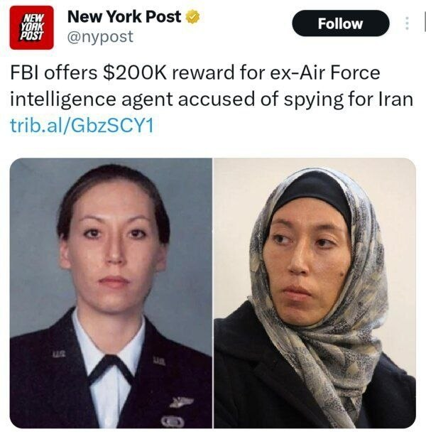

🔴 نیویورک پست:

اف‌بی‌آی جایزه‌ای ۲۰۰ هزار دلاری برای دستگیری مونیکا ویت، مأمور سابق اطلاعات نیروی هوایی آمریکا که از سال ۲۰۱۹ متهم به جاسوسی برای ایران است، اعلام کرده است

@IranianMinds

## IranianMinds — post 20170

  <a href="https://t.me/IranianMinds/20170" target="_blank">📎 Download file</a>

📲#اپلیکیشن اندروید سایت جهانی دربی بت

👍اسپانسر لیگ انگلیس
👍
🔥امکان شارژ امن از طریق کارت بانکی
➖➖➖➖➖➖➖➖➖

🪙همین حالا عضو شوید 👇
https://t.me/+aCbq7yy8QY80NzQ0

## IranianMinds — post 20169

  

😤دنبال یه سایت شرط بندی بین المللی بودی که به ایرانیا خدمات بده؟!
⛔

👍دربی بت همون انتخاب  100%

💎ویژگی های سایت جهانی Derby Bet:

⬅️امکان شارژ امن با کارت بانکی

⬅️واریز اول دوبل شارژ می شوید(بونوس۱۰۰٪)

⬅️پر اپشن ترین سایت فعال در ایران

⬅️تسویه حساب کمتر از 5 دقیقه

⬅️برگشت بخشی از باخت به صورت هفتگی

🚨کد هدیه ثبت نام:GG007

⚠️برای دانلود اپلکیشن کلیک کنید
👉
re25

🔔کانال دربی بت :

🪙https://t.me/+aCbq7yy8QY80NzQ0

## IranianMinds — post 20168

🔴 ترامپ :

نابودی نظامی ایران ادامه خواهد داشت

@IranianMinds

## BBCPersian — post 281124

🔻عراقچی: پیام‌های آمریکایی‌ها متناقض و نیت‌شان نامشخص است

وزیر خارجه ایران آمریکا را به ارسال پیام‌های‌ متناقض متهم کرده و جدیت واشنگتن را در مورد مذاکره زیر سوال برده است.

عباس عراقچی که در حاشیه نشست بریکس در دهلی نو صحبت می‌کرد، گفت: «آمریکایی‌ها پیام‌های متناقضی می‌فرستند، ما نمی‌دانیم که دقیقا نیت آمریکایی ها چیست.»

وزیر خارجه ایران افزود: «در مورد جدییت آمریکایی‌ها در مذاکرات تردید داریم؛ اما به محض اینکه احساس کنیم و اطمینان حاصل کنیم آنها جدی هستند و آماده یک توافق عادلانه هستند ما به مذاکرات برمی‌گردیم.»

آقای عراقچی همچنین آتش‌بس را «ناپایدار» توصیف کرد اما گفت که ایران سعی دارد آن را حفظ کند.

او در عین حال تاکید کرد که برای این مناقشه «هیچ راه‌ حل نظامی وجود ندارد.»

«ما در برابر هرگونه فشار و تحریم مقاومت می‌کنیم. کشور من بیش از چهل سال هدف تحریم‌های شدید آمریکا بوده اما این سیاست‌های ما را تغییر نداد.»

https://bbc.in/3R12525
@BBCPersian

## BBCPersian — post 281123

  <a href="telegram/content/BBCPersian_281123_1778843436.mp4" target="_blank">🎬 Download video</a>

🔻کل‌بی، شرکت بزرگ تولید تنقلات در ژاپن اعلام کرده که به‌دلیل اختلال در تامین مواد اولیه جوهر چاپ در پی جنگ ایران و توقف نفتکش‌ها در تنگه هرمز، بسته‌بندی‌ بعضی میان‌وعده‌‌هایش را به‌طور موقت سیاه‌وسفید کرده است.

بنابر اعلام این شرکت، ۱۴ محصول از جمله چیپس و میگوی ترد آن از ۲۵ مه در این بسته‌بندی‌های جدید در فروشگاه‌های ژاپن عرضه می‌شود.

چاپ سیاه‌وسفید در مقایسه با چاپ با جوهرهای رنگی ارزان‌تر تمام می‌شود، اما بعضی تحلیلگران معتقدند این اقدام ممکن است نوعی ترفند بازاریابی برای این شرکت ژاپنی، همزمان با بسته بودن تنگه هرمز باشد.

بسته بودن تنگه هرمز بر قیمت بسیاری مواد اولیه تاثیر گذاشته است. ایران در واکنش به حملات آمریکا و اسرائیل، عملا تنگه راهبردی هرمز را بسته و در نتیجه، حجم عظیمی از نفت پشت این تنگه متوقف شده است.

@BBCPersian

## BBCPersian — post 281122

🔻اجتناب وزارت خارجه چین از پاسخ به سوالات در مورد توافق‌های اعلام شده از سوی ترامپ

سخنگوی وزارت خارجه چین در کنفرانس خبری از پاسخ دادن به سوالات در مورد توافق‌های تجاری‌ای که رئیس‌جمهور آمریکا اعلام کرده است، اجتناب کرد.

پیشتر دونالد ترامپ به شبکه فاکس‌نیوز گفت که شی‌ جین‌پینگ، رئیس‌جمهور چین، متعهد به چندین توافق تجاری با آمریکا شده است، از جمله خرید ۲۰۰ فروند هواپیمای بوئینگ، نفت آمریکا و همچنین محصولات کشاروزی مانند سویا.

سخنگوی وزارت خارجه چین بدون تایید یا تکذیب این توافق‌های تجاری، در عوض بر اهمیت «اتفاق نظر» دو رهبر در جریان سفر دونالد ترامپ تاکید کرد.

این سخنگو در پاسخ به سوالی دیگر گفت: «اساس روابط اقتصادی و تجاری چین و آمریکا مبتنی بر منفعت دوجانبه و همکاری برد-برد است.»

https://bbc.in/3R12525
@BBCPersian

## BBCPersian — post 281121

  

🔻کره جنوبی با طرح مطرح شده از سوی ایران برای دریافت عوارض از کشتی‌های عبوری از تنگه هرمز مخالفت کرده و می‌گوید که چنین اقدامی با اصل آزادی کشتیرانی در آب‌های بین‌امللی مغایرت دارد.

مجلس ایران پیگیر طرحی است که هدف آن دریافت عوارض از کشتی‌های عبوری از تنگه هرمز حتی در شرایط صلح است.

هوانگ جونگ وو، وزیر اقیانوس‌ها و شیلات کره جنوبی گفت که دریافت عوارض از این تنگه «عملا معادل مسدود کردن این آبراه» است.

او تنگه هرمز را با کانال سوئز مقایسه کرد و گفت که «سوئز یک کانال مصنوعی است که دریافت عوارض در آن امری عادی محسوب می‌شود، اما تنگه هرمز یک گذرگاه بین‌المللی دریایی است که تحت قوانین بین‌المللی قرار دارد.»

سئول بارها اعلام کرده است که قصد پرداخت چنین عوارضی را ندارد و «آزادی ناوبری» را اصلی اساسی می‌داند.

بخش بزرگی از واردات انرژی‌ کره جنوبی از خاورمیانه و از مسیر تنگه هرمز انجام می‌شود.

کمتر از دو هفته پیش یک کشتی کره جنوبی هم در منطقه تنگه هرمز هدف حمله قرار گرفت.

📸 Amirhossein KHORGOOEI / ISNA / AFP via Getty Images

https://bbc.in/3R12525
@BBCPersian

## BBCPersian — post 281120

🔻افزایش قیمت سوخت در هند در پی جهش قیمت جهانی نفت

شرکت‌های دولتی عرضه سوخت در هند برای نخستین بار در چهار سال اخیر قیمت‌ها را افزایش دادند .

جهش قیمت جهانی نفت پس از آغاز جنگ ایران و محدود شدن رفت‌وآمد در تنگه هرمز، باعث فشار بر ذخایر ارزی هند شده است.

هند، سومین واردکننده بزرگ نفت در جهان، از آخرین اقتصادهای بزرگ محسوب می‌شود که قیمت سوخت در جایگاه‌ها را افزایش می‌دهد.

این تصمیم باعث افزایش هزینه کالاهای روزمره برای صدها میلیون نفر خواهد شد.

این اقدام تنها چند روز پس از آن صورت می‌گیرد که نارندرا مودی، نخست‌وزیر هند، از مردم خواست که در مصرف سوخت صرفه‌جویی کنند.

https://bbc.in/3R12525
@BBCPersian

## Dirty_Kids — post 389487

  

شاشیدم تو تار به تار سیبیلاتون.

@Dirty_Kids 👻

## Dirty_Kids — post 389486

  

قیمت جهانی استارلینک مینی با تخفیف به زیر ۲۰۰دلار (۳۶میلیون تومن) رسیده و پایین‌تر هم میاد. سایز دیشش هم اندازه‌ی یه کاغذ A4 هس و براحتی همه جا مخفی میشه و با وضعیت ایران هیچ رقمه نمیشه جلوی موج قاچاقش رو گرفت.

رویای آخوند برای کنترل بلند مدت اینترنت فقط یه توهمه.

@Dirty_Kids 👻

## Dirty_Kids — post 389485

  

🌪وقتی اینترنت طوفانیه... کافیه بادبان ها رو بکشی تا

⚫️با بالاترین کیفیت ممکن
⚡️ 

⚫️100 هزار تومان شارژ هدیه 
🎁

⚫️پایین ترین قیمت گیگی 250
🌐 

⚫️و ارائه پورسانت %10 در ازای هر معرفی
💼

بتونی یه اتصال پایدار با پشتیبانی 24 ساعته داشته باشی
🚀

بادبان راهتو باز می‌کنه
⛵️

R25

🛡@BadBan_VPN | کانال 

🤖@BadBan_VPNBot | ربات 

📞@BadBan_VPNSupport | پشتیبانی

## Hranews — post 112950

  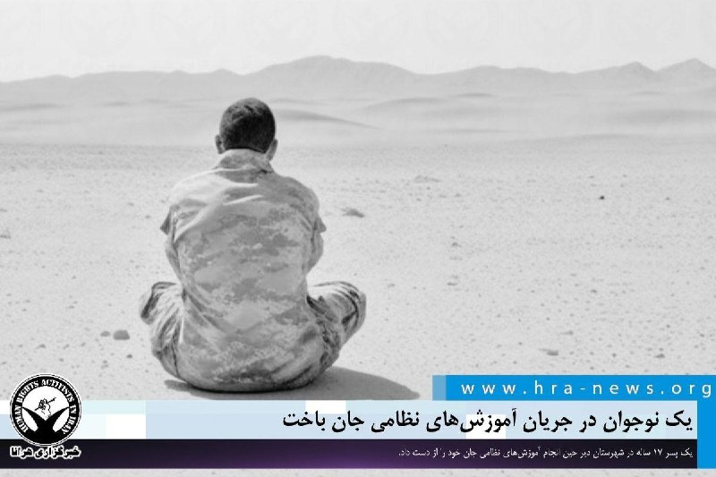

برخلاف پیمان‌نامه حقوق کودک؛ یک نوجوان در جریان آموزش‌های نظامی جان باخت

❗️
❗️
❗️
❗️
❗️– برخلاف تعهدات بین‌المللی ایران تحت عنوان الحاق به پیمان‌نامه حقوق #کودک و تعهدات مربوط به عدم به‌کارگیری کودکان در امور نظامی، یک پسر ۱۷ ساله در شهرستان دیر حین انجام آموزش‌های نظامی جان خود را از دست داد. رسانه‌های رسمی او را از نیروهای بسیج معرفی کردند.

ادامه مطلب

↘️
@hranews_bot تماس ✉️ - @Hranews کانال هرانا 🆑

## manototv — post 105478

  <a href="telegram/content/manototv_105478_1778843439.mp4" target="_blank">🎬 Download video</a>

نارندرا مودی، نخست‌وزیر هند، روز جمعه ۲۵ اردیبهشت در جریان سفر به ابوظبی، با انتشار پیامی در شبکه اجتماعی ایکس نوشت: «دوستی میان هند و امارات بسیار نیرومند است.»

مودی در این سفر با شیخ محمد بن زاید، رئیس امارات متحده عربی، دیدار کرد. محور گفتگوهای دو طرف، گسترش روابط دوجانبه، همکاری‌های انرژی، همکاری‌های دفاعی و تحولات منطقه‌ای اعلام شده است.

این سفر در شرایطی انجام می‌شود که تنش‌های منطقه‌ای و نگرانی‌ها درباره امنیت مسیرهای انرژی، اهمیت همکاری میان هند و امارات را افزایش داده است. امارات یکی از شرکای مهم هند در حوزه انرژی و تجارت به شمار می‌رود و ابوظبی و دهلی نو در سال‌های اخیر روابط اقتصادی و راهبردی خود را گسترش داده‌اند.

## manototv — post 105477

  <a href="telegram/content/manototv_105477_1778843440.mp4" target="_blank">🎬 Download video</a>

عباس عراقچی، وزیر خارجه جمهوری اسلامی، در گفتگو با رسانه دولتی هند گفت «هیچ راه‌حل نظامی‌ای وجود ندارد» و افزود ایالات متحده باید این واقعیت را درک کند.

او گفت آمریکا «دست‌کم دو بار» جمهوری اسلامی را آزموده و اکنون به این نتیجه رسیده است که «راه‌حل نظامی وجود ندارد».

عراقچی مهم‌ترین مشکل در روند کنونی را «پیام‌های متناقض» از سوی مقام‌های آمریکایی دانست و گفت این پیام‌ها از طریق اظهارنظرها، مصاحبه‌ها و مواضع مختلف دریافت می‌شود.

## manototv — post 105476

  <a href="telegram/content/manototv_105476_1778843440.mp4" target="_blank">🎬 Download video</a>

رسانه دولتی اسرائیل گزارش داد ایال زامیر، رئیس ستاد ارتش اسرائیل، در جریان جنگ با ایران به امارات متحده عربی سفر کرده است.
بر اساس این گزارش، او همراه با چند مقام نظامی اسرائیل با مقام‌های اماراتی، از جمله محمد بن زاید، رئیس امارات، دیدار کرده است. ارتش اسرائیل تاکنون واکنشی به این گزارش نشان نداده است.
این گزارش پس از آن منتشر می‌شود که بنیامین نتانیاهو نیز گفته بود در زمان جنگ به امارات سفر کرده؛ ادعایی که از سوی امارات رد شد. همچنین گزارش‌هایی درباره سفر رؤسای سازمان‌های اطلاعاتی و امنیتی اسرائیل به امارات در زمان جنگ منتشر شده است.
در همین حال، مقام‌های آمریکایی تأیید کرده‌اند اسرائیل یک سامانه پدافند موشکی را به همراه نیروهای نظامی برای راه‌اندازی آن به امارات منتقل کرده است.

## alonews — post 120162

  <a href="telegram/content/alonews_120162_1778843441.webm" target="_blank">🎬 Download video</a>

👈ترامپ: 80 درصد از توان موشکی ایران نابود شده است

✅ @AloNews خبر جنگ

## alonews — post 120161

  <a href="telegram/content/alonews_120161_1778843441.webm" target="_blank">🎬 Download video</a>

👈ترامپ : «مواد هسته‌ای» ایران، ممکنه به چین یا آمریکا تحویل داده شه!

✅ @AloNews خبر جنگ

## alonews — post 120160

  <a href="telegram/content/alonews_120160_1778843441.webm" target="_blank">🎬 Download video</a>

👈ترامپ: «من دیگر خیلی بیشتر از این صبر نخواهم کرد. آنها باید توافق را امضا کنند.»

✅ @AloNews خبر جنگ

## alonews — post 120159

  <a href="telegram/content/alonews_120159_1778843441.webm" target="_blank">🎬 Download video</a>

👈عراقچی: پس از اینکه ترامپ آخرین پیشنهاد ما را رد کرد، پیام‌هایی از آمریکا دریافت کردیم که تمایلش به ادامه گفت‌وگو است

✅ @AloNews خبر جنگ

## alonews — post 120158

  <a href="telegram/content/alonews_120158_1778843441.webm" target="_blank">🎬 Download video</a>

👈ترامپ: پل‌ها و سایت‌های برق ایران که می‌توانیم هدف قرار دهیم

🔴ترامپ می‌گوید ایران آتش‌بس را به عنوان لطفی به دیگر کشورها انجام داد

✅ @AloNews خبر جنگ

## alonews — post 120157

  <a href="telegram/content/alonews_120157_1778843441.webm" target="_blank">🎬 Download video</a>

👈ترامپ: هیچ تعهدی در مورد تایوان ندادم

✅ @AloNews خبر جنگ

## alonews — post 120156

  <a href="telegram/content/alonews_120156_1778843441.webm" target="_blank">🎬 Download video</a>

👈ترامپ: پل‌ها و سایت‌های برق ایران که می‌توانیم هدف قرار دهیم

✅ @AloNews خبر جنگ

## alonews — post 120155

  <a href="telegram/content/alonews_120155_1778843441.webm" target="_blank">🎬 Download video</a>

👈ترامپ درباره ایران: من با تعلیق برنامه هسته‌ای ایران به مدت ۲۰ سال مشکلی ندارم اما باید یک تعهد «واقعی» باشد

✅ @AloNews خبر جنگ

## alonews — post 120154

  <a href="telegram/content/alonews_120154_1778843442.mp4" target="_blank">🎬 Download video</a>

⭕️یکی از صدها موشکی که برگشتن رو سر مردم و جمهوری اسلامی طبق روال همیشه با مظلوم نمایی انداختن گردن امریکا و اسرائیل

🤔مدرسه میناب جای تحقیق و بررسی زیادی داره.

✅@AloNews

## alonews — post 120153

  <a href="telegram/content/alonews_120153_1778843443.webm" target="_blank">🎬 Download video</a>

👈ترامپ پس از پایان سفر خود به چین، درباره تایوان به فاکس نیوز گفت: ما به دنبال جنگیدن نیستیم

🔴ترامپ به خبرنگاران گفت: فکر نمی کنم با چین بر سر تایوان اختلاف نظر وجود داشته باشد.

✅ @AloNews خبر جنگ

## alonews — post 120152

  <a href="telegram/content/alonews_120152_1778843443.webm" target="_blank">🎬 Download video</a>

👈ترامپ به فاکس نیوز: ممکن است با تامین سلاح برای تایوان موافقت کنم و ممکن است موافقت نکنم

🔴هنوز تصمیمی برای تامین سلاح برای تایوان نگرفته‌ام

✅ @AloNews خبر جنگ

## alonews — post 120151

  <a href="telegram/content/alonews_120151_1778843443.webm" target="_blank">🎬 Download video</a>

👈پیام کتبی سید مجتبی خامنه ای ، به مناسبت بزرگداشت فردوسی: فارسی فقط ابزار حرف زدن نیست؛ بخشی از هویت و اقتدار تمدن ایرانیه.

🔴مردم ایران تو جنگ اخیر مثل قهرمان‌های شاهنامه ایستادن و مقابل متجاوزها مقاومت کردن.

🔴اهالی هنر و رسانه باید این حماسه و مقاومت مردم رو برای تاریخ ماندگار کنن.

🔴باید مقابل تهاجم فرهنگی و سبک زندگی آمریکایی ایستاد و روی پدافند زبانی و فرهنگی بیشتر کار کرد.

✅ @AloNews خبر جنگ

## alonews — post 120150

  <a href="telegram/content/alonews_120150_1778843443.webm" target="_blank">🎬 Download video</a>

👈عراقچی : تنگه خیلی هم گشاده

✅ @AloNews خبر جنگ

## alonews — post 120149

  <a href="telegram/content/alonews_120149_1778843444.webm" target="_blank">🎬 Download video</a>

👈عراقچی: امیدوارم کشورهای حاشیه خلیج فارس متوجه شوند که آمریکا و اسرائیل نمی‌توانند برای آنها امنیت بیاورند

✅ @AloNews خبر جنگ

## alonews — post 120148

  <a href="telegram/content/alonews_120148_1778843444.mp4" target="_blank">🎬 Download video</a>

🔴نفت به آغوش مناطق ساحلی و جزایر ما رسیده و اینطور در حال نابودکردن است.

✅@AloNews

## alonews — post 120147

  <a href="telegram/content/alonews_120147_1778843445.webm" target="_blank">🎬 Download video</a>

👈زاکانی، شهردار تهران: ما قصد داشتیم قبل از جنگ بیت رهبری رو با معماری جدید بازسازی کنیم، اما آمریکا عملیات تخریب رو که بسیار هزینه‌بر هم بود برای ما رایگان انجام داد.

✅ @AloNews خبر جنگ

## alonews — post 120146

  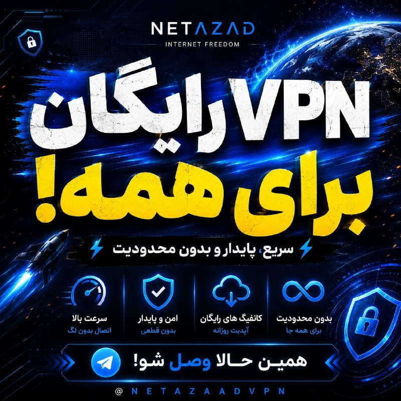

🌐 اینترنت رایگان و آزاد برای همه مردم

⚡ VPN رایگان
⚡ کانفیگ تست‌شده و پرسرعت
⚡ آپدیت روزانه
⚡ بدون قطعی و دردسر

@NetaazaadVPN
@NetaazaadVPN

اینجا فقط وصل میشی و راحت استفاده میکنی 🫡

👇
@NetaazaadVPN
@NetaazaadVPN
@NetaazaadVPN

## alonews — post 120145

  <a href="telegram/content/alonews_120145_1778843445.webm" target="_blank">🎬 Download video</a>

👈عراقچی: میانجیگری پاکستان شکست نخورده، اما با مشکلاتی مواجه است

🔴از هرگونه تلاش چین، هند و روسیه برای حل بحران استقبال می‌کنیم

🔴عراقچی درباره خروج اورانیوم از ایران به روسیه: مذاکره خوبی با لاوروف داشتم. مشارکت راهبردی با روسیه داریم. با پوتین در روسیه دیدار کردم و در خصوص اورانیوم هم صحبت کردیم، از پیشنهاد طرف روسی متشکریم، این موضوعی بود که باید در حین مذاکرات به نتیجه برسیم.

🔴موضوع غنی سازی پیچیده است و برای رسیدن به نتیجه با طرف آمریکایی پیشنهاد دادیم این بحث به تعویق بیفتد.

🔴در حال حاضر این موضوع مورد بحث نیست.

🔴نسبت به جدیت آمریکایی‌ها شک داریم. آماده توافق منصفانه و عادلانه هستیم.

✅ @AloNews خبر جنگ

## alonews — post 120144

  <a href="telegram/content/alonews_120144_1778843446.webm" target="_blank">🎬 Download video</a>

👈وزیر امورخارجه: اگر از سوی آمریکایی‌ها جدیتی احساس کنیم، مذاکرات را از سر خواهیم گرفت

✅ @AloNews خبر جنگ

## alonews — post 120143

  <a href="telegram/content/alonews_120143_1778843446.webm" target="_blank">🎬 Download video</a>

👈جعفر قادری، نایب رئیس دوم کمیسیون اقتصادی مجلس: اینترنت بین‌الملل مهم است اما از همه چیز مهم‌تر امنیت ملی است

🔴فعال اقتصادی که برای او منفعت و درآمد دارد قطعا برای ادامه کار خود هزینه اینترنت پرو را پرداخت می‌کند

✅ @AloNews خبر جنگ

<!-- MSG END -->

<!-- NAV START -->

<a href="https://github.com/adamapplecoding/dlrl/blob/main/telegram/content/archive_1.md" style="display:inline-block; padding:6px 12px; margin:0 4px; background-color:#2ea44f; color:white; text-decoration:none; border-radius:4px; font-weight:bold;">صفحه بعد</a>

<!-- NAV END -->
